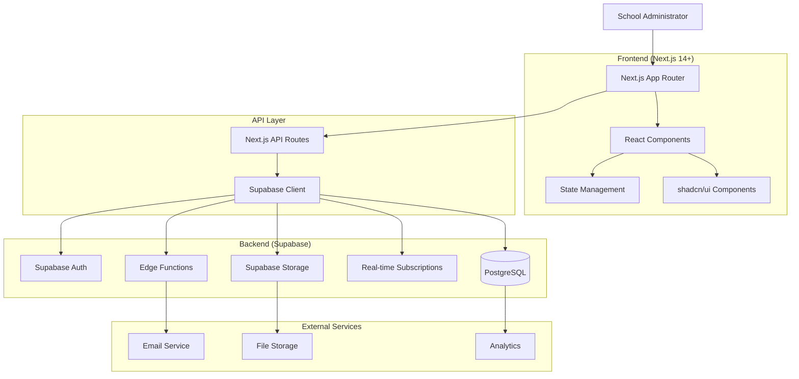
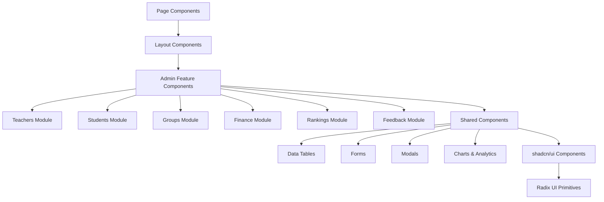
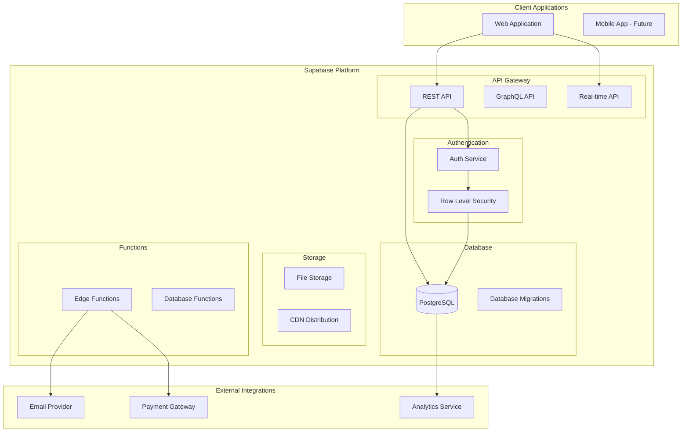
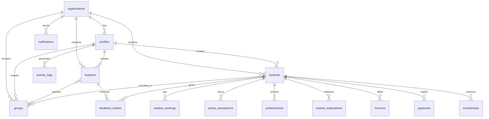
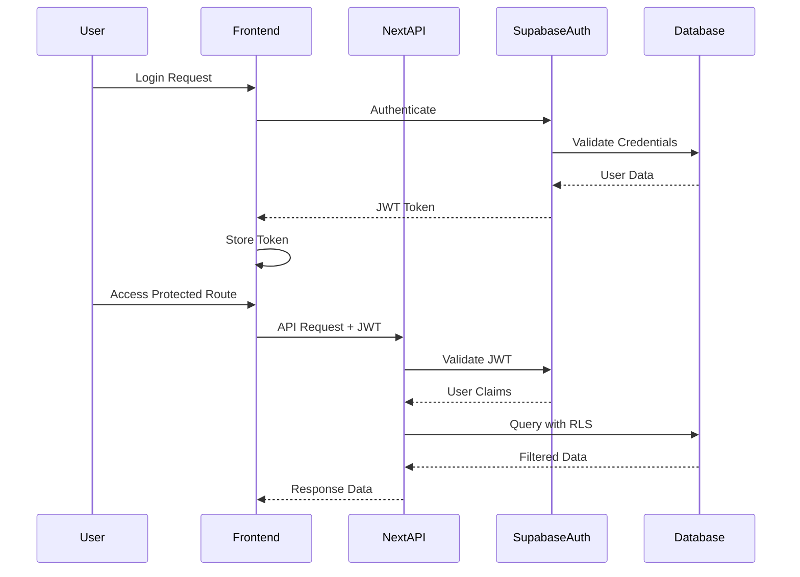
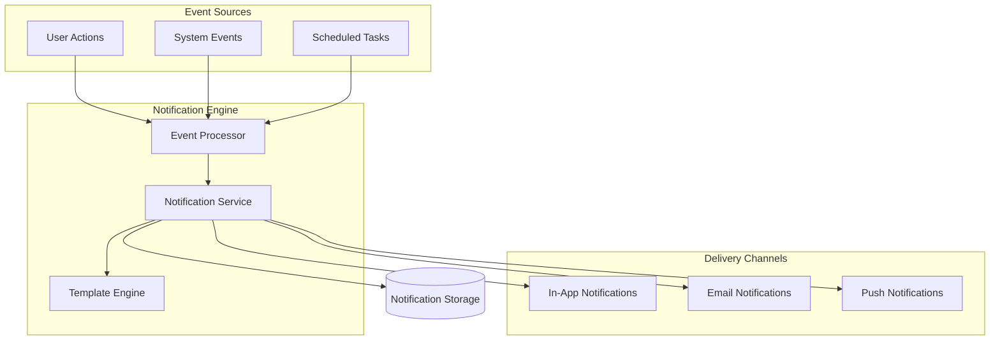
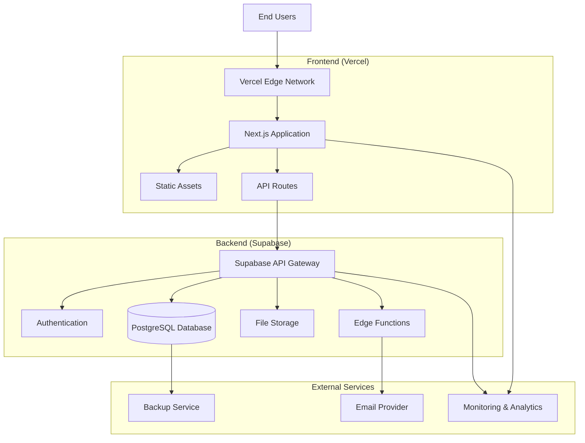

# Harry School Admin CRM - System Architecture

## 1. Architecture Overview

Harry School Admin CRM follows a modern **JAMstack architecture** with a React-based frontend and a serverless backend powered by Supabase. The system is designed for scalability, security, and maintainability with a clear separation of concerns.

### 1.1 High-Level Architecture Diagram



### 1.2 Technology Stack

#### Frontend Stack
- **Framework**: Next.js 14+ with App Router
- **Language**: TypeScript 5.0+
- **UI Framework**: React 18+
- **Component Library**: shadcn/ui + Radix UI
- **Styling**: Tailwind CSS
- **State Management**: Zustand (client) + React Query (server state)
- **Animation**: Framer Motion
- **Internationalization**: next-intl

#### Backend Stack
- **Database**: PostgreSQL (Supabase)
- **Authentication**: Supabase Auth
- **API**: REST + Real-time subscriptions
- **Storage**: Supabase Storage
- **Functions**: Supabase Edge Functions
- **Security**: Row Level Security (RLS)

#### Infrastructure
- **Frontend Hosting**: Vercel
- **Backend Hosting**: Supabase
- **CDN**: Vercel Edge Network
- **Domain**: Custom domain with SSL
- **Monitoring**: Supabase Analytics + Vercel Analytics

## 2. Frontend Architecture

### 2.1 Next.js App Router Structure

```
src/
├── app/                          # Next.js App Router
│   ├── [locale]/                 # Internationalization routing
│   │   ├── (auth)/              # Authentication routes
│   │   │   └── login/
│   │   ├── (dashboard)/         # Protected dashboard routes
│   │   │   ├── teachers/
│   │   │   ├── students/
│   │   │   ├── groups/
│   │   │   ├── finance/
│   │   │   ├── rankings/
│   │   │   ├── rewards/
│   │   │   └── settings/
│   │   └── layout.tsx           # Root layout with i18n
│   ├── api/                     # API routes
│   │   ├── teachers/
│   │   ├── students/
│   │   ├── groups/
│   │   ├── finance/
│   │   ├── rankings/
│   │   ├── rewards/
│   │   ├── notifications/
│   │   └── settings/
│   └── globals.css              # Global styles
```

### 2.2 Component Architecture



### 2.3 State Management Architecture

```typescript
// Zustand Store Structure
interface AppStore {
  // UI State
  ui: {
    sidebarOpen: boolean
    currentLocale: string
    theme: 'light' | 'dark'
    loading: boolean
  }
  
  // User State
  user: {
    profile: UserProfile | null
    permissions: Permission[]
    organization: Organization | null
  }
  
  // Cache State
  cache: {
    teachers: Teacher[]
    students: Student[]
    groups: Group[]
    lastSync: Record<string, Date>
  }
}
```

### 2.4 Data Fetching Strategy

```typescript
// React Query Configuration
const queryClient = new QueryClient({
  defaultOptions: {
    queries: {
      staleTime: 5 * 60 * 1000,      // 5 minutes
      cacheTime: 10 * 60 * 1000,     // 10 minutes
      refetchOnWindowFocus: false,
      refetchOnMount: true,
    },
  },
})

// Example Query Hook
export const useTeachers = (filters?: TeacherFilters) => {
  return useQuery({
    queryKey: ['teachers', filters],
    queryFn: () => teacherService.getAll(filters),
    enabled: !!filters,
  })
}
```

## 3. Backend Architecture

### 3.1 Supabase Architecture Overview



### 3.2 Database Architecture

#### Core Schema Structure



#### Table Relationships Summary

1. **Multi-Tenant Foundation**
   - `organizations` → Primary tenant isolation
   - `profiles` → User management with organization scope

2. **Educational Core**
   - `teachers` → Professional staff management
   - `students` → Student lifecycle management
   - `groups` → Class/course management
   - `teacher_group_assignments` → Teaching relationships
   - `student_group_enrollments` → Enrollment relationships

3. **Performance System**
   - `student_rankings` → Unified ranking system
   - `points_transactions` → Point earning/spending history
   - `achievements` → Achievement definitions
   - `student_achievements` → Achievement unlocks
   - `rewards_catalog` → Available rewards
   - `reward_redemptions` → Reward purchases

4. **Feedback System**
   - `feedback_entries` → Bidirectional feedback
   - `feedback_templates` → Reusable feedback forms

5. **Financial Management**
   - `invoices` → Billing management
   - `payments` → Payment tracking
   - `payment_schedules` → Installment plans
   - `discounts` → Discount management
   - `scholarships` → Financial aid

6. **System Management**
   - `notifications` → Real-time notifications
   - `activity_logs` → Audit trails
   - `system_settings` → Configuration management

### 3.3 Row Level Security (RLS) Policies

```sql
-- Example RLS Policies for Multi-Tenant Security

-- Teachers can only be accessed by users in the same organization
CREATE POLICY "Teachers are isolated by organization" ON teachers
  USING (organization_id IN (
    SELECT organization_id FROM profiles 
    WHERE id = auth.uid()
  ));

-- Students can only be managed by authorized users
CREATE POLICY "Students require proper authorization" ON students
  USING (
    organization_id IN (
      SELECT organization_id FROM profiles 
      WHERE id = auth.uid() 
      AND role IN ('admin', 'superadmin')
    )
  );

-- Feedback can be viewed by involved parties and admins
CREATE POLICY "Feedback access control" ON feedback_entries
  USING (
    from_user_id = auth.uid() OR 
    to_user_id = auth.uid() OR
    organization_id IN (
      SELECT organization_id FROM profiles 
      WHERE id = auth.uid() AND role IN ('admin', 'superadmin')
    )
  );
```

### 3.4 API Architecture

#### REST API Structure

```
/api/
├── auth/                    # Authentication endpoints
│   ├── login/
│   ├── logout/
│   └── profile/
├── teachers/               # Teacher management
│   ├── GET /               # List teachers
│   ├── POST /              # Create teacher
│   ├── GET /[id]           # Get teacher details
│   ├── PUT /[id]           # Update teacher
│   └── DELETE /[id]        # Delete teacher
├── students/               # Student management
│   ├── GET /               # List students
│   ├── POST /              # Create student
│   ├── GET /[id]           # Get student details
│   ├── PUT /[id]           # Update student
│   └── DELETE /[id]        # Delete student
├── groups/                 # Group management
│   ├── GET /               # List groups
│   ├── POST /              # Create group
│   ├── GET /[id]           # Get group details
│   ├── PUT /[id]           # Update group
│   └── DELETE /[id]        # Delete group
├── rankings/               # Ranking system
│   ├── GET /leaderboard    # Get leaderboards
│   ├── POST /points        # Award points
│   └── GET /achievements   # Get achievements
├── rewards/                # Reward system
│   ├── GET /catalog        # Get reward catalog
│   ├── POST /redeem        # Redeem reward
│   └── GET /redemptions    # Get redemption history
├── finance/                # Financial management
│   ├── GET /invoices       # List invoices
│   ├── POST /payments      # Record payment
│   └── GET /reports        # Financial reports
├── notifications/          # Notification system
│   ├── GET /               # Get user notifications
│   ├── POST /send          # Send notification
│   └── PUT /[id]/read      # Mark as read
└── settings/              # System settings
    ├── GET /organization   # Organization settings
    ├── PUT /organization   # Update organization
    └── GET /system         # System configuration
```

## 4. Service Architecture

### 4.1 Service Layer Structure

```typescript
// Base Service Class
abstract class BaseService<T> {
  protected supabase: SupabaseClient
  protected tableName: string
  
  constructor(tableName: string) {
    this.supabase = createClient()
    this.tableName = tableName
  }
  
  // CRUD Operations
  async getAll(filters?: FilterOptions): Promise<T[]>
  async getById(id: string): Promise<T | null>
  async create(data: Partial<T>): Promise<T>
  async update(id: string, data: Partial<T>): Promise<T>
  async delete(id: string): Promise<void>
  
  // Common utilities
  protected buildQuery(filters?: FilterOptions): PostgrestFilterBuilder<any, any, any>
  protected handleError(error: PostgrestError): never
}

// Specific Service Implementation
class TeacherService extends BaseService<Teacher> {
  constructor() {
    super('teachers')
  }
  
  // Teacher-specific methods
  async getBySpecialization(specialization: string): Promise<Teacher[]>
  async assignToGroup(teacherId: string, groupId: string): Promise<void>
  async getPerformanceMetrics(teacherId: string): Promise<TeacherMetrics>
}
```

### 4.2 Service Layer Organization

```
src/lib/services/
├── base-service.ts              # Base CRUD service
├── teacher-service.ts           # Teacher management
├── student-service.ts           # Student management
├── group-service.ts             # Group management
├── ranking-service.ts           # Ranking system
├── feedback-service.ts          # Feedback system
├── rewards-service.ts           # Rewards management
├── notification-service.ts      # Notifications
├── finance/                     # Financial services
│   ├── invoice-service.ts
│   ├── payment-service.ts
│   └── financial-reports-service.ts
├── import-export/              # Data import/export
│   ├── teachers-import-service.ts
│   ├── students-import-service.ts
│   └── export-service.ts
└── analytics/                  # Analytics and reporting
    ├── dashboard-analytics-service.ts
    └── performance-analytics-service.ts
```

## 5. Security Architecture

### 5.1 Authentication & Authorization Flow



### 5.2 Row Level Security Implementation

```sql
-- Enable RLS on all tables
ALTER TABLE teachers ENABLE ROW LEVEL SECURITY;
ALTER TABLE students ENABLE ROW LEVEL SECURITY;
ALTER TABLE groups ENABLE ROW LEVEL SECURITY;
ALTER TABLE feedback_entries ENABLE ROW LEVEL SECURITY;
ALTER TABLE student_rankings ENABLE ROW LEVEL SECURITY;

-- Organization isolation policy (applied to all tables)
CREATE POLICY "Isolate by organization" ON teachers
  USING (organization_id = get_user_organization_id(auth.uid()));

CREATE POLICY "Isolate by organization" ON students
  USING (organization_id = get_user_organization_id(auth.uid()));

-- Role-based access policies
CREATE POLICY "Admin full access" ON teachers
  USING (get_user_role(auth.uid()) IN ('admin', 'superadmin'));

CREATE POLICY "Viewer read only" ON teachers
  FOR SELECT
  USING (get_user_role(auth.uid()) = 'viewer');
```

### 5.3 Data Validation & Sanitization

```typescript
// Input validation using Zod
import { z } from 'zod'

export const TeacherSchema = z.object({
  firstName: z.string().min(1).max(100),
  lastName: z.string().min(1).max(100),
  email: z.string().email().optional(),
  phone: z.string().min(10).max(20),
  specializations: z.array(z.string()).default([]),
  qualifications: z.array(QualificationSchema).default([]),
  hireDate: z.string().datetime(),
  salaryAmount: z.number().positive().optional(),
})

// API route validation
export async function POST(request: Request) {
  try {
    const body = await request.json()
    const validatedData = TeacherSchema.parse(body)
    
    const result = await teacherService.create(validatedData)
    return NextResponse.json(result)
  } catch (error) {
    if (error instanceof z.ZodError) {
      return NextResponse.json(
        { error: 'Validation failed', issues: error.issues },
        { status: 400 }
      )
    }
    return NextResponse.json({ error: 'Internal server error' }, { status: 500 })
  }
}
```

## 6. Performance Architecture

### 6.1 Caching Strategy

```typescript
// React Query Caching Configuration
const queryClient = new QueryClient({
  defaultOptions: {
    queries: {
      staleTime: 5 * 60 * 1000,        // 5 minutes
      cacheTime: 10 * 60 * 1000,       // 10 minutes
      refetchOnWindowFocus: false,
    },
  },
})

// Service Worker Caching (Future Enhancement)
// Cache static assets and API responses
self.addEventListener('fetch', (event) => {
  if (event.request.url.includes('/api/')) {
    event.respondWith(
      caches.open('api-cache').then(cache => {
        return cache.match(event.request).then(response => {
          if (response) {
            // Return cached response
            return response
          }
          
          // Fetch and cache new response
          return fetch(event.request).then(fetchResponse => {
            cache.put(event.request, fetchResponse.clone())
            return fetchResponse
          })
        })
      })
    )
  }
})
```

### 6.2 Database Performance Optimizations

```sql
-- Essential Indexes for Performance
CREATE INDEX CONCURRENTLY idx_teachers_organization_id ON teachers(organization_id) WHERE deleted_at IS NULL;
CREATE INDEX CONCURRENTLY idx_students_organization_id ON students(organization_id) WHERE deleted_at IS NULL;
CREATE INDEX CONCURRENTLY idx_groups_organization_id ON groups(organization_id) WHERE deleted_at IS NULL;

-- Composite indexes for common queries
CREATE INDEX CONCURRENTLY idx_teachers_org_active ON teachers(organization_id, is_active) WHERE deleted_at IS NULL;
CREATE INDEX CONCURRENTLY idx_students_org_status ON students(organization_id, enrollment_status) WHERE deleted_at IS NULL;

-- Full-text search indexes
CREATE INDEX CONCURRENTLY idx_teachers_search ON teachers USING gin(to_tsvector('english', full_name || ' ' || COALESCE(email, '')));
CREATE INDEX CONCURRENTLY idx_students_search ON students USING gin(to_tsvector('english', full_name || ' ' || COALESCE(primary_phone, '')));

-- Partial indexes for soft deletes
CREATE INDEX CONCURRENTLY idx_teachers_active ON teachers(id) WHERE deleted_at IS NULL;
CREATE INDEX CONCURRENTLY idx_students_active ON students(id) WHERE deleted_at IS NULL;
```

### 6.3 Frontend Performance Optimizations

```typescript
// Code Splitting and Lazy Loading
const TeachersPage = lazy(() => import('@/app/[locale]/(dashboard)/teachers/page'))
const StudentsPage = lazy(() => import('@/app/[locale]/(dashboard)/students/page'))
const GroupsPage = lazy(() => import('@/app/[locale]/(dashboard)/groups/page'))

// Component Memoization
const TeacherCard = memo(({ teacher, onEdit, onDelete }: TeacherCardProps) => {
  return (
    <Card>
      {/* Component content */}
    </Card>
  )
})

// Virtual Scrolling for Large Lists
import { FixedSizeList as List } from 'react-window'

const VirtualizedTeacherList = ({ teachers }: { teachers: Teacher[] }) => (
  <List
    height={600}
    itemCount={teachers.length}
    itemSize={120}
    itemData={teachers}
  >
    {TeacherRow}
  </List>
)
```

## 7. Real-time Architecture

### 7.1 Real-time Features Implementation

```typescript
// Supabase Real-time Subscriptions
useEffect(() => {
  const channel = supabase
    .channel('notifications')
    .on('postgres_changes', 
      { 
        event: 'INSERT', 
        schema: 'public', 
        table: 'notifications',
        filter: `user_id=eq.${user.id}` 
      },
      (payload) => {
        setNotifications(prev => [payload.new, ...prev])
      }
    )
    .subscribe()

  return () => {
    supabase.removeChannel(channel)
  }
}, [user.id])

// Real-time Ranking Updates
const useRankingUpdates = (userId: string) => {
  const [ranking, setRanking] = useState<StudentRanking | null>(null)
  
  useEffect(() => {
    const channel = supabase
      .channel('rankings')
      .on('postgres_changes',
        {
          event: 'UPDATE',
          schema: 'public',
          table: 'student_rankings',
          filter: `student_id=eq.${userId}`
        },
        (payload) => {
          setRanking(payload.new as StudentRanking)
        }
      )
      .subscribe()
      
    return () => supabase.removeChannel(channel)
  }, [userId])
  
  return ranking
}
```

### 7.2 Notification System Architecture



## 8. Deployment Architecture

### 8.1 Infrastructure Overview



### 8.2 Environment Configuration

```typescript
// Environment Variables Structure
interface EnvironmentConfig {
  // Supabase Configuration
  NEXT_PUBLIC_SUPABASE_URL: string
  NEXT_PUBLIC_SUPABASE_ANON_KEY: string
  SUPABASE_SERVICE_ROLE_KEY: string
  
  // Application Configuration
  NEXT_PUBLIC_APP_URL: string
  NEXTAUTH_SECRET: string
  
  // Feature Flags
  NEXT_PUBLIC_ENABLE_ANALYTICS: boolean
  NEXT_PUBLIC_ENABLE_REAL_TIME: boolean
  
  // External Services
  EMAIL_SERVICE_API_KEY: string
  STORAGE_BUCKET_URL: string
}

// Environment-specific configurations
const config = {
  development: {
    apiUrl: 'http://localhost:3000',
    supabaseUrl: process.env.NEXT_PUBLIC_SUPABASE_URL,
    debug: true,
  },
  staging: {
    apiUrl: 'https://staging.harryschool.com',
    supabaseUrl: process.env.NEXT_PUBLIC_SUPABASE_URL,
    debug: false,
  },
  production: {
    apiUrl: 'https://admin.harryschool.com',
    supabaseUrl: process.env.NEXT_PUBLIC_SUPABASE_URL,
    debug: false,
  }
}
```

### 8.3 CI/CD Pipeline

```yaml
# GitHub Actions Workflow
name: Deploy to Production

on:
  push:
    branches: [main]
  pull_request:
    branches: [main]

jobs:
  test:
    runs-on: ubuntu-latest
    steps:
      - uses: actions/checkout@v3
      - name: Setup Node.js
        uses: actions/setup-node@v3
        with:
          node-version: '18'
          cache: 'npm'
      
      - name: Install dependencies
        run: npm ci
      
      - name: Run type check
        run: npm run type-check
      
      - name: Run linting
        run: npm run lint
      
      - name: Run tests
        run: npm run test:ci

  deploy:
    needs: test
    runs-on: ubuntu-latest
    if: github.ref == 'refs/heads/main'
    steps:
      - uses: actions/checkout@v3
      
      - name: Deploy to Vercel
        uses: amondnet/vercel-action@v20
        with:
          vercel-token: ${{ secrets.VERCEL_TOKEN }}
          vercel-org-id: ${{ secrets.ORG_ID }}
          vercel-project-id: ${{ secrets.PROJECT_ID }}
          vercel-args: '--prod'
```

## 9. Monitoring & Analytics Architecture

### 9.1 Application Monitoring

```typescript
// Error Tracking and Performance Monitoring
import { useEffect } from 'react'

// Performance monitoring
export const usePerformanceMonitoring = () => {
  useEffect(() => {
    // Monitor Core Web Vitals
    import('web-vitals').then(({ getCLS, getFID, getFCP, getLCP, getTTFB }) => {
      getCLS(console.log)
      getFID(console.log)
      getFCP(console.log)
      getLCP(console.log)
      getTTFB(console.log)
    })
  }, [])
}

// Error boundary for error tracking
export class ErrorBoundary extends Component {
  componentDidCatch(error: Error, errorInfo: ErrorInfo) {
    // Log error to monitoring service
    console.error('Application Error:', error, errorInfo)
    
    // Send to error tracking service
    if (process.env.NODE_ENV === 'production') {
      // Send error to monitoring service
    }
  }
}
```

### 9.2 Business Analytics

```sql
-- Analytics Views for Business Intelligence
CREATE VIEW analytics_dashboard AS
SELECT 
  date_trunc('day', created_at) as date,
  COUNT(*) FILTER (WHERE created_at >= NOW() - INTERVAL '24 hours') as new_students_today,
  COUNT(*) FILTER (WHERE created_at >= NOW() - INTERVAL '7 days') as new_students_week,
  COUNT(*) FILTER (WHERE created_at >= NOW() - INTERVAL '30 days') as new_students_month,
  AVG(total_points) as avg_student_points,
  COUNT(*) FILTER (WHERE enrollment_status = 'active') as active_students,
  COUNT(*) FILTER (WHERE enrollment_status = 'inactive') as inactive_students
FROM students
WHERE organization_id = get_user_organization_id(auth.uid())
GROUP BY date_trunc('day', created_at)
ORDER BY date DESC;

-- Teacher Performance Analytics
CREATE VIEW teacher_performance_analytics AS
SELECT 
  t.id,
  t.full_name,
  COUNT(DISTINCT tga.group_id) as groups_taught,
  COUNT(DISTINCT sge.student_id) as students_taught,
  AVG(fe.rating) as avg_rating,
  COUNT(fe.id) as total_feedback_received
FROM teachers t
LEFT JOIN teacher_group_assignments tga ON t.id = tga.teacher_id
LEFT JOIN student_group_enrollments sge ON tga.group_id = sge.group_id
LEFT JOIN feedback_entries fe ON t.id = fe.to_user_id
WHERE t.organization_id = get_user_organization_id(auth.uid())
  AND t.deleted_at IS NULL
GROUP BY t.id, t.full_name;
```

## 10. Scalability Considerations

### 10.1 Database Scaling Strategy

1. **Vertical Scaling**: Increase database resources as needed
2. **Read Replicas**: Implement read replicas for heavy read operations
3. **Connection Pooling**: Use PgBouncer for connection management
4. **Query Optimization**: Regular query performance analysis
5. **Archival Strategy**: Move old data to separate archive tables

### 10.2 Application Scaling

```typescript
// Horizontal scaling considerations
const scalingConfig = {
  // API rate limiting
  rateLimit: {
    windowMs: 15 * 60 * 1000, // 15 minutes
    max: 100, // limit each IP to 100 requests per windowMs
  },
  
  // Caching configuration
  cache: {
    redis: {
      host: process.env.REDIS_HOST,
      port: process.env.REDIS_PORT,
      ttl: 300, // 5 minutes
    }
  },
  
  // Load balancing
  loadBalancer: {
    algorithm: 'round-robin',
    healthCheck: '/api/health',
    maxConnections: 1000,
  }
}
```

### 10.3 Future Architecture Considerations

1. **Microservices Migration**: Potential migration to microservices for specific domains
2. **Event-Driven Architecture**: Implement event sourcing for audit trails
3. **API Gateway**: Centralized API management and routing
4. **Message Queues**: Async processing for heavy operations
5. **Machine Learning Integration**: AI-powered insights and recommendations

---

*This architecture document serves as the definitive guide for understanding the Harry School Admin CRM system architecture. It should be updated as the system evolves and new architectural decisions are made.*