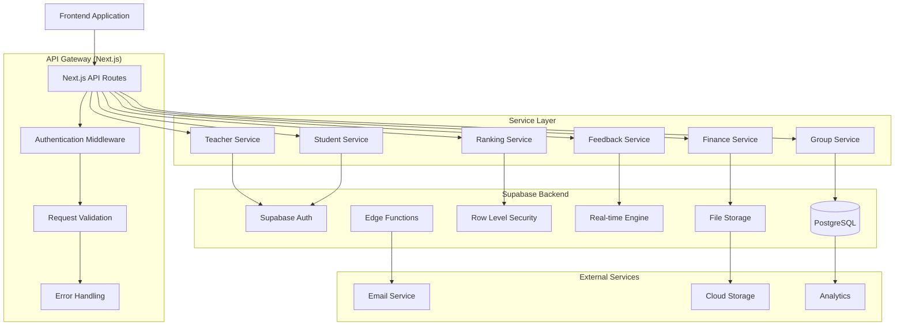

# Harry School Admin CRM - Backend Technical Documentation

## 1. Backend Overview

The Harry School Admin CRM backend is built on **Supabase**, a modern Backend-as-a-Service (BaaS) platform that provides PostgreSQL database, authentication, real-time subscriptions, edge functions, and file storage. The system uses **Next.js API routes** as a middleware layer for complex business logic and integrations.

### 1.1 Technology Stack

- **Database**: PostgreSQL 15+ with Supabase
- **API Framework**: Next.js 14+ API Routes
- **Authentication**: Supabase Auth with Row Level Security (RLS)
- **Real-time**: Supabase Real-time subscriptions
- **Storage**: Supabase Storage for file management
- **Functions**: Supabase Edge Functions (Deno runtime)
- **Language**: TypeScript for type safety

### 1.2 Backend Architecture Layers



## 2. Database Schema

### 2.1 Complete Database Schema Overview

The database consists of **30+ tables** organized into logical modules:

#### Core Tables (Multi-tenant Foundation)
- `organizations` - Tenant isolation and organization settings
- `profiles` - User management extending auth.users
- `schema_versions` - Database versioning and migrations

#### Educational Management Tables
- `teachers` - Teacher profiles and professional information
- `students` - Student profiles and academic information  
- `groups` - Class/course management
- `teacher_group_assignments` - Many-to-many teacher-group relationships
- `student_group_enrollments` - Many-to-many student-group relationships

#### Performance & Ranking Tables
- `student_rankings` - Unified ranking system for students
- `points_transactions` - Point earning/spending history
- `achievements` - Achievement definitions and criteria
- `student_achievements` - Achievement unlocks and progress
- `rewards_catalog` - Available rewards and prizes
- `reward_redemptions` - Reward purchase and delivery tracking

#### Feedback System Tables
- `feedback_entries` - Bidirectional feedback between teachers and students
- `feedback_templates` - Reusable feedback templates

#### Financial Management Tables
- `payment_methods` - Payment method configurations
- `payment_schedules` - Installment plan templates
- `discounts` - Discount and promotion management
- `scholarships` - Financial aid and scholarships
- `invoices` - Billing and invoice management
- `invoice_line_items` - Invoice detail items
- `payments` - Payment transaction records
- `payment_installments` - Installment payment tracking
- `financial_transactions` - All financial transaction history
- `student_accounts` - Student account balances

#### System Management Tables
- `notifications` - Real-time notification system
- `activity_logs` - Audit trail and system activity
- `system_settings` - System configuration
- `organization_settings` - Organization-specific settings
- `user_notification_settings` - User notification preferences
- `security_events` - Security audit and monitoring
- `user_sessions` - Active user session management
- `backup_history` - System backup tracking

### 2.2 Database Entity Relationship Diagram

```mermaid
erDiagram
    %% Multi-tenant Foundation
    organizations ||--o{ profiles : contains
    organizations ||--o{ teachers : has
    organizations ||--o{ students : has
    organizations ||--o{ groups : contains
    organizations ||--o{ system_settings : configures
    
    %% User Management
    profiles ||--o{ activity_logs : generates
    profiles ||--o{ notifications : receives
    profiles ||--o{ user_notification_settings : has
    
    %% Educational Core Relationships
    teachers }o--o{ groups : teaches
    students }o--o{ groups : enrolled_in
    teachers ||--o{ teacher_group_assignments : assigned_to
    students ||--o{ student_group_enrollments : enrolled_in
    
    %% Feedback System
    teachers ||--o{ feedback_entries : receives
    students ||--o{ feedback_entries : gives
    feedback_templates ||--o{ feedback_entries : templates
    
    %% Ranking & Achievement System
    students ||--o{ student_rankings : has_ranking
    students ||--o{ points_transactions : earns_points
    students ||--o{ student_achievements : unlocks
    achievements ||--o{ student_achievements : definition
    students ||--o{ reward_redemptions : redeems
    rewards_catalog ||--o{ reward_redemptions : catalog_item
    
    %% Financial Management
    students ||--o{ student_accounts : has_account
    students ||--o{ invoices : billed_to
    students ||--o{ scholarships : receives
    invoices ||--o{ invoice_line_items : contains
    invoices ||--o{ payments : paid_by
    payments ||--o{ payment_installments : split_into
    payment_methods ||--o{ payments : processed_by
    payment_schedules ||--o{ invoices : follows
    discounts ||--o{ invoices : applied_to
    
    %% System Relationships
    organizations ||--o{ backup_history : backed_up
    profiles ||--o{ security_events : triggers
    profiles ||--o{ user_sessions : active_in
```



### 2.3 Key Database Tables Detailed

#### 2.3.1 Core Tables

```sql
-- Organizations (Multi-tenant foundation)
CREATE TABLE organizations (
    id UUID PRIMARY KEY DEFAULT gen_random_uuid(),
    name TEXT NOT NULL,
    slug TEXT UNIQUE NOT NULL,
    logo_url TEXT,
    address JSONB,
    contact_info JSONB,
    settings JSONB DEFAULT '{}'::jsonb,
    subscription_plan TEXT DEFAULT 'basic',
    subscription_status TEXT DEFAULT 'active',
    max_students INTEGER DEFAULT 500,
    max_teachers INTEGER DEFAULT 50,
    max_groups INTEGER DEFAULT 50,
    
    -- Audit fields
    created_at TIMESTAMPTZ DEFAULT NOW(),
    updated_at TIMESTAMPTZ DEFAULT NOW(),
    created_by UUID REFERENCES auth.users(id),
    updated_by UUID REFERENCES auth.users(id),
    
    -- Soft delete
    deleted_at TIMESTAMPTZ,
    deleted_by UUID REFERENCES auth.users(id)
);

-- Profiles (User management extending auth.users)
CREATE TABLE profiles (
    id UUID PRIMARY KEY REFERENCES auth.users(id) ON DELETE CASCADE,
    organization_id UUID NOT NULL REFERENCES organizations(id) ON DELETE CASCADE,
    email TEXT NOT NULL,
    full_name TEXT NOT NULL,
    avatar_url TEXT,
    phone TEXT,
    role user_role NOT NULL DEFAULT 'admin',
    
    -- Profile settings
    language_preference TEXT DEFAULT 'en',
    timezone TEXT DEFAULT 'Asia/Tashkent',
    notification_preferences JSONB DEFAULT '{}',
    
    -- Activity tracking
    last_login_at TIMESTAMPTZ,
    login_count INTEGER DEFAULT 0,
    
    -- Audit fields
    created_at TIMESTAMPTZ DEFAULT NOW(),
    updated_at TIMESTAMPTZ DEFAULT NOW()
);
```

#### 2.3.2 Educational Management Tables

```sql
-- Teachers
CREATE TABLE teachers (
    id UUID PRIMARY KEY DEFAULT gen_random_uuid(),
    organization_id UUID NOT NULL REFERENCES organizations(id) ON DELETE CASCADE,
    
    -- Basic Information
    first_name TEXT NOT NULL,
    last_name TEXT NOT NULL,
    full_name TEXT GENERATED ALWAYS AS (first_name || ' ' || last_name) STORED,
    email TEXT,
    phone TEXT NOT NULL,
    date_of_birth DATE,
    gender TEXT CHECK (gender IN ('male', 'female', 'other')),
    
    -- Professional Information
    employee_id TEXT,
    hire_date DATE NOT NULL DEFAULT CURRENT_DATE,
    employment_status TEXT DEFAULT 'active',
    contract_type TEXT,
    salary_amount DECIMAL(10,2),
    salary_currency TEXT DEFAULT 'UZS',
    
    -- Education & Qualifications
    qualifications JSONB DEFAULT '[]'::jsonb,
    specializations TEXT[] DEFAULT '{}',
    certifications JSONB DEFAULT '[]'::jsonb,
    languages_spoken TEXT[] DEFAULT '{}',
    
    -- Contact & Personal
    address JSONB,
    emergency_contact JSONB,
    documents JSONB DEFAULT '[]'::jsonb,
    notes TEXT,
    
    -- System fields
    profile_image_url TEXT,
    is_active BOOLEAN DEFAULT true,
    
    -- Audit fields
    created_at TIMESTAMPTZ DEFAULT NOW(),
    updated_at TIMESTAMPTZ DEFAULT NOW(),
    created_by UUID REFERENCES auth.users(id),
    updated_by UUID REFERENCES auth.users(id),
    
    -- Soft delete
    deleted_at TIMESTAMPTZ,
    deleted_by UUID REFERENCES auth.users(id)
);

-- Students
CREATE TABLE students (
    id UUID PRIMARY KEY DEFAULT gen_random_uuid(),
    organization_id UUID NOT NULL REFERENCES organizations(id) ON DELETE CASCADE,
    
    -- Basic Information
    first_name TEXT NOT NULL,
    last_name TEXT NOT NULL,
    full_name TEXT GENERATED ALWAYS AS (first_name || ' ' || last_name) STORED,
    date_of_birth DATE NOT NULL,
    gender TEXT CHECK (gender IN ('male', 'female', 'other')),
    nationality TEXT,
    
    -- Student-specific Information
    student_id TEXT,
    enrollment_date DATE NOT NULL DEFAULT CURRENT_DATE,
    enrollment_status TEXT DEFAULT 'active',
    grade_level TEXT,
    
    -- Contact Information
    primary_phone TEXT,
    secondary_phone TEXT,
    email TEXT,
    address JSONB,
    
    -- Family Information
    parent_guardian_info JSONB DEFAULT '[]'::jsonb,
    emergency_contacts JSONB DEFAULT '[]'::jsonb,
    family_notes TEXT,
    
    -- Academic Information
    previous_education JSONB,
    special_needs TEXT,
    medical_notes TEXT,
    allergies TEXT,
    
    -- Financial Information
    payment_plan TEXT CHECK (payment_plan IN ('monthly', 'quarterly', 'annual', 'custom')),
    tuition_fee DECIMAL(10,2),
    currency TEXT DEFAULT 'UZS',
    payment_status TEXT DEFAULT 'current',
    
    -- System fields
    profile_image_url TEXT,
    documents JSONB DEFAULT '[]'::jsonb,
    notes TEXT,
    is_active BOOLEAN DEFAULT true,
    
    -- Audit fields (same pattern as teachers)
    created_at TIMESTAMPTZ DEFAULT NOW(),
    updated_at TIMESTAMPTZ DEFAULT NOW(),
    created_by UUID REFERENCES auth.users(id),
    updated_by UUID REFERENCES auth.users(id),
    deleted_at TIMESTAMPTZ,
    deleted_by UUID REFERENCES auth.users(id)
);

-- Groups
CREATE TABLE groups (
    id UUID PRIMARY KEY DEFAULT gen_random_uuid(),
    organization_id UUID NOT NULL REFERENCES organizations(id) ON DELETE CASCADE,
    
    -- Basic Information
    name TEXT NOT NULL,
    description TEXT,
    group_code TEXT,
    
    -- Academic Information
    subject TEXT NOT NULL,
    level TEXT,
    curriculum JSONB,
    
    -- Scheduling
    schedule JSONB NOT NULL,
    start_date DATE,
    end_date DATE,
    
    -- Capacity Management
    max_students INTEGER DEFAULT 20,
    current_enrollment INTEGER DEFAULT 0,
    
    -- Status and Settings
    status TEXT DEFAULT 'active',
    is_active BOOLEAN DEFAULT true,
    
    -- Audit fields (same pattern)
    created_at TIMESTAMPTZ DEFAULT NOW(),
    updated_at TIMESTAMPTZ DEFAULT NOW(),
    created_by UUID REFERENCES auth.users(id),
    updated_by UUID REFERENCES auth.users(id),
    deleted_at TIMESTAMPTZ,
    deleted_by UUID REFERENCES auth.users(id)
);
```

#### 2.3.3 Ranking & Feedback System Tables

```sql
-- Unified Student Rankings
CREATE TABLE student_rankings (
    id UUID PRIMARY KEY DEFAULT gen_random_uuid(),
    organization_id UUID NOT NULL REFERENCES organizations(id) ON DELETE CASCADE,
    student_id UUID NOT NULL REFERENCES students(id) ON DELETE CASCADE,
    
    -- Performance Metrics
    total_points INTEGER DEFAULT 0,
    available_coins INTEGER DEFAULT 0,
    spent_coins INTEGER DEFAULT 0,
    current_level INTEGER DEFAULT 1,
    current_rank INTEGER,
    
    -- Analytics
    last_activity_at TIMESTAMPTZ DEFAULT NOW(),
    
    -- Audit fields
    created_at TIMESTAMPTZ DEFAULT NOW(),
    updated_at TIMESTAMPTZ DEFAULT NOW(),
    
    UNIQUE(organization_id, student_id)
);

-- Points Transactions
CREATE TABLE points_transactions (
    id UUID PRIMARY KEY DEFAULT gen_random_uuid(),
    organization_id UUID NOT NULL REFERENCES organizations(id) ON DELETE CASCADE,
    student_id UUID NOT NULL REFERENCES students(id) ON DELETE CASCADE,
    
    -- Transaction Details
    transaction_type VARCHAR(20) NOT NULL CHECK (transaction_type IN ('earned', 'deducted', 'bonus', 'redeemed')),
    points_amount INTEGER NOT NULL,
    coins_earned INTEGER DEFAULT 0,
    reason TEXT NOT NULL,
    category VARCHAR(50) NOT NULL DEFAULT 'manual',
    
    -- Context
    related_entity_type VARCHAR(50),
    related_entity_id UUID,
    awarded_by UUID NOT NULL REFERENCES profiles(id),
    
    -- Audit fields
    created_at TIMESTAMPTZ DEFAULT NOW(),
    deleted_by UUID REFERENCES profiles(id),
    deleted_at TIMESTAMPTZ DEFAULT NULL
);

-- Bidirectional Feedback System
CREATE TABLE feedback_entries (
    id UUID PRIMARY KEY DEFAULT gen_random_uuid(),
    organization_id UUID REFERENCES organizations(id) ON DELETE CASCADE,
    
    -- Bidirectional feedback support
    from_user_id UUID REFERENCES profiles(id),
    to_user_id UUID REFERENCES profiles(id),
    from_user_type VARCHAR(10) CHECK (from_user_type IN ('student', 'teacher')),
    to_user_type VARCHAR(10) CHECK (to_user_type IN ('student', 'teacher')),
    
    -- Feedback content
    subject VARCHAR(200),
    message TEXT NOT NULL,
    rating INTEGER CHECK (rating >= 1 AND rating <= 5),
    category VARCHAR(50),
    
    -- Context and relationships
    group_id UUID REFERENCES groups(id),
    is_anonymous BOOLEAN DEFAULT false,
    
    -- Integration with ranking system
    affects_ranking BOOLEAN DEFAULT true,
    ranking_points_impact INTEGER DEFAULT 0,
    
    -- Admin management
    status VARCHAR(20) DEFAULT 'active',
    admin_response TEXT,
    responded_by UUID REFERENCES profiles(id),
    responded_at TIMESTAMPTZ,
    
    -- Audit fields
    created_at TIMESTAMPTZ DEFAULT NOW(),
    updated_at TIMESTAMPTZ DEFAULT NOW(),
    deleted_at TIMESTAMPTZ,
    deleted_by UUID REFERENCES profiles(id)
);
```

#### 2.3.4 Financial Management Tables

```sql
-- Payment Methods
CREATE TABLE payment_methods (
    id UUID DEFAULT gen_random_uuid() PRIMARY KEY,
    organization_id UUID NOT NULL REFERENCES organizations(id) ON DELETE CASCADE,
    name TEXT NOT NULL,
    type payment_method_type NOT NULL,
    is_active BOOLEAN DEFAULT true,
    gateway_config JSONB,
    processing_fee_percentage NUMERIC(5,2) DEFAULT 0,
    processing_fee_fixed NUMERIC(10,2) DEFAULT 0,
    display_order INTEGER DEFAULT 0,
    
    -- Audit fields
    created_at TIMESTAMPTZ DEFAULT now(),
    updated_at TIMESTAMPTZ DEFAULT now(),
    created_by UUID REFERENCES profiles(id),
    updated_by UUID REFERENCES profiles(id),
    deleted_at TIMESTAMPTZ,
    deleted_by UUID REFERENCES profiles(id)
);

-- Invoices
CREATE TABLE invoices (
    id UUID DEFAULT gen_random_uuid() PRIMARY KEY,
    organization_id UUID NOT NULL REFERENCES organizations(id) ON DELETE CASCADE,
    student_id UUID NOT NULL REFERENCES students(id) ON DELETE CASCADE,
    
    -- Invoice Details
    invoice_number TEXT NOT NULL,
    issue_date DATE NOT NULL DEFAULT CURRENT_DATE,
    due_date DATE NOT NULL,
    
    -- Financial Information
    subtotal NUMERIC(10,2) NOT NULL,
    tax_amount NUMERIC(10,2) DEFAULT 0,
    discount_amount NUMERIC(10,2) DEFAULT 0,
    total_amount NUMERIC(10,2) NOT NULL,
    currency TEXT DEFAULT 'UZS',
    
    -- Status and Management
    status invoice_status DEFAULT 'draft',
    payment_terms TEXT,
    notes TEXT,
    
    -- Audit fields
    created_at TIMESTAMPTZ DEFAULT now(),
    updated_at TIMESTAMPTZ DEFAULT now(),
    created_by UUID REFERENCES profiles(id),
    updated_by UUID REFERENCES profiles(id),
    deleted_at TIMESTAMPTZ,
    deleted_by UUID REFERENCES profiles(id)
);

-- Payments
CREATE TABLE payments (
    id UUID DEFAULT gen_random_uuid() PRIMARY KEY,
    organization_id UUID NOT NULL REFERENCES organizations(id) ON DELETE CASCADE,
    student_id UUID NOT NULL REFERENCES students(id) ON DELETE CASCADE,
    invoice_id UUID REFERENCES invoices(id) ON DELETE SET NULL,
    
    -- Payment Details
    payment_reference TEXT,
    amount NUMERIC(10,2) NOT NULL,
    currency TEXT DEFAULT 'UZS',
    payment_date DATE NOT NULL DEFAULT CURRENT_DATE,
    
    -- Payment Method and Processing
    payment_method_id UUID REFERENCES payment_methods(id),
    gateway_transaction_id TEXT,
    gateway_response JSONB,
    
    -- Status and Management
    status payment_status DEFAULT 'pending',
    notes TEXT,
    
    -- Audit fields
    created_at TIMESTAMPTZ DEFAULT now(),
    updated_at TIMESTAMPTZ DEFAULT now(),
    created_by UUID REFERENCES profiles(id),
    updated_by UUID REFERENCES profiles(id),
    deleted_at TIMESTAMPTZ,
    deleted_by UUID REFERENCES profiles(id)
);
```

### 2.4 Database Indexes and Performance Optimization

```sql
-- Essential indexes for core tables
CREATE INDEX CONCURRENTLY idx_teachers_org_active ON teachers(organization_id, is_active) WHERE deleted_at IS NULL;
CREATE INDEX CONCURRENTLY idx_students_org_status ON students(organization_id, enrollment_status) WHERE deleted_at IS NULL;
CREATE INDEX CONCURRENTLY idx_groups_org_active ON groups(organization_id, is_active) WHERE deleted_at IS NULL;

-- Search optimization indexes
CREATE INDEX CONCURRENTLY idx_teachers_search ON teachers USING gin(to_tsvector('english', full_name || ' ' || COALESCE(email, '')));
CREATE INDEX CONCURRENTLY idx_students_search ON students USING gin(to_tsvector('english', full_name || ' ' || COALESCE(primary_phone, '')));

-- Relationship indexes for JOINs
CREATE INDEX CONCURRENTLY idx_teacher_group_assignments_teacher ON teacher_group_assignments(teacher_id);
CREATE INDEX CONCURRENTLY idx_teacher_group_assignments_group ON teacher_group_assignments(group_id);
CREATE INDEX CONCURRENTLY idx_student_group_enrollments_student ON student_group_enrollments(student_id);
CREATE INDEX CONCURRENTLY idx_student_group_enrollments_group ON student_group_enrollments(group_id);

-- Performance indexes for ranking system
CREATE INDEX CONCURRENTLY idx_student_rankings_org_rank ON student_rankings(organization_id, current_rank) WHERE current_rank IS NOT NULL;
CREATE INDEX CONCURRENTLY idx_points_transactions_student_date ON points_transactions(student_id, created_at);

-- Financial indexes
CREATE INDEX CONCURRENTLY idx_invoices_student_status ON invoices(student_id, status) WHERE deleted_at IS NULL;
CREATE INDEX CONCURRENTLY idx_payments_student_date ON payments(student_id, payment_date) WHERE deleted_at IS NULL;

-- Feedback system indexes
CREATE INDEX CONCURRENTLY idx_feedback_entries_to_user ON feedback_entries(to_user_id, created_at) WHERE deleted_at IS NULL;
CREATE INDEX CONCURRENTLY idx_feedback_entries_from_user ON feedback_entries(from_user_id, created_at) WHERE deleted_at IS NULL;
```

## 3. Row Level Security (RLS) Policies

### 3.1 Organization-Level Isolation

```sql
-- Function to get user's organization ID
CREATE OR REPLACE FUNCTION get_user_organization_id(user_id UUID)
RETURNS UUID AS $$
BEGIN
  RETURN (
    SELECT organization_id 
    FROM profiles 
    WHERE id = user_id AND deleted_at IS NULL
  );
END;
$$ LANGUAGE plpgsql SECURITY DEFINER;

-- Function to get user's role
CREATE OR REPLACE FUNCTION get_user_role(user_id UUID)
RETURNS user_role AS $$
BEGIN
  RETURN (
    SELECT role 
    FROM profiles 
    WHERE id = user_id AND deleted_at IS NULL
  );
END;
$$ LANGUAGE plpgsql SECURITY DEFINER;
```

### 3.2 RLS Policies for Core Tables

```sql
-- Teachers RLS Policies
ALTER TABLE teachers ENABLE ROW LEVEL SECURITY;

CREATE POLICY "Teachers organization isolation" ON teachers
  USING (organization_id = get_user_organization_id(auth.uid()));

CREATE POLICY "Teachers admin access" ON teachers
  USING (get_user_role(auth.uid()) IN ('admin', 'superadmin'));

CREATE POLICY "Teachers viewer read only" ON teachers
  FOR SELECT
  USING (get_user_role(auth.uid()) = 'viewer');

-- Students RLS Policies
ALTER TABLE students ENABLE ROW LEVEL SECURITY;

CREATE POLICY "Students organization isolation" ON students
  USING (organization_id = get_user_organization_id(auth.uid()));

CREATE POLICY "Students admin access" ON students
  USING (get_user_role(auth.uid()) IN ('admin', 'superadmin'));

-- Groups RLS Policies
ALTER TABLE groups ENABLE ROW LEVEL SECURITY;

CREATE POLICY "Groups organization isolation" ON groups
  USING (organization_id = get_user_organization_id(auth.uid()));

-- Feedback RLS Policies
ALTER TABLE feedback_entries ENABLE ROW LEVEL SECURITY;

CREATE POLICY "Feedback involved parties access" ON feedback_entries
  USING (
    from_user_id = auth.uid() OR 
    to_user_id = auth.uid() OR
    organization_id = get_user_organization_id(auth.uid()) 
    AND get_user_role(auth.uid()) IN ('admin', 'superadmin')
  );

-- Financial RLS Policies
ALTER TABLE invoices ENABLE ROW LEVEL SECURITY;
ALTER TABLE payments ENABLE ROW LEVEL SECURITY;

CREATE POLICY "Invoices organization isolation" ON invoices
  USING (organization_id = get_user_organization_id(auth.uid()));

CREATE POLICY "Payments organization isolation" ON payments
  USING (organization_id = get_user_organization_id(auth.uid()));
```

## 4. API Endpoints Documentation

### 4.1 Teachers API Endpoints

#### `GET /api/teachers`
```typescript
// Query Parameters
interface TeachersQuery {
  page?: number
  limit?: number
  search?: string
  specialization?: string
  employment_status?: 'active' | 'inactive' | 'on_leave' | 'terminated'
  sort_by?: 'name' | 'hire_date' | 'created_at'
  sort_order?: 'asc' | 'desc'
}

// Response
interface TeachersResponse {
  data: Teacher[]
  pagination: {
    page: number
    limit: number
    total: number
    pages: number
  }
}
```

#### `POST /api/teachers`
```typescript
// Request Body
interface CreateTeacherRequest {
  first_name: string
  last_name: string
  email?: string
  phone: string
  date_of_birth?: string
  gender?: 'male' | 'female' | 'other'
  employee_id?: string
  hire_date: string
  employment_status?: 'active' | 'inactive' | 'on_leave' | 'terminated'
  contract_type?: 'full_time' | 'part_time' | 'contract' | 'substitute'
  salary_amount?: number
  specializations?: string[]
  qualifications?: Qualification[]
  address?: Address
  emergency_contact?: Contact
}

// Response
interface CreateTeacherResponse {
  data: Teacher
  message: string
}
```

#### `GET /api/teachers/[id]`
```typescript
// Path Parameters
interface TeacherPathParams {
  id: string
}

// Response
interface TeacherResponse {
  data: Teacher & {
    groups: Group[]
    assignments: TeacherGroupAssignment[]
    feedback_summary: FeedbackSummary
    performance_metrics: TeacherPerformanceMetrics
  }
}
```

#### `PUT /api/teachers/[id]`
```typescript
// Request Body (Partial update)
interface UpdateTeacherRequest extends Partial<CreateTeacherRequest> {}

// Response
interface UpdateTeacherResponse {
  data: Teacher
  message: string
}
```

#### `DELETE /api/teachers/[id]`
```typescript
// Soft delete - moves to deleted state
// Response
interface DeleteTeacherResponse {
  message: string
  deleted_at: string
}
```

### 4.2 Students API Endpoints

#### `GET /api/students`
```typescript
interface StudentsQuery {
  page?: number
  limit?: number
  search?: string
  enrollment_status?: 'active' | 'inactive' | 'graduated' | 'transferred' | 'expelled' | 'on_hold'
  grade_level?: string
  payment_status?: 'current' | 'overdue' | 'paid_ahead' | 'partial' | 'suspended'
  group_id?: string
  sort_by?: 'name' | 'enrollment_date' | 'created_at'
  sort_order?: 'asc' | 'desc'
}

interface StudentsResponse {
  data: Student[]
  pagination: PaginationMeta
  summary: {
    total_students: number
    active_students: number
    inactive_students: number
    overdue_payments: number
  }
}
```

#### `POST /api/students`
```typescript
interface CreateStudentRequest {
  first_name: string
  last_name: string
  date_of_birth: string
  gender?: 'male' | 'female' | 'other'
  nationality?: string
  student_id?: string
  enrollment_date: string
  enrollment_status?: 'active' | 'inactive' | 'graduated' | 'transferred' | 'expelled' | 'on_hold'
  grade_level?: string
  primary_phone?: string
  secondary_phone?: string
  email?: string
  address?: Address
  parent_guardian_info?: ParentGuardian[]
  emergency_contacts?: Contact[]
  payment_plan?: 'monthly' | 'quarterly' | 'annual' | 'custom'
  tuition_fee?: number
  special_needs?: string
  medical_notes?: string
  allergies?: string
}
```

### 4.3 Groups API Endpoints

#### `GET /api/groups`
```typescript
interface GroupsQuery {
  page?: number
  limit?: number
  search?: string
  subject?: string
  level?: string
  status?: 'active' | 'inactive' | 'completed' | 'cancelled'
  teacher_id?: string
  has_capacity?: boolean
}

interface GroupsResponse {
  data: Group[]
  pagination: PaginationMeta
}
```

#### `POST /api/groups`
```typescript
interface CreateGroupRequest {
  name: string
  description?: string
  group_code?: string
  subject: string
  level?: string
  curriculum?: object
  schedule: GroupSchedule
  start_date?: string
  end_date?: string
  max_students?: number
  teacher_ids?: string[]
}

interface GroupSchedule {
  days: Array<'monday' | 'tuesday' | 'wednesday' | 'thursday' | 'friday' | 'saturday' | 'sunday'>
  start_time: string
  end_time: string
  frequency: 'weekly' | 'biweekly' | 'monthly'
  timezone: string
}
```

### 4.4 Rankings API Endpoints

#### `GET /api/rankings/leaderboard`
```typescript
interface LeaderboardQuery {
  type?: 'students' | 'teachers' | 'all'
  period?: 'daily' | 'weekly' | 'monthly' | 'all_time'
  limit?: number
  group_id?: string
}

interface LeaderboardResponse {
  data: Array<{
    user_id: string
    user_name: string
    user_type: 'student' | 'teacher'
    total_points: number
    current_rank: number
    level: number
    badges: Badge[]
    recent_achievements: Achievement[]
  }>
  period: string
  generated_at: string
}
```

#### `POST /api/rankings/points`
```typescript
interface AwardPointsRequest {
  student_id: string
  points_amount: number
  reason: string
  category: string
  related_entity_type?: string
  related_entity_id?: string
}

interface AwardPointsResponse {
  data: {
    transaction_id: string
    new_total_points: number
    coins_earned: number
    level_change?: {
      previous_level: number
      new_level: number
    }
    achievements_unlocked?: Achievement[]
  }
  message: string
}
```

### 4.5 Rewards API Endpoints

#### `GET /api/rewards/catalog`
```typescript
interface RewardsCatalogQuery {
  category?: 'general' | 'academic' | 'behavioral' | 'attendance' | 'special'
  type?: 'privilege' | 'certificate' | 'recognition' | 'physical' | 'special'
  available_only?: boolean
  student_id?: string // For filtering based on student's available coins
}

interface RewardsCatalogResponse {
  data: Array<{
    id: string
    name: string
    description: string
    coin_cost: number
    reward_type: string
    reward_category: string
    inventory_quantity?: number
    max_redemptions_per_student?: number
    requires_approval: boolean
    is_featured: boolean
    image_url?: string
    can_redeem: boolean // Based on student's available coins
  }>
}
```

#### `POST /api/rewards/redeem`
```typescript
interface RedeemRewardRequest {
  student_id: string
  reward_id: string
  request_notes?: string
  delivery_method?: 'pickup' | 'delivery' | 'digital'
  delivery_address?: string
}

interface RedeemRewardResponse {
  data: {
    redemption_id: string
    coins_spent: number
    remaining_coins: number
    status: 'pending' | 'approved' | 'delivered'
    estimated_delivery?: string
  }
  message: string
}
```

### 4.6 Finance API Endpoints

#### `GET /api/finance/invoices`
```typescript
interface InvoicesQuery {
  student_id?: string
  status?: 'draft' | 'sent' | 'paid' | 'partially_paid' | 'overdue' | 'cancelled'
  from_date?: string
  to_date?: string
  page?: number
  limit?: number
}

interface InvoicesResponse {
  data: Invoice[]
  pagination: PaginationMeta
  summary: {
    total_invoices: number
    total_amount: number
    paid_amount: number
    outstanding_amount: number
    overdue_amount: number
  }
}
```

#### `POST /api/finance/payments`
```typescript
interface RecordPaymentRequest {
  student_id: string
  invoice_id?: string
  amount: number
  currency?: string
  payment_date: string
  payment_method_id: string
  payment_reference?: string
  notes?: string
}

interface RecordPaymentResponse {
  data: {
    payment_id: string
    amount: number
    invoice_updated: boolean
    new_invoice_status?: string
    remaining_balance?: number
  }
  message: string
}
```

### 4.7 Feedback API Endpoints

#### `GET /api/feedback`
```typescript
interface FeedbackQuery {
  from_user_id?: string
  to_user_id?: string
  user_type?: 'student' | 'teacher'
  category?: string
  status?: 'active' | 'reviewed' | 'resolved' | 'flagged'
  group_id?: string
  rating_min?: number
  rating_max?: number
  from_date?: string
  to_date?: string
}

interface FeedbackResponse {
  data: FeedbackEntry[]
  analytics: {
    average_rating: number
    total_feedback: number
    category_breakdown: Array<{
      category: string
      count: number
      average_rating: number
    }>
    trend_data: Array<{
      date: string
      count: number
      average_rating: number
    }>
  }
}
```

#### `POST /api/feedback`
```typescript
interface CreateFeedbackRequest {
  from_user_id: string
  to_user_id: string
  from_user_type: 'student' | 'teacher'
  to_user_type: 'student' | 'teacher'
  subject?: string
  message: string
  rating: number // 1-5
  category: string
  group_id?: string
  is_anonymous?: boolean
  affects_ranking?: boolean
}

interface CreateFeedbackResponse {
  data: {
    feedback_id: string
    ranking_points_impact: number
    recipient_new_rating: number
  }
  message: string
}
```

### 4.8 Notifications API Endpoints

#### `GET /api/notifications`
```typescript
interface NotificationsQuery {
  type?: string
  status?: 'unread' | 'read' | 'archived'
  limit?: number
  before?: string // For pagination
}

interface NotificationsResponse {
  data: Array<{
    id: string
    type: string
    title: string
    message: string
    metadata?: object
    read_at?: string
    created_at: string
  }>
  unread_count: number
  has_more: boolean
}
```

#### `POST /api/notifications/send`
```typescript
interface SendNotificationRequest {
  user_ids: string[]
  type: string
  title: string
  message: string
  metadata?: object
  scheduled_for?: string
}
```

## 5. Service Layer Architecture

### 5.1 Base Service Class

```typescript
import { SupabaseClient } from '@supabase/supabase-js'
import { Database } from '@/types/database.generated'

abstract class BaseService<T> {
  protected supabase: SupabaseClient<Database>
  protected tableName: string

  constructor(supabase: SupabaseClient<Database>, tableName: string) {
    this.supabase = supabase
    this.tableName = tableName
  }

  // Core CRUD operations
  async getAll(filters?: FilterOptions): Promise<T[]> {
    let query = this.supabase
      .from(this.tableName)
      .select('*')
      .is('deleted_at', null)

    if (filters) {
      query = this.applyFilters(query, filters)
    }

    const { data, error } = await query
    if (error) throw new DatabaseError(error.message)
    return data as T[]
  }

  async getById(id: string): Promise<T | null> {
    const { data, error } = await this.supabase
      .from(this.tableName)
      .select('*')
      .eq('id', id)
      .is('deleted_at', null)
      .single()

    if (error) {
      if (error.code === 'PGRST116') return null
      throw new DatabaseError(error.message)
    }
    return data as T
  }

  async create(data: Partial<T>): Promise<T> {
    const { data: result, error } = await this.supabase
      .from(this.tableName)
      .insert(data)
      .select()
      .single()

    if (error) throw new DatabaseError(error.message)
    return result as T
  }

  async update(id: string, data: Partial<T>): Promise<T> {
    const { data: result, error } = await this.supabase
      .from(this.tableName)
      .update({ ...data, updated_at: new Date().toISOString() })
      .eq('id', id)
      .select()
      .single()

    if (error) throw new DatabaseError(error.message)
    return result as T
  }

  async delete(id: string): Promise<void> {
    const { error } = await this.supabase
      .from(this.tableName)
      .update({ deleted_at: new Date().toISOString() })
      .eq('id', id)

    if (error) throw new DatabaseError(error.message)
  }

  // Utility methods
  protected applyFilters(query: any, filters: FilterOptions): any {
    if (filters.search) {
      query = query.or(`full_name.ilike.%${filters.search}%,email.ilike.%${filters.search}%`)
    }
    
    if (filters.status) {
      query = query.eq('status', filters.status)
    }
    
    if (filters.sort_by) {
      const ascending = filters.sort_order !== 'desc'
      query = query.order(filters.sort_by, { ascending })
    }
    
    if (filters.limit) {
      query = query.limit(filters.limit)
    }
    
    if (filters.offset) {
      query = query.range(filters.offset, filters.offset + (filters.limit || 10) - 1)
    }
    
    return query
  }
}
```

### 5.2 Specific Service Implementations

#### Teacher Service
```typescript
class TeacherService extends BaseService<Teacher> {
  constructor(supabase: SupabaseClient<Database>) {
    super(supabase, 'teachers')
  }

  async getTeachersBySpecialization(specialization: string): Promise<Teacher[]> {
    const { data, error } = await this.supabase
      .from('teachers')
      .select('*')
      .contains('specializations', [specialization])
      .is('deleted_at', null)

    if (error) throw new DatabaseError(error.message)
    return data as Teacher[]
  }

  async assignTeacherToGroup(teacherId: string, groupId: string): Promise<void> {
    const { error } = await this.supabase
      .from('teacher_group_assignments')
      .insert({
        teacher_id: teacherId,
        group_id: groupId,
        assigned_at: new Date().toISOString()
      })

    if (error) throw new DatabaseError(error.message)
  }

  async getTeacherWithGroups(teacherId: string): Promise<TeacherWithGroups> {
    const { data, error } = await this.supabase
      .from('teachers')
      .select(`
        *,
        teacher_group_assignments (
          *,
          groups (*)
        )
      `)
      .eq('id', teacherId)
      .is('deleted_at', null)
      .single()

    if (error) throw new DatabaseError(error.message)
    return data as TeacherWithGroups
  }

  async getTeacherPerformanceMetrics(teacherId: string): Promise<TeacherPerformanceMetrics> {
    const { data, error } = await this.supabase
      .rpc('get_teacher_performance_metrics', { teacher_id: teacherId })

    if (error) throw new DatabaseError(error.message)
    return data as TeacherPerformanceMetrics
  }
}
```

#### Student Service
```typescript
class StudentService extends BaseService<Student> {
  constructor(supabase: SupabaseClient<Database>) {
    super(supabase, 'students')
  }

  async getStudentsByGroup(groupId: string): Promise<Student[]> {
    const { data, error } = await this.supabase
      .from('students')
      .select(`
        *,
        student_group_enrollments!inner (
          group_id
        )
      `)
      .eq('student_group_enrollments.group_id', groupId)
      .is('deleted_at', null)

    if (error) throw new DatabaseError(error.message)
    return data as Student[]
  }

  async enrollStudentInGroup(studentId: string, groupId: string): Promise<void> {
    const { error } = await this.supabase
      .from('student_group_enrollments')
      .insert({
        student_id: studentId,
        group_id: groupId,
        enrollment_date: new Date().toISOString(),
        status: 'active'
      })

    if (error) throw new DatabaseError(error.message)
  }

  async getStudentRankingInfo(studentId: string): Promise<StudentRanking> {
    const { data, error } = await this.supabase
      .from('student_rankings')
      .select('*')
      .eq('student_id', studentId)
      .single()

    if (error) throw new DatabaseError(error.message)
    return data as StudentRanking
  }

  async awardPointsToStudent(
    studentId: string, 
    points: number, 
    reason: string, 
    category: string
  ): Promise<PointsTransaction> {
    const { data, error } = await this.supabase
      .rpc('award_points_to_student', {
        p_student_id: studentId,
        p_points: points,
        p_reason: reason,
        p_category: category
      })

    if (error) throw new DatabaseError(error.message)
    return data as PointsTransaction
  }
}
```

#### Feedback Service
```typescript
class FeedbackService extends BaseService<FeedbackEntry> {
  constructor(supabase: SupabaseClient<Database>) {
    super(supabase, 'feedback_entries')
  }

  async createFeedback(feedback: CreateFeedbackRequest): Promise<FeedbackEntry> {
    const { data, error } = await this.supabase
      .rpc('create_feedback_with_ranking_impact', {
        p_feedback: feedback
      })

    if (error) throw new DatabaseError(error.message)
    return data as FeedbackEntry
  }

  async getFeedbackAnalytics(userId: string, userType: 'student' | 'teacher'): Promise<FeedbackAnalytics> {
    const { data, error } = await this.supabase
      .rpc('get_feedback_analytics', {
        p_user_id: userId,
        p_user_type: userType
      })

    if (error) throw new DatabaseError(error.message)
    return data as FeedbackAnalytics
  }

  async getFeedbackByUser(
    userId: string, 
    direction: 'received' | 'given' = 'received'
  ): Promise<FeedbackEntry[]> {
    const column = direction === 'received' ? 'to_user_id' : 'from_user_id'
    
    const { data, error } = await this.supabase
      .from('feedback_entries')
      .select('*')
      .eq(column, userId)
      .is('deleted_at', null)
      .order('created_at', { ascending: false })

    if (error) throw new DatabaseError(error.message)
    return data as FeedbackEntry[]
  }
}
```

## 6. Database Functions and Procedures

### 6.1 Core Database Functions

```sql
-- Function to award points and update rankings
CREATE OR REPLACE FUNCTION award_points_to_student(
  p_student_id UUID,
  p_points INTEGER,
  p_reason TEXT,
  p_category VARCHAR(50) DEFAULT 'manual',
  p_awarded_by UUID DEFAULT auth.uid()
)
RETURNS points_transactions AS $$
DECLARE
  v_transaction points_transactions;
  v_coins_earned INTEGER;
  v_organization_id UUID;
BEGIN
  -- Get organization ID
  SELECT organization_id INTO v_organization_id
  FROM students 
  WHERE id = p_student_id;
  
  -- Calculate coins earned (1 coin per 10 points)
  v_coins_earned := p_points / 10;
  
  -- Insert transaction
  INSERT INTO points_transactions (
    organization_id,
    student_id,
    transaction_type,
    points_amount,
    coins_earned,
    reason,
    category,
    awarded_by
  ) VALUES (
    v_organization_id,
    p_student_id,
    CASE WHEN p_points > 0 THEN 'earned' ELSE 'deducted' END,
    p_points,
    v_coins_earned,
    p_reason,
    p_category,
    p_awarded_by
  ) RETURNING * INTO v_transaction;
  
  -- Update student ranking
  INSERT INTO student_rankings (
    organization_id,
    student_id,
    total_points,
    available_coins,
    current_level,
    last_activity_at
  ) VALUES (
    v_organization_id,
    p_student_id,
    p_points,
    v_coins_earned,
    1,
    NOW()
  ) 
  ON CONFLICT (organization_id, student_id) 
  DO UPDATE SET
    total_points = student_rankings.total_points + p_points,
    available_coins = student_rankings.available_coins + v_coins_earned,
    current_level = GREATEST(1, (student_rankings.total_points + p_points) / 100),
    last_activity_at = NOW(),
    updated_at = NOW();
  
  -- Update rankings for all students in organization
  PERFORM update_student_rankings(v_organization_id);
  
  RETURN v_transaction;
END;
$$ LANGUAGE plpgsql SECURITY DEFINER;

-- Function to update student rankings
CREATE OR REPLACE FUNCTION update_student_rankings(p_organization_id UUID)
RETURNS VOID AS $$
BEGIN
  WITH ranked_students AS (
    SELECT 
      id,
      ROW_NUMBER() OVER (ORDER BY total_points DESC, last_activity_at ASC) as new_rank
    FROM student_rankings
    WHERE organization_id = p_organization_id
  )
  UPDATE student_rankings 
  SET 
    current_rank = ranked_students.new_rank,
    updated_at = NOW()
  FROM ranked_students
  WHERE student_rankings.id = ranked_students.id;
END;
$$ LANGUAGE plpgsql SECURITY DEFINER;

-- Function to create feedback with ranking impact
CREATE OR REPLACE FUNCTION create_feedback_with_ranking_impact(p_feedback JSONB)
RETURNS feedback_entries AS $$
DECLARE
  v_feedback feedback_entries;
  v_points_impact INTEGER;
BEGIN
  -- Calculate points impact based on rating
  v_points_impact := CASE 
    WHEN (p_feedback->>'rating')::INTEGER >= 4 THEN 10
    WHEN (p_feedback->>'rating')::INTEGER = 3 THEN 0
    ELSE -5
  END;
  
  -- Insert feedback entry
  INSERT INTO feedback_entries (
    organization_id,
    from_user_id,
    to_user_id,
    from_user_type,
    to_user_type,
    subject,
    message,
    rating,
    category,
    group_id,
    is_anonymous,
    affects_ranking,
    ranking_points_impact
  ) VALUES (
    (p_feedback->>'organization_id')::UUID,
    (p_feedback->>'from_user_id')::UUID,
    (p_feedback->>'to_user_id')::UUID,
    p_feedback->>'from_user_type',
    p_feedback->>'to_user_type',
    p_feedback->>'subject',
    p_feedback->>'message',
    (p_feedback->>'rating')::INTEGER,
    p_feedback->>'category',
    (p_feedback->>'group_id')::UUID,
    COALESCE((p_feedback->>'is_anonymous')::BOOLEAN, false),
    COALESCE((p_feedback->>'affects_ranking')::BOOLEAN, true),
    v_points_impact
  ) RETURNING * INTO v_feedback;
  
  -- Award points if recipient is a student and affects ranking
  IF v_feedback.to_user_type = 'student' AND v_feedback.affects_ranking THEN
    PERFORM award_points_to_student(
      v_feedback.to_user_id,
      v_points_impact,
      'Feedback from ' || v_feedback.from_user_type,
      'feedback'
    );
  END IF;
  
  RETURN v_feedback;
END;
$$ LANGUAGE plpgsql SECURITY DEFINER;
```

### 6.2 Analytics and Reporting Functions

```sql
-- Get teacher performance metrics
CREATE OR REPLACE FUNCTION get_teacher_performance_metrics(p_teacher_id UUID)
RETURNS JSONB AS $$
DECLARE
  v_result JSONB;
BEGIN
  SELECT jsonb_build_object(
    'total_groups', COUNT(DISTINCT tga.group_id),
    'total_students', COUNT(DISTINCT sge.student_id),
    'average_rating', ROUND(AVG(fe.rating), 2),
    'total_feedback', COUNT(fe.id),
    'rating_distribution', jsonb_object_agg(fe.rating::text, rating_counts.count),
    'recent_feedback_trend', (
      SELECT jsonb_agg(
        jsonb_build_object(
          'date', date_trunc('day', created_at),
          'count', COUNT(*),
          'avg_rating', AVG(rating)
        )
      )
      FROM feedback_entries
      WHERE to_user_id = p_teacher_id
        AND created_at >= NOW() - INTERVAL '30 days'
        AND deleted_at IS NULL
      GROUP BY date_trunc('day', created_at)
      ORDER BY date_trunc('day', created_at)
    )
  ) INTO v_result
  FROM teachers t
  LEFT JOIN teacher_group_assignments tga ON t.id = tga.teacher_id
  LEFT JOIN student_group_enrollments sge ON tga.group_id = sge.group_id
  LEFT JOIN feedback_entries fe ON t.id = fe.to_user_id AND fe.deleted_at IS NULL
  LEFT JOIN LATERAL (
    SELECT rating, COUNT(*) as count
    FROM feedback_entries
    WHERE to_user_id = p_teacher_id AND deleted_at IS NULL
    GROUP BY rating
  ) rating_counts ON true
  WHERE t.id = p_teacher_id AND t.deleted_at IS NULL;
  
  RETURN v_result;
END;
$$ LANGUAGE plpgsql SECURITY DEFINER;

-- Get dashboard analytics
CREATE OR REPLACE FUNCTION get_dashboard_analytics(p_organization_id UUID)
RETURNS JSONB AS $$
DECLARE
  v_result JSONB;
BEGIN
  SELECT jsonb_build_object(
    'students', jsonb_build_object(
      'total', COUNT(DISTINCT s.id),
      'active', COUNT(DISTINCT s.id) FILTER (WHERE s.enrollment_status = 'active'),
      'recent_enrollments', COUNT(DISTINCT s.id) FILTER (WHERE s.created_at >= NOW() - INTERVAL '30 days')
    ),
    'teachers', jsonb_build_object(
      'total', COUNT(DISTINCT t.id),
      'active', COUNT(DISTINCT t.id) FILTER (WHERE t.employment_status = 'active')
    ),
    'groups', jsonb_build_object(
      'total', COUNT(DISTINCT g.id),
      'active', COUNT(DISTINCT g.id) FILTER (WHERE g.is_active = true)
    ),
    'financial', jsonb_build_object(
      'monthly_revenue', COALESCE(SUM(p.amount) FILTER (WHERE p.payment_date >= date_trunc('month', NOW())), 0),
      'outstanding_balance', COALESCE(SUM(i.total_amount) FILTER (WHERE i.status IN ('sent', 'overdue')), 0)
    ),
    'rankings', jsonb_build_object(
      'total_points_awarded', COALESCE(SUM(pt.points_amount) FILTER (WHERE pt.points_amount > 0), 0),
      'total_coins_earned', COALESCE(SUM(pt.coins_earned), 0)
    )
  ) INTO v_result
  FROM organizations o
  LEFT JOIN students s ON o.id = s.organization_id AND s.deleted_at IS NULL
  LEFT JOIN teachers t ON o.id = t.organization_id AND t.deleted_at IS NULL
  LEFT JOIN groups g ON o.id = g.organization_id AND g.deleted_at IS NULL
  LEFT JOIN invoices i ON o.id = i.organization_id AND i.deleted_at IS NULL
  LEFT JOIN payments p ON o.id = p.organization_id AND p.deleted_at IS NULL
  LEFT JOIN points_transactions pt ON o.id = pt.organization_id AND pt.deleted_at IS NULL
  WHERE o.id = p_organization_id;
  
  RETURN v_result;
END;
$$ LANGUAGE plpgsql SECURITY DEFINER;
```

## 7. Real-time Features Implementation

### 7.1 Real-time Subscriptions

```typescript
// Notification real-time subscription
export const useNotificationSubscription = (userId: string) => {
  const [notifications, setNotifications] = useState<Notification[]>([])
  
  useEffect(() => {
    const channel = supabase
      .channel('user_notifications')
      .on(
        'postgres_changes',
        {
          event: 'INSERT',
          schema: 'public',
          table: 'notifications',
          filter: `user_id=eq.${userId}`
        },
        (payload) => {
          setNotifications(prev => [payload.new as Notification, ...prev])
          
          // Show toast notification
          toast({
            title: payload.new.title,
            description: payload.new.message,
          })
        }
      )
      .subscribe()

    return () => {
      supabase.removeChannel(channel)
    }
  }, [userId])

  return notifications
}

// Ranking updates real-time subscription
export const useRankingSubscription = (studentId: string) => {
  const [ranking, setRanking] = useState<StudentRanking | null>(null)
  
  useEffect(() => {
    const channel = supabase
      .channel('ranking_updates')
      .on(
        'postgres_changes',
        {
          event: 'UPDATE',
          schema: 'public',
          table: 'student_rankings',
          filter: `student_id=eq.${studentId}`
        },
        (payload) => {
          setRanking(payload.new as StudentRanking)
          
          // Show achievement notification if level increased
          if (payload.old.current_level < payload.new.current_level) {
            toast({
              title: '🎉 Level Up!',
              description: `Congratulations! You've reached level ${payload.new.current_level}`,
            })
          }
        }
      )
      .subscribe()

    return () => {
      supabase.removeChannel(channel)
    }
  }, [studentId])

  return ranking
}
```

### 7.2 Database Triggers for Real-time Events

```sql
-- Trigger function to create notifications
CREATE OR REPLACE FUNCTION create_notification_trigger()
RETURNS TRIGGER AS $$
BEGIN
  -- Create notification for new feedback
  IF TG_TABLE_NAME = 'feedback_entries' AND TG_OP = 'INSERT' THEN
    INSERT INTO notifications (
      organization_id,
      user_id,
      type,
      title,
      message,
      metadata
    ) VALUES (
      NEW.organization_id,
      NEW.to_user_id,
      'feedback_received',
      'New Feedback Received',
      'You have received new feedback with a rating of ' || NEW.rating || ' stars',
      jsonb_build_object(
        'feedback_id', NEW.id,
        'from_user_type', NEW.from_user_type,
        'rating', NEW.rating
      )
    );
  END IF;
  
  -- Create notification for points awarded
  IF TG_TABLE_NAME = 'points_transactions' AND TG_OP = 'INSERT' AND NEW.points_amount > 0 THEN
    INSERT INTO notifications (
      organization_id,
      user_id,
      type,
      title,
      message,
      metadata
    ) VALUES (
      NEW.organization_id,
      NEW.student_id,
      'points_awarded',
      'Points Awarded! 🎉',
      'You earned ' || NEW.points_amount || ' points: ' || NEW.reason,
      jsonb_build_object(
        'transaction_id', NEW.id,
        'points', NEW.points_amount,
        'coins_earned', NEW.coins_earned
      )
    );
  END IF;
  
  RETURN NEW;
END;
$$ LANGUAGE plpgsql;

-- Create triggers
CREATE TRIGGER feedback_notification_trigger
  AFTER INSERT ON feedback_entries
  FOR EACH ROW
  EXECUTE FUNCTION create_notification_trigger();

CREATE TRIGGER points_notification_trigger
  AFTER INSERT ON points_transactions
  FOR EACH ROW
  EXECUTE FUNCTION create_notification_trigger();
```

## 8. Error Handling and Validation

### 8.1 Custom Error Classes

```typescript
export class DatabaseError extends Error {
  constructor(message: string, public code?: string) {
    super(message)
    this.name = 'DatabaseError'
  }
}

export class ValidationError extends Error {
  constructor(
    message: string, 
    public field?: string,
    public issues?: Array<{ field: string; message: string }>
  ) {
    super(message)
    this.name = 'ValidationError'
  }
}

export class AuthorizationError extends Error {
  constructor(message: string = 'Unauthorized access') {
    super(message)
    this.name = 'AuthorizationError'
  }
}

export class NotFoundError extends Error {
  constructor(resource: string, id?: string) {
    super(`${resource}${id ? ` with id ${id}` : ''} not found`)
    this.name = 'NotFoundError'
  }
}
```

### 8.2 API Error Handler Middleware

```typescript
import { NextRequest, NextResponse } from 'next/server'
import { ZodError } from 'zod'

export function withErrorHandling(handler: Function) {
  return async (request: NextRequest, context?: any) => {
    try {
      return await handler(request, context)
    } catch (error) {
      console.error('API Error:', error)

      if (error instanceof ZodError) {
        return NextResponse.json(
          {
            error: 'Validation failed',
            issues: error.issues.map(issue => ({
              field: issue.path.join('.'),
              message: issue.message
            }))
          },
          { status: 400 }
        )
      }

      if (error instanceof ValidationError) {
        return NextResponse.json(
          {
            error: error.message,
            field: error.field,
            issues: error.issues
          },
          { status: 400 }
        )
      }

      if (error instanceof AuthorizationError) {
        return NextResponse.json(
          { error: error.message },
          { status: 403 }
        )
      }

      if (error instanceof NotFoundError) {
        return NextResponse.json(
          { error: error.message },
          { status: 404 }
        )
      }

      if (error instanceof DatabaseError) {
        return NextResponse.json(
          { error: 'Database operation failed', details: error.message },
          { status: 500 }
        )
      }

      // Generic error
      return NextResponse.json(
        { error: 'Internal server error' },
        { status: 500 }
      )
    }
  }
}
```

### 8.3 Input Validation Schemas

```typescript
import { z } from 'zod'

export const TeacherCreateSchema = z.object({
  first_name: z.string().min(1, 'First name is required').max(100),
  last_name: z.string().min(1, 'Last name is required').max(100),
  email: z.string().email('Invalid email format').optional(),
  phone: z.string().min(10, 'Phone must be at least 10 digits').max(20),
  date_of_birth: z.string().datetime('Invalid date format').optional(),
  gender: z.enum(['male', 'female', 'other']).optional(),
  employee_id: z.string().max(50).optional(),
  hire_date: z.string().datetime('Invalid date format'),
  employment_status: z.enum(['active', 'inactive', 'on_leave', 'terminated']).default('active'),
  contract_type: z.enum(['full_time', 'part_time', 'contract', 'substitute']).optional(),
  salary_amount: z.number().positive('Salary must be positive').optional(),
  specializations: z.array(z.string()).default([]),
  qualifications: z.array(z.object({
    degree: z.string(),
    institution: z.string(),
    year: z.number().int().min(1950).max(new Date().getFullYear()),
    field_of_study: z.string().optional()
  })).default([])
})

export const StudentCreateSchema = z.object({
  first_name: z.string().min(1, 'First name is required').max(100),
  last_name: z.string().min(1, 'Last name is required').max(100),
  date_of_birth: z.string().datetime('Invalid date format'),
  gender: z.enum(['male', 'female', 'other']).optional(),
  nationality: z.string().max(50).optional(),
  student_id: z.string().max(50).optional(),
  enrollment_date: z.string().datetime('Invalid date format'),
  enrollment_status: z.enum(['active', 'inactive', 'graduated', 'transferred', 'expelled', 'on_hold']).default('active'),
  grade_level: z.string().max(20).optional(),
  primary_phone: z.string().min(10).max(20).optional(),
  secondary_phone: z.string().min(10).max(20).optional(),
  email: z.string().email('Invalid email format').optional(),
  payment_plan: z.enum(['monthly', 'quarterly', 'annual', 'custom']).optional(),
  tuition_fee: z.number().positive('Tuition fee must be positive').optional(),
  special_needs: z.string().max(1000).optional(),
  medical_notes: z.string().max(1000).optional(),
  allergies: z.string().max(500).optional()
})

export const FeedbackCreateSchema = z.object({
  from_user_id: z.string().uuid('Invalid user ID'),
  to_user_id: z.string().uuid('Invalid user ID'),
  from_user_type: z.enum(['student', 'teacher']),
  to_user_type: z.enum(['student', 'teacher']),
  subject: z.string().max(200).optional(),
  message: z.string().min(1, 'Message is required').max(2000),
  rating: z.number().int().min(1, 'Rating must be 1-5').max(5, 'Rating must be 1-5'),
  category: z.string().max(50),
  group_id: z.string().uuid('Invalid group ID').optional(),
  is_anonymous: z.boolean().default(false),
  affects_ranking: z.boolean().default(true)
})
```

## 9. Performance Optimization

### 9.1 Database Query Optimization

```sql
-- Materialized view for frequently accessed dashboard data
CREATE MATERIALIZED VIEW dashboard_summary AS
SELECT 
  o.id as organization_id,
  COUNT(DISTINCT s.id) FILTER (WHERE s.deleted_at IS NULL) as total_students,
  COUNT(DISTINCT s.id) FILTER (WHERE s.enrollment_status = 'active' AND s.deleted_at IS NULL) as active_students,
  COUNT(DISTINCT t.id) FILTER (WHERE t.deleted_at IS NULL) as total_teachers,
  COUNT(DISTINCT t.id) FILTER (WHERE t.employment_status = 'active' AND t.deleted_at IS NULL) as active_teachers,
  COUNT(DISTINCT g.id) FILTER (WHERE g.deleted_at IS NULL) as total_groups,
  COUNT(DISTINCT g.id) FILTER (WHERE g.is_active = true AND g.deleted_at IS NULL) as active_groups,
  COALESCE(SUM(p.amount) FILTER (WHERE p.payment_date >= date_trunc('month', NOW()) AND p.deleted_at IS NULL), 0) as monthly_revenue,
  COALESCE(SUM(i.total_amount) FILTER (WHERE i.status IN ('sent', 'overdue') AND i.deleted_at IS NULL), 0) as outstanding_balance
FROM organizations o
LEFT JOIN students s ON o.id = s.organization_id
LEFT JOIN teachers t ON o.id = t.organization_id
LEFT JOIN groups g ON o.id = g.organization_id
LEFT JOIN invoices i ON o.id = i.organization_id
LEFT JOIN payments p ON o.id = p.organization_id
GROUP BY o.id;

-- Create unique index for concurrent refresh
CREATE UNIQUE INDEX idx_dashboard_summary_org ON dashboard_summary (organization_id);

-- Function to refresh dashboard summary
CREATE OR REPLACE FUNCTION refresh_dashboard_summary()
RETURNS void AS $$
BEGIN
  REFRESH MATERIALIZED VIEW CONCURRENTLY dashboard_summary;
END;
$$ LANGUAGE plpgsql;
```

### 9.2 Caching Strategy

```typescript
// Service-level caching with Redis-like interface
class CacheService {
  private static instance: CacheService
  private cache = new Map<string, { data: any; expires: number }>()

  static getInstance(): CacheService {
    if (!CacheService.instance) {
      CacheService.instance = new CacheService()
    }
    return CacheService.instance
  }

  set(key: string, data: any, ttlSeconds: number = 300): void {
    const expires = Date.now() + (ttlSeconds * 1000)
    this.cache.set(key, { data, expires })
  }

  get<T>(key: string): T | null {
    const cached = this.cache.get(key)
    if (!cached) return null
    
    if (Date.now() > cached.expires) {
      this.cache.delete(key)
      return null
    }
    
    return cached.data as T
  }

  delete(key: string): void {
    this.cache.delete(key)
  }

  clear(): void {
    this.cache.clear()
  }

  // Generate cache key with organization scope
  generateKey(scope: string, ...parts: string[]): string {
    return `${scope}:${parts.join(':')}`
  }
}

// Enhanced service with caching
class CachedTeacherService extends TeacherService {
  private cache = CacheService.getInstance()

  async getAll(filters?: FilterOptions): Promise<Teacher[]> {
    const cacheKey = this.cache.generateKey(
      'teachers',
      JSON.stringify(filters || {})
    )
    
    const cached = this.cache.get<Teacher[]>(cacheKey)
    if (cached) return cached

    const teachers = await super.getAll(filters)
    this.cache.set(cacheKey, teachers, 300) // 5 minutes
    
    return teachers
  }

  async update(id: string, data: Partial<Teacher>): Promise<Teacher> {
    const teacher = await super.update(id, data)
    
    // Invalidate related cache entries
    this.invalidateTeacherCaches(id)
    
    return teacher
  }

  private invalidateTeacherCaches(teacherId: string): void {
    // Remove specific teacher cache
    this.cache.delete(this.cache.generateKey('teacher', teacherId))
    
    // Clear all teachers list caches (could be more granular)
    const keys = Array.from(this.cache['cache'].keys()).filter(key => 
      key.startsWith('teachers:')
    )
    keys.forEach(key => this.cache.delete(key))
  }
}
```

## 10. Security Implementation

### 10.1 API Route Authentication

```typescript
import { createServerClient } from '@supabase/ssr'
import { NextRequest, NextResponse } from 'next/server'

export async function withAuth(
  handler: (request: NextRequest, user: User, context?: any) => Promise<Response>,
  requiredRole: 'viewer' | 'admin' | 'superadmin' = 'admin'
) {
  return async (request: NextRequest, context?: any) => {
    try {
      const supabase = createServerClient(
        process.env.NEXT_PUBLIC_SUPABASE_URL!,
        process.env.NEXT_PUBLIC_SUPABASE_ANON_KEY!,
        {
          cookies: {
            get: (name: string) => request.cookies.get(name)?.value,
          },
        }
      )

      const { data: { user }, error } = await supabase.auth.getUser()
      
      if (error || !user) {
        return NextResponse.json(
          { error: 'Unauthorized' },
          { status: 401 }
        )
      }

      // Get user profile with role
      const { data: profile, error: profileError } = await supabase
        .from('profiles')
        .select('role, organization_id')
        .eq('id', user.id)
        .single()

      if (profileError || !profile) {
        return NextResponse.json(
          { error: 'User profile not found' },
          { status: 403 }
        )
      }

      // Check role permissions
      const roleHierarchy = {
        viewer: 1,
        admin: 2,
        superadmin: 3
      }

      if (roleHierarchy[profile.role] < roleHierarchy[requiredRole]) {
        return NextResponse.json(
          { error: 'Insufficient permissions' },
          { status: 403 }
        )
      }

      return await handler(request, user, context)
    } catch (error) {
      console.error('Auth middleware error:', error)
      return NextResponse.json(
        { error: 'Authentication error' },
        { status: 500 }
      )
    }
  }
}
```

### 10.2 Input Sanitization

```typescript
import DOMPurify from 'isomorphic-dompurify'

export class SecurityUtils {
  static sanitizeInput(input: string): string {
    // Remove HTML tags and potentially dangerous content
    return DOMPurify.sanitize(input, { ALLOWED_TAGS: [] })
  }

  static sanitizeObject(obj: Record<string, any>): Record<string, any> {
    const sanitized: Record<string, any> = {}
    
    for (const [key, value] of Object.entries(obj)) {
      if (typeof value === 'string') {
        sanitized[key] = this.sanitizeInput(value)
      } else if (typeof value === 'object' && value !== null) {
        sanitized[key] = this.sanitizeObject(value)
      } else {
        sanitized[key] = value
      }
    }
    
    return sanitized
  }

  static validateUUID(uuid: string): boolean {
    const uuidRegex = /^[0-9a-f]{8}-[0-9a-f]{4}-[1-5][0-9a-f]{3}-[89ab][0-9a-f]{3}-[0-9a-f]{12}$/i
    return uuidRegex.test(uuid)
  }

  static validateEmail(email: string): boolean {
    const emailRegex = /^[^\s@]+@[^\s@]+\.[^\s@]+$/
    return emailRegex.test(email)
  }

  static validatePhoneNumber(phone: string): boolean {
    const phoneRegex = /^[\+]?[1-9]?[\d\s\-\(\)]{7,15}$/
    return phoneRegex.test(phone)
  }
}
```

---

*This backend documentation serves as the definitive technical guide for the Harry School Admin CRM backend implementation. It should be referenced for all backend development, maintenance, and enhancement activities.*