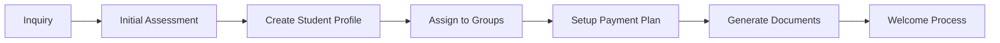
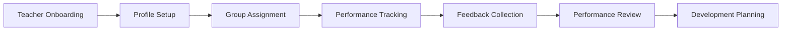
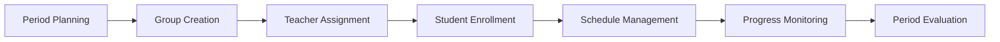
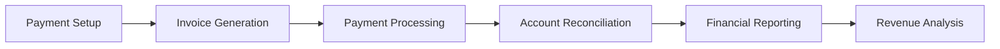

# Harry School Admin CRM - Product Requirements Document

## 1. Executive Summary

### 1.1 Product Vision
Harry School Admin CRM is a comprehensive educational management platform designed specifically for Harry School, a private education center in Tashkent, Uzbekistan. The system provides a unified platform for managing teachers, students, groups, financial operations, and performance analytics while fostering educational excellence through innovative ranking and feedback systems.

### 1.2 Mission Statement
To streamline educational operations, enhance teacher-student relationships, and provide data-driven insights that improve educational outcomes through modern technology and user-centric design.

### 1.3 Success Metrics
- **Operational Efficiency**: 40% reduction in administrative task completion time
- **User Satisfaction**: 90%+ satisfaction rating from administrators
- **Data Accuracy**: 99.5%+ accuracy in student and teacher records
- **System Performance**: <200ms response time for core operations
- **Educational Impact**: Measurable improvement in student-teacher feedback quality

## 2. Market Context & Business Case

### 2.1 Target Market
- **Primary**: Private education centers in Central Asia
- **Secondary**: International schools and educational institutions
- **Tertiary**: Educational management service providers

### 2.2 Competitive Advantages
- **Unified Ranking System**: Both teachers and students in one cohesive performance framework
- **Bidirectional Feedback**: Innovative two-way feedback system
- **Multi-Language Support**: Native support for English, Russian, and Uzbek Latin
- **Cultural Adaptation**: Designed specifically for Central Asian educational practices
- **Cost-Effective**: Open-source foundation with commercial-grade features

### 2.3 Business Impact
- **Revenue Growth**: Enable tracking and optimization of student enrollment and retention
- **Cost Reduction**: Automate manual administrative processes
- **Quality Improvement**: Data-driven insights for educational excellence
- **Scalability**: Support growth from 100 to 500+ students

## 3. User Personas & Stakeholders

### 3.1 Primary Users

#### School Administrator (Primary Persona)
- **Role**: Day-to-day system management and operations
- **Goals**: 
  - Efficiently manage teacher and student records
  - Monitor school performance metrics
  - Generate reports for stakeholders
  - Ensure smooth operational workflow
- **Pain Points**:
  - Manual data entry and record keeping
  - Difficulty tracking student progress
  - Time-consuming report generation
  - Limited visibility into teacher performance
- **Technical Skills**: Moderate (comfortable with web applications)
- **Usage Frequency**: Daily (4-6 hours)

#### School Director/Owner (Secondary Persona)
- **Role**: Strategic decision making and oversight
- **Goals**:
  - Access high-level performance analytics
  - Monitor financial performance
  - Make data-driven strategic decisions
  - Ensure compliance and quality standards
- **Pain Points**:
  - Lack of consolidated reporting
  - Difficulty accessing real-time insights
  - Manual financial tracking
- **Technical Skills**: Basic to moderate
- **Usage Frequency**: Weekly to bi-weekly

#### Finance Manager (Tertiary Persona)
- **Role**: Financial operations and payment management
- **Goals**:
  - Track student payments and outstanding balances
  - Generate financial reports
  - Manage discounts and scholarships
  - Monitor revenue performance
- **Technical Skills**: Moderate
- **Usage Frequency**: Daily (2-4 hours)

### 3.2 Secondary Users

#### Teachers (Indirect Users)
- **Role**: Receive feedback and performance insights
- **Goals**: Improve teaching effectiveness through feedback
- **Interaction**: View their profiles and feedback (limited access)

#### Students & Parents (Indirect Users)
- **Role**: Beneficiaries of improved educational services
- **Goals**: Better educational outcomes and communication
- **Interaction**: Indirect benefit through improved service quality

## 4. Core User Journeys

### 4.1 Student Enrollment Journey

**Steps**:
1. Administrator receives student inquiry
2. Conducts initial assessment and records information
3. Creates comprehensive student profile with family details
4. Assigns student to appropriate learning groups
5. Configures payment plan and financial setup
6. Generates enrollment documents and contracts
7. Initiates welcome and onboarding process

### 4.2 Teacher Performance Management Journey

**Steps**:
1. Create teacher profile with qualifications and specializations
2. Set up employment details and compensation structure
3. Assign to teaching groups and schedule
4. Monitor daily performance through various metrics
5. Collect student feedback and peer evaluations
6. Conduct periodic performance reviews
7. Create development plans and goals

### 4.3 Academic Period Management Journey

### 4.4 Financial Management Journey

## 5. Functional Requirements

### 5.1 Core Modules

#### 5.1.1 Teacher Management
- **Teacher CRUD Operations**: Complete lifecycle management
- **Professional Information**: Qualifications, certifications, specializations
- **Employment Tracking**: Contracts, salary, performance history
- **Group Assignments**: Many-to-many relationship management
- **Performance Analytics**: Teaching effectiveness metrics
- **Document Management**: Store and organize professional documents

#### 5.1.2 Student Management
- **Student CRUD Operations**: Complete academic lifecycle
- **Academic Records**: Grades, progress, enrollment history
- **Family Information**: Parent/guardian details and contacts
- **Financial Integration**: Payment tracking and billing
- **Health & Special Needs**: Medical information and accommodations
- **Group Enrollments**: Class assignment and history

#### 5.1.3 Group Management
- **Class Configuration**: Subject, level, capacity, schedule
- **Teacher-Student Assignments**: Relationship management
- **Schedule Management**: Class timing and frequency
- **Performance Tracking**: Group-level analytics
- **Curriculum Integration**: Subject matter and learning objectives

#### 5.1.4 Financial Management
- **Payment Processing**: Multiple payment methods and schedules
- **Invoice Management**: Automated billing and tracking
- **Financial Reporting**: Revenue analytics and insights
- **Discount & Scholarship Management**: Financial aid programs
- **Account Reconciliation**: Payment matching and balancing

#### 5.1.5 Unified Ranking System
- **Performance Metrics**: Points, levels, achievements for both teachers and students
- **Leaderboards**: Comparative performance tracking
- **Achievement System**: Milestone recognition and rewards
- **Cross-Impact Analytics**: Teacher-student performance correlation
- **Reward Catalog**: Virtual and physical reward management

#### 5.1.6 Bidirectional Feedback System
- **Student-to-Teacher Feedback**: Quality and effectiveness ratings
- **Teacher-to-Student Feedback**: Progress and behavior insights
- **Anonymous Options**: Safe feedback environment
- **Admin Moderation**: Review and response system
- **Analytics Integration**: Feedback impact on rankings

### 5.2 System Features

#### 5.2.1 Dashboard & Analytics
- **Real-time Metrics**: Live performance indicators
- **Custom Reports**: Configurable reporting system
- **Activity Feeds**: Real-time system activity
- **Performance Trends**: Historical analytics and insights
- **Quick Actions**: Direct access to common tasks

#### 5.2.2 Import/Export System
- **Bulk Import**: CSV/Excel data import with validation
- **Template Generation**: Pre-formatted import templates
- **Export Options**: Multiple formats (PDF, Excel, CSV)
- **Data Validation**: Error checking and correction
- **Bulk Operations**: Mass updates and modifications

#### 5.2.3 Notification System
- **Real-time Notifications**: System alerts and updates
- **Email Integration**: Automated email notifications
- **Notification Preferences**: User-configurable settings
- **Activity Tracking**: Complete audit trail
- **Event-Driven Updates**: Automatic status changes

## 6. Non-Functional Requirements

### 6.1 Performance Requirements
- **Response Time**: <200ms for standard operations, <500ms for complex queries
- **Throughput**: Support 100+ concurrent users
- **Uptime**: 99.9% availability during business hours
- **Scalability**: Handle 500+ students, 50+ teachers, 50+ groups
- **Load Time**: Initial page load <2 seconds

### 6.2 Security Requirements
- **Authentication**: Multi-factor authentication support
- **Authorization**: Role-based access control (RBAC)
- **Data Encryption**: At-rest and in-transit encryption
- **Audit Logging**: Complete activity audit trail
- **Privacy Compliance**: GDPR-compliant data handling
- **Session Management**: Secure session handling with timeout

### 6.3 Usability Requirements
- **User Interface**: Intuitive, modern web interface
- **Accessibility**: WCAG 2.1 AA compliance
- **Mobile Responsiveness**: Tablet and mobile optimization
- **Multi-Language**: English, Russian, Uzbek Latin support
- **Learning Curve**: <2 hours for basic operations
- **Error Handling**: Clear error messages and recovery options

### 6.4 Reliability Requirements
- **Data Integrity**: 99.99% data accuracy
- **Backup & Recovery**: Daily automated backups with point-in-time recovery
- **Error Handling**: Graceful error handling with user notifications
- **Fault Tolerance**: System resilience to component failures
- **Data Validation**: Comprehensive input validation and sanitization

### 6.5 Compatibility Requirements
- **Browser Support**: Chrome 90+, Firefox 85+, Safari 14+, Edge 90+
- **Operating Systems**: Windows 10+, macOS 10.15+, Linux Ubuntu 18.04+
- **Mobile Devices**: iOS 13+, Android 8.0+
- **Screen Resolutions**: 1024x768 minimum, optimized for 1920x1080

### 6.6 Localization Requirements
- **Languages**: English (primary), Russian, Uzbek Latin
- **Cultural Adaptation**: Date/time formats, number formats, naming conventions
- **Currency Support**: UZS (primary), USD, EUR
- **Timezone Support**: Asia/Tashkent (primary), UTC
- **Right-to-Left Support**: Future consideration for Arabic/Persian

## 7. Technical Architecture Requirements

### 7.1 Frontend Requirements
- **Framework**: Next.js 14+ with App Router
- **Language**: TypeScript for type safety
- **UI Components**: shadcn/ui component library
- **Styling**: Tailwind CSS for responsive design
- **State Management**: Zustand for client state, React Query for server state
- **Animations**: Framer Motion for smooth interactions

### 7.2 Backend Requirements
- **Database**: PostgreSQL with Supabase
- **Authentication**: Supabase Auth
- **API**: REST APIs with real-time subscriptions
- **Security**: Row Level Security (RLS) policies
- **Storage**: Supabase Storage for file management
- **Functions**: Edge Functions for custom logic

### 7.3 Infrastructure Requirements
- **Hosting**: Vercel for frontend, Supabase for backend
- **CDN**: Global content delivery network
- **Monitoring**: Application performance monitoring
- **Logging**: Centralized logging system
- **Backup**: Automated database backups
- **SSL**: HTTPS encryption for all communications

### 7.4 Integration Requirements
- **Payment Gateways**: Multiple payment processor support
- **Email Service**: Transactional email delivery
- **File Storage**: Document and image storage
- **Notification Service**: Push notifications and email alerts
- **Analytics**: Usage analytics and reporting
- **Third-party APIs**: Integration capability for future extensions

## 8. Data Requirements

### 8.1 Data Model Overview
- **Organizations**: Multi-tenant organization management
- **Users**: Authentication and profile management
- **Teachers**: Professional and employment information
- **Students**: Academic and personal information
- **Groups**: Class and curriculum management
- **Enrollments**: Student-group relationships
- **Payments**: Financial transactions and billing
- **Feedback**: Bidirectional feedback system
- **Rankings**: Performance tracking and analytics
- **Achievements**: Recognition and reward system

### 8.2 Data Volume Estimates
- **Students**: 500-1000 records
- **Teachers**: 50-100 records
- **Groups**: 50-100 records
- **Enrollments**: 2000-5000 relationships
- **Payments**: 1000-2000 monthly transactions
- **Feedback**: 500-1000 monthly entries
- **System Growth**: 20% annual growth in data volume

### 8.3 Data Retention Requirements
- **Active Data**: Immediately accessible
- **Historical Data**: 7 years retention
- **Soft Deletes**: 1 year retention before permanent deletion
- **Audit Logs**: 5 years retention
- **Backup Data**: 30-day backup retention
- **Compliance**: Adherence to local data protection laws

### 8.4 Data Migration Requirements
- **Legacy System Import**: Support for existing data import
- **Data Validation**: Comprehensive validation during migration
- **Rollback Capability**: Ability to rollback migration if needed
- **Data Mapping**: Clear mapping between old and new systems
- **Progress Tracking**: Migration progress monitoring

## 9. Compliance & Legal Requirements

### 9.1 Data Protection
- **Privacy Policy**: Clear data handling policies
- **Consent Management**: User consent tracking
- **Data Minimization**: Collect only necessary data
- **Right to Deletion**: User data deletion capabilities
- **Data Portability**: Export user data on request

### 9.2 Educational Compliance
- **Student Privacy**: Protection of student information
- **Academic Records**: Secure handling of academic data
- **Parent Access**: Appropriate parent/guardian access controls
- **Staff Privacy**: Protection of employee information
- **Audit Requirements**: Maintain audit trails for compliance

### 9.3 Financial Compliance
- **Payment Security**: PCI DSS compliance for payment processing
- **Financial Records**: Proper financial record keeping
- **Tax Compliance**: Support for tax reporting requirements
- **Audit Trail**: Complete financial transaction logging

## 10. Success Criteria & Metrics

### 10.1 User Adoption Metrics
- **User Registration**: 95% of target users registered within 3 months
- **Active Usage**: 80% daily active users among registered users
- **Feature Utilization**: 70% utilization of core features
- **User Satisfaction**: 90%+ satisfaction score in user surveys

### 10.2 Performance Metrics
- **System Response Time**: 95% of requests <200ms
- **System Uptime**: 99.9% availability
- **Error Rate**: <0.1% error rate for core operations
- **Data Accuracy**: 99.9% data integrity

### 10.3 Business Impact Metrics
- **Administrative Efficiency**: 40% reduction in task completion time
- **Data Quality**: 50% improvement in data accuracy
- **User Productivity**: 30% increase in administrative productivity
- **Educational Outcomes**: Measurable improvement in teacher-student feedback quality

### 10.4 Technical Success Metrics
- **Code Quality**: 90%+ test coverage
- **Security**: Zero critical security vulnerabilities
- **Accessibility**: WCAG 2.1 AA compliance
- **Performance**: Lighthouse score >90 for all core pages

## 11. Risk Assessment & Mitigation

### 11.1 Technical Risks
- **Data Loss**: Mitigated by automated backups and redundancy
- **Security Breaches**: Mitigated by comprehensive security measures
- **Performance Issues**: Mitigated by performance monitoring and optimization
- **Integration Failures**: Mitigated by thorough testing and fallback procedures

### 11.2 Business Risks
- **User Adoption**: Mitigated by user training and support programs
- **Scope Creep**: Mitigated by clear requirements and change management
- **Competition**: Mitigated by unique features and continuous innovation
- **Market Changes**: Mitigated by flexible architecture and rapid iteration

### 11.3 Operational Risks
- **System Downtime**: Mitigated by high availability architecture
- **Data Corruption**: Mitigated by data validation and backup procedures
- **User Errors**: Mitigated by intuitive design and error prevention
- **Staff Changes**: Mitigated by comprehensive documentation and training

## 12. Implementation Timeline

### Phase 1: Foundation (Completed)
- Basic CRUD operations for Teachers, Students, Groups
- Authentication and authorization system
- Core database schema implementation
- Basic UI components and layouts

### Phase 2: Core Features (Completed)
- Advanced search and filtering
- Import/export functionality
- Notification system
- Basic reporting capabilities

### Phase 3: Advanced Features (Completed)
- Unified ranking system
- Bidirectional feedback system
- Financial management module
- Advanced analytics and reporting

### Phase 4: Optimization (Current)
- Performance optimization
- Mobile responsiveness improvements
- Advanced security features
- Comprehensive testing suite

### Phase 5: Future Enhancements
- Advanced AI/ML features
- Mobile application
- Third-party integrations
- Advanced automation capabilities

---

*This PRD serves as the definitive guide for the Harry School Admin CRM system development and evolution. It should be reviewed and updated quarterly to reflect changing requirements and business needs.*