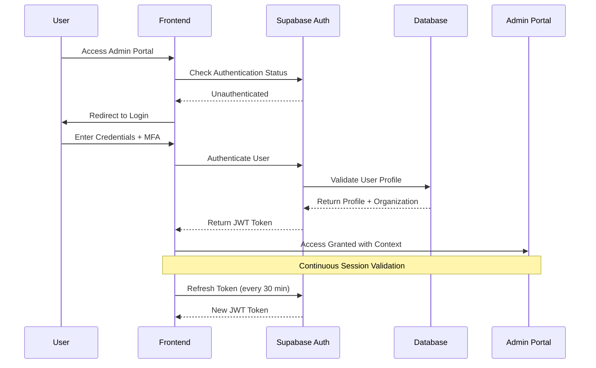

# Authentication & Authorization Implementation - Harry School CRM

## Overview

The Harry School CRM implements a robust authentication and authorization system using Supabase Auth with custom role-based access control. The system enforces admin-only access with comprehensive session management and multi-factor authentication for enhanced security.

## Authentication Architecture

### Authentication Flow



### Supabase Auth Configuration

```typescript
// supabase/auth-config.ts
export const authConfig = {
  site_url: process.env.NEXT_PUBLIC_SITE_URL,
  redirect_urls: {
    success: `${process.env.NEXT_PUBLIC_SITE_URL}/dashboard`,
    failure: `${process.env.NEXT_PUBLIC_SITE_URL}/auth/error`,
  },
  
  // Admin-only access - no self registration
  enable_signup: false,
  
  // Session configuration
  jwt_expiry: 3600, // 1 hour
  refresh_token_expiry: 2592000, // 30 days
  
  // Security settings
  security: {
    captcha_enabled: true,
    max_password_length: 128,
    min_password_length: 12,
    password_requirements: {
      uppercase: true,
      lowercase: true,
      numbers: true,
      symbols: true,
    },
  },
  
  // MFA configuration
  mfa: {
    enabled: true,
    required_for_admins: true,
    totp: {
      issuer: "Harry School CRM",
      period: 30,
      digits: 6,
    },
  },
};

// Authentication service implementation
export class AuthService {
  private supabase: SupabaseClient;
  
  constructor() {
    this.supabase = createClientComponentClient();
  }
  
  async signIn(credentials: SignInCredentials): Promise<AuthResult> {
    try {
      const { data, error } = await this.supabase.auth.signInWithPassword({
        email: credentials.email,
        password: credentials.password,
      });
      
      if (error) throw error;
      
      // Verify user has valid profile and organization
      const profile = await this.getUserProfile(data.user.id);
      if (!profile || profile.deleted_at) {
        throw new Error('Account not found or deactivated');
      }
      
      // Check if MFA is required
      if (profile.role !== 'viewer' && !data.user.user_metadata.mfa_verified) {
        return {
          success: false,
          requires_mfa: true,
          user: data.user,
        };
      }
      
      // Log successful authentication
      await this.logAuthEvent('LOGIN_SUCCESS', data.user.id);
      
      return {
        success: true,
        user: data.user,
        profile,
      };
    } catch (error) {
      await this.logAuthEvent('LOGIN_FAILED', null, { error: error.message });
      throw error;
    }
  }
  
  async enableMFA(user_id: string): Promise<MFASetupResult> {
    const { data, error } = await this.supabase.auth.mfa.enroll({
      factorType: 'totp',
    });
    
    if (error) throw error;
    
    return {
      factor_id: data.id,
      qr_code: data.totp.qr_code,
      secret: data.totp.secret,
      uri: data.totp.uri,
    };
  }
  
  async verifyMFA(code: string, factor_id: string): Promise<void> {
    const { error } = await this.supabase.auth.mfa.verify({
      factorId: factor_id,
      code,
    });
    
    if (error) throw error;
  }
  
  async signOut(): Promise<void> {
    const user = await this.getCurrentUser();
    await this.supabase.auth.signOut();
    
    if (user) {
      await this.logAuthEvent('LOGOUT', user.id);
    }
  }
  
  async refreshSession(): Promise<Session | null> {
    const { data } = await this.supabase.auth.refreshSession();
    return data.session;
  }
  
  private async getUserProfile(user_id: string): Promise<UserProfile | null> {
    const { data } = await this.supabase
      .from('profiles')
      .select(`
        *,
        organization:organizations(*)
      `)
      .eq('id', user_id)
      .single();
    
    return data;
  }
  
  private async logAuthEvent(
    event: string, 
    user_id: string | null, 
    metadata?: any
  ): Promise<void> {
    await this.supabase.from('activity_logs').insert({
      user_id,
      action: event,
      resource_type: 'auth',
      description: `Authentication event: ${event}`,
      metadata,
      ip_address: await this.getClientIP(),
      user_agent: navigator.userAgent,
    });
  }
}
```

### Password Policy Implementation

```typescript
// lib/password-policy.ts
export interface PasswordPolicy {
  minLength: number;
  maxLength: number;
  requireUppercase: boolean;
  requireLowercase: boolean;
  requireNumbers: boolean;
  requireSymbols: boolean;
  preventCommonPasswords: boolean;
  preventUserInfo: boolean;
  historyCheck: number;
  expiryDays: number;
}

export const defaultPasswordPolicy: PasswordPolicy = {
  minLength: 12,
  maxLength: 128,
  requireUppercase: true,
  requireLowercase: true,
  requireNumbers: true,
  requireSymbols: true,
  preventCommonPasswords: true,
  preventUserInfo: true,
  historyCheck: 12, // Last 12 passwords
  expiryDays: 90,
};

export class PasswordValidator {
  constructor(private policy: PasswordPolicy = defaultPasswordPolicy) {}
  
  validate(password: string, userInfo?: UserInfo): ValidationResult {
    const errors: string[] = [];
    
    if (password.length < this.policy.minLength) {
      errors.push(`Password must be at least ${this.policy.minLength} characters`);
    }
    
    if (password.length > this.policy.maxLength) {
      errors.push(`Password must not exceed ${this.policy.maxLength} characters`);
    }
    
    if (this.policy.requireUppercase && !/[A-Z]/.test(password)) {
      errors.push('Password must contain at least one uppercase letter');
    }
    
    if (this.policy.requireLowercase && !/[a-z]/.test(password)) {
      errors.push('Password must contain at least one lowercase letter');
    }
    
    if (this.policy.requireNumbers && !/\d/.test(password)) {
      errors.push('Password must contain at least one number');
    }
    
    if (this.policy.requireSymbols && !/[!@#$%^&*()_+\-=\[\]{};':"\\|,.<>\/?]/.test(password)) {
      errors.push('Password must contain at least one special character');
    }
    
    if (this.policy.preventCommonPasswords && this.isCommonPassword(password)) {
      errors.push('Password is too common. Please choose a different password');
    }
    
    if (this.policy.preventUserInfo && userInfo && this.containsUserInfo(password, userInfo)) {
      errors.push('Password cannot contain personal information');
    }
    
    return {
      isValid: errors.length === 0,
      errors,
      strength: this.calculateStrength(password),
    };
  }
  
  private isCommonPassword(password: string): boolean {
    const commonPasswords = [
      'password123', 'admin123', 'password', '123456789',
      'qwerty123', 'welcome123', 'password1', 'admin',
    ];
    return commonPasswords.includes(password.toLowerCase());
  }
  
  private containsUserInfo(password: string, userInfo: UserInfo): boolean {
    const lowercasePassword = password.toLowerCase();
    const email = userInfo.email.toLowerCase();
    const [localPart] = email.split('@');
    
    return (
      lowercasePassword.includes(userInfo.firstName.toLowerCase()) ||
      lowercasePassword.includes(userInfo.lastName.toLowerCase()) ||
      lowercasePassword.includes(localPart) ||
      lowercasePassword.includes(userInfo.organization?.toLowerCase() || '')
    );
  }
  
  private calculateStrength(password: string): PasswordStrength {
    let score = 0;
    
    if (password.length >= 8) score += 1;
    if (password.length >= 12) score += 1;
    if (/[a-z]/.test(password)) score += 1;
    if (/[A-Z]/.test(password)) score += 1;
    if (/\d/.test(password)) score += 1;
    if (/[^A-Za-z0-9]/.test(password)) score += 1;
    if (password.length >= 16) score += 1;
    if (/[^A-Za-z0-9]{2,}/.test(password)) score += 1;
    
    if (score < 3) return 'weak';
    if (score < 5) return 'medium';
    if (score < 7) return 'strong';
    return 'very_strong';
  }
}
```

## Authorization System

### Role-Based Access Control (RBAC)

```typescript
// lib/rbac.ts
export type Role = 'superadmin' | 'admin' | 'viewer';
export type Permission = 'read' | 'write' | 'delete' | 'manage_users' | 'manage_organization';
export type Resource = 'students' | 'teachers' | 'groups' | 'users' | 'organization' | 'settings';

export interface RoleDefinition {
  name: Role;
  description: string;
  permissions: Permission[];
  resources: Resource[];
  inherits?: Role[];
}

export const roleDefinitions: Record<Role, RoleDefinition> = {
  viewer: {
    name: 'viewer',
    description: 'Read-only access to organization data',
    permissions: ['read'],
    resources: ['students', 'teachers', 'groups'],
  },
  
  admin: {
    name: 'admin',
    description: 'Full access to organization data and user management',
    permissions: ['read', 'write', 'delete', 'manage_users'],
    resources: ['students', 'teachers', 'groups', 'users', 'settings'],
    inherits: ['viewer'],
  },
  
  superadmin: {
    name: 'superadmin',
    description: 'System-wide access including organization management',
    permissions: ['read', 'write', 'delete', 'manage_users', 'manage_organization'],
    resources: ['students', 'teachers', 'groups', 'users', 'organization', 'settings'],
    inherits: ['admin'],
  },
};

export class AuthorizationService {
  constructor(private userContext: UserContext) {}
  
  hasPermission(permission: Permission, resource: Resource): boolean {
    const userRole = this.userContext.role;
    const roleDefinition = roleDefinitions[userRole];
    
    if (!roleDefinition) return false;
    
    // Check direct permissions
    if (roleDefinition.permissions.includes(permission) && 
        roleDefinition.resources.includes(resource)) {
      return true;
    }
    
    // Check inherited permissions
    if (roleDefinition.inherits) {
      for (const inheritedRole of roleDefinition.inherits) {
        const inheritedDefinition = roleDefinitions[inheritedRole];
        if (inheritedDefinition.permissions.includes(permission) && 
            inheritedDefinition.resources.includes(resource)) {
          return true;
        }
      }
    }
    
    return false;
  }
  
  canAccess(resource: Resource, action: 'read' | 'write' | 'delete' = 'read'): boolean {
    // Map actions to permissions
    const permissionMap: Record<string, Permission> = {
      read: 'read',
      write: 'write',
      delete: 'delete',
    };
    
    const permission = permissionMap[action];
    return this.hasPermission(permission, resource);
  }
  
  canManageUser(targetUserId: string): boolean {
    // Users can't manage themselves for critical operations
    if (targetUserId === this.userContext.userId) return false;
    
    // Only admins and superadmins can manage users
    if (!this.hasPermission('manage_users', 'users')) return false;
    
    // Admins can only manage users in their organization
    if (this.userContext.role === 'admin') {
      return this.isInSameOrganization(targetUserId);
    }
    
    // Superadmins can manage any user
    return this.userContext.role === 'superadmin';
  }
  
  canAccessOrganization(organizationId: string): boolean {
    // Superadmins can access any organization
    if (this.userContext.role === 'superadmin') return true;
    
    // Others can only access their own organization
    return this.userContext.organizationId === organizationId;
  }
  
  private isInSameOrganization(userId: string): boolean {
    // This would typically query the database
    // For now, assume it's implemented elsewhere
    return true; // Placeholder
  }
}

// Authorization middleware for API routes
export function withAuthorization(
  requiredPermission: Permission,
  requiredResource: Resource
) {
  return function <T extends NextRequest>(
    handler: (req: T, context: any) => Promise<Response>
  ) {
    return async function (req: T, context: any): Promise<Response> {
      try {
        const userContext = await getUserContext(req);
        
        if (!userContext) {
          return new Response('Unauthorized', { status: 401 });
        }
        
        const authService = new AuthorizationService(userContext);
        
        if (!authService.hasPermission(requiredPermission, requiredResource)) {
          return new Response('Forbidden', { status: 403 });
        }
        
        // Add user context to request
        (req as any).userContext = userContext;
        
        return await handler(req, context);
      } catch (error) {
        console.error('Authorization error:', error);
        return new Response('Internal Server Error', { status: 500 });
      }
    };
  };
}
```

### Session Management

```typescript
// lib/session-management.ts
export interface SessionConfig {
  maxDuration: number; // Maximum session duration in seconds
  idleTimeout: number; // Idle timeout in seconds
  maxConcurrentSessions: number; // Maximum concurrent sessions per user
  refreshThreshold: number; // Refresh token before expiry (seconds)
}

export const sessionConfig: SessionConfig = {
  maxDuration: 8 * 60 * 60, // 8 hours
  idleTimeout: 30 * 60, // 30 minutes
  maxConcurrentSessions: 3,
  refreshThreshold: 5 * 60, // 5 minutes
};

export class SessionManager {
  private supabase: SupabaseClient;
  
  constructor() {
    this.supabase = createClientComponentClient();
  }
  
  async validateSession(): Promise<SessionValidationResult> {
    const { data: { session } } = await this.supabase.auth.getSession();
    
    if (!session) {
      return { valid: false, reason: 'NO_SESSION' };
    }
    
    // Check if session is expired
    const now = Math.floor(Date.now() / 1000);
    if (session.expires_at && session.expires_at < now) {
      return { valid: false, reason: 'EXPIRED' };
    }
    
    // Check idle timeout
    const lastActivity = await this.getLastActivity(session.user.id);
    if (lastActivity && (now - lastActivity) > sessionConfig.idleTimeout) {
      await this.invalidateSession(session.user.id);
      return { valid: false, reason: 'IDLE_TIMEOUT' };
    }
    
    // Check maximum session duration
    const sessionStart = session.issued_at || 0;
    if ((now - sessionStart) > sessionConfig.maxDuration) {
      await this.invalidateSession(session.user.id);
      return { valid: false, reason: 'MAX_DURATION_EXCEEDED' };
    }
    
    // Update last activity
    await this.updateLastActivity(session.user.id);
    
    // Check if token needs refresh
    const shouldRefresh = session.expires_at && 
      (session.expires_at - now) < sessionConfig.refreshThreshold;
    
    return {
      valid: true,
      session,
      shouldRefresh,
    };
  }
  
  async refreshSession(): Promise<Session | null> {
    const { data, error } = await this.supabase.auth.refreshSession();
    
    if (error) {
      console.error('Session refresh failed:', error);
      return null;
    }
    
    if (data.session) {
      await this.updateLastActivity(data.session.user.id);
    }
    
    return data.session;
  }
  
  async limitConcurrentSessions(userId: string): Promise<void> {
    // This would typically be implemented with a session store
    // For Supabase, we can use a custom table to track active sessions
    
    const activeSessions = await this.getActiveSessions(userId);
    
    if (activeSessions.length >= sessionConfig.maxConcurrentSessions) {
      // Remove oldest sessions
      const sessionsToRemove = activeSessions
        .sort((a, b) => a.last_activity - b.last_activity)
        .slice(0, activeSessions.length - sessionConfig.maxConcurrentSessions + 1);
      
      for (const session of sessionsToRemove) {
        await this.invalidateSessionById(session.id);
      }
    }
  }
  
  private async updateLastActivity(userId: string): Promise<void> {
    const now = Math.floor(Date.now() / 1000);
    
    // Update user profile with last activity
    await this.supabase
      .from('profiles')
      .update({ 
        last_login_at: new Date().toISOString(),
        login_count: this.supabase.rpc('increment_login_count', { user_id: userId })
      })
      .eq('id', userId);
  }
  
  private async getLastActivity(userId: string): Promise<number | null> {
    const { data } = await this.supabase
      .from('profiles')
      .select('last_login_at')
      .eq('id', userId)
      .single();
    
    return data?.last_login_at ? 
      Math.floor(new Date(data.last_login_at).getTime() / 1000) : null;
  }
  
  private async getActiveSessions(userId: string): Promise<ActiveSession[]> {
    // Implementation would depend on session storage strategy
    // This is a placeholder
    return [];
  }
  
  private async invalidateSession(userId: string): Promise<void> {
    await this.supabase.auth.admin.deleteUser(userId);
  }
  
  private async invalidateSessionById(sessionId: string): Promise<void> {
    // Implementation depends on session storage
  }
}
```

### Frontend Authorization Components

```typescript
// components/auth/ProtectedRoute.tsx
interface ProtectedRouteProps {
  children: React.ReactNode;
  requiredRole?: Role;
  requiredPermission?: Permission;
  requiredResource?: Resource;
  fallback?: React.ReactNode;
}

export function ProtectedRoute({ 
  children, 
  requiredRole,
  requiredPermission,
  requiredResource,
  fallback = <UnauthorizedMessage />
}: ProtectedRouteProps) {
  const { user, profile, loading } = useAuth();
  const authService = new AuthorizationService(profile);
  
  if (loading) {
    return <LoadingSpinner />;
  }
  
  if (!user || !profile) {
    redirect('/auth/login');
    return null;
  }
  
  // Check role requirement
  if (requiredRole && !hasRole(profile.role, requiredRole)) {
    return fallback;
  }
  
  // Check permission requirement
  if (requiredPermission && requiredResource && 
      !authService.hasPermission(requiredPermission, requiredResource)) {
    return fallback;
  }
  
  return <>{children}</>;
}

// Hook for checking permissions
export function usePermissions() {
  const { profile } = useAuth();
  const authService = useMemo(() => 
    profile ? new AuthorizationService(profile) : null, [profile]
  );
  
  return {
    hasPermission: (permission: Permission, resource: Resource) =>
      authService?.hasPermission(permission, resource) ?? false,
    canAccess: (resource: Resource, action?: 'read' | 'write' | 'delete') =>
      authService?.canAccess(resource, action) ?? false,
    canManageUser: (userId: string) =>
      authService?.canManageUser(userId) ?? false,
  };
}

// Permission-based component rendering
interface PermissionGateProps {
  permission: Permission;
  resource: Resource;
  children: React.ReactNode;
  fallback?: React.ReactNode;
}

export function PermissionGate({ 
  permission, 
  resource, 
  children, 
  fallback = null 
}: PermissionGateProps) {
  const { hasPermission } = usePermissions();
  
  if (!hasPermission(permission, resource)) {
    return <>{fallback}</>;
  }
  
  return <>{children}</>;
}
```

## Security Implementation Checklist

### Authentication Security
- [ ] Admin-only access (no self-registration)
- [ ] Strong password policy enforcement
- [ ] Multi-factor authentication for admins
- [ ] Account lockout after failed attempts
- [ ] Session management with timeout
- [ ] Secure password reset flow
- [ ] Authentication event logging

### Authorization Security
- [ ] Role-based access control implementation
- [ ] Principle of least privilege enforcement
- [ ] Resource-level permission checking
- [ ] Organization-scoped data access
- [ ] API endpoint authorization
- [ ] Frontend route protection
- [ ] Permission-based UI rendering

### Session Security
- [ ] JWT token validation
- [ ] Automatic token refresh
- [ ] Session timeout handling
- [ ] Concurrent session limiting
- [ ] Session invalidation on security events
- [ ] Activity tracking
- [ ] Secure session storage

### Monitoring & Compliance
- [ ] Authentication event logging
- [ ] Failed login attempt monitoring
- [ ] Privilege escalation detection
- [ ] Session anomaly detection
- [ ] Compliance audit trails
- [ ] Security metrics collection
- [ ] Incident response procedures

This authentication and authorization implementation provides comprehensive security for the Harry School CRM while maintaining usability for educational administrators. The system enforces strict access controls while providing the flexibility needed for different organizational structures and user roles.