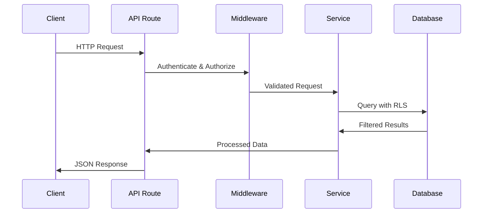

# Harry School CRM Backend Architecture

## Overview

The Harry School CRM backend is built on a modern, scalable architecture using Next.js 14+ App Router with Supabase as the backend-as-a-service platform. This document outlines the complete backend architecture, including database design, API structure, authentication flows, and deployment considerations.

## Technology Stack

### Core Technologies

- **Next.js 14+**: React framework with App Router for server-side rendering and API routes
- **TypeScript**: Full type safety across the entire backend
- **Supabase**: Backend-as-a-service providing:
  - PostgreSQL database with Row Level Security (RLS)
  - Authentication and authorization
  - Real-time subscriptions
  - Edge Functions
  - Storage for file uploads

### Database & Storage

- **PostgreSQL**: Primary database via Supabase
- **Row Level Security (RLS)**: Multi-tenant data isolation
- **Supabase Storage**: File and image storage
- **Redis**: Caching layer for session and query caching

### Development Tools

- **Zod**: Schema validation for all API inputs
- **Prisma**: Database schema management and migrations
- **Jest**: Unit and integration testing
- **Playwright**: End-to-end API testing

## Architecture Patterns

### Multi-Tenant Architecture

The system implements organization-based multi-tenancy:

```
Organization A
├── Users (Profiles)
├── Teachers
├── Students  
├── Groups
└── Settings

Organization B
├── Users (Profiles)
├── Teachers
├── Students
├── Groups
└── Settings
```

**Key Features**:
- Complete data isolation between organizations
- RLS policies enforce organization-scoped access
- Shared schema with organization_id foreign keys
- Superadmin role can access cross-organization data

### Layered Architecture

```
┌─────────────────────────────────────────────┐
│                Frontend                      │
│         (React Components)                   │
└─────────────────────────────────────────────┘
                      │
┌─────────────────────────────────────────────┐
│              API Routes                      │
│        (/api/* endpoints)                   │
└─────────────────────────────────────────────┘
                      │
┌─────────────────────────────────────────────┐
│             Middleware                       │
│        (Authentication, Validation)          │
└─────────────────────────────────────────────┘
                      │
┌─────────────────────────────────────────────┐
│            Service Layer                     │
│    (Business Logic, Data Access)             │
└─────────────────────────────────────────────┘
                      │
┌─────────────────────────────────────────────┐
│           Database Layer                     │
│     (Supabase PostgreSQL with RLS)          │
└─────────────────────────────────────────────┘
```

## API Architecture

### Route Structure

```
src/app/api/
├── auth/                    # Authentication endpoints
├── profile/                 # User profile management
├── organizations/           # Organization management
├── teachers/                # Teacher CRUD operations
│   ├── route.ts            # GET /api/teachers, POST /api/teachers
│   ├── [id]/               # Individual teacher operations
│   └── statistics/         # Teacher statistics
├── students/                # Student CRUD operations
│   ├── route.ts            # GET /api/students, POST /api/students  
│   ├── [id]/               # Individual student operations
│   └── enrollments/        # Student enrollment management
├── groups/                  # Group CRUD operations
│   ├── route.ts            # GET /api/groups, POST /api/groups
│   ├── [id]/               # Individual group operations
│   └── assignments/        # Teacher-group assignments
├── finance/                 # Financial management
│   ├── invoices/           # Invoice management
│   ├── payments/           # Payment processing
│   └── reports/            # Financial reports
├── settings/                # System settings
├── reports/                 # Analytics and reports
├── export/                  # Data export functionality
├── import/                  # Data import functionality
└── templates/               # Document templates
```

### Request/Response Flow



## Authentication & Authorization

### Authentication Flow

```typescript
// JWT-based authentication using Supabase Auth
export const withAuth = (
  handler: (request: NextRequest, context: AuthContext) => Promise<NextResponse>,
  authLevel: 'auth' | 'admin' | 'superadmin' = 'auth'
) => {
  return async function(request: NextRequest): Promise<NextResponse> {
    // 1. Validate JWT token
    const { data: { user }, error } = await supabase.auth.getUser()
    
    // 2. Fetch user profile with organization
    const { data: profile } = await supabase
      .from('profiles')
      .select('*')
      .eq('id', user.id)
      .single()
    
    // 3. Check role permissions
    if (authLevel === 'admin' && !['admin', 'superadmin'].includes(profile.role)) {
      return NextResponse.json({ error: 'Insufficient permissions' }, { status: 403 })
    }
    
    // 4. Execute handler with auth context
    return handler(request, { user, profile })
  }
}
```

### Role-Based Access Control

| Role | Permissions | Scope |
|------|-------------|-------|
| **superadmin** | Full system access | All organizations |
| **admin** | Complete CRUD operations | Single organization |
| **viewer** | Read-only access | Single organization |

### Row Level Security Policies

```sql
-- Example RLS policy for teachers table
CREATE POLICY "Users can view teachers in their organization" ON teachers
  FOR SELECT USING (
    is_superadmin() OR 
    organization_id = get_user_organization()
  );

CREATE POLICY "Admins can manage teachers in their organization" ON teachers
  FOR ALL USING (
    is_superadmin() OR 
    (organization_id = get_user_organization() AND get_user_role() IN ('admin', 'superadmin'))
  );
```

## Service Layer Architecture

### Service Classes

Each major entity has a dedicated service class handling business logic:

```typescript
// Example: TeacherService
export class TeacherService {
  private supabase: SupabaseClient
  
  constructor() {
    this.supabase = createServerClient()
  }
  
  async getAll(filters: TeacherFilters, pagination: Pagination) {
    // 1. Apply organization filtering
    // 2. Build dynamic filters
    // 3. Execute query with RLS
    // 4. Return paginated results
  }
  
  async create(data: CreateTeacherRequest) {
    // 1. Validate business rules
    // 2. Insert with organization context
    // 3. Log activity
    // 4. Return created entity
  }
  
  async update(id: string, data: UpdateTeacherRequest) {
    // 1. Verify ownership
    // 2. Apply updates
    // 3. Log changes
    // 4. Return updated entity
  }
  
  async delete(id: string) {
    // 1. Soft delete with cascade
    // 2. Update related records
    // 3. Log deletion
    // 4. Return deleted entity
  }
}
```

### Business Rules Engine

```typescript
// Example business rules
export class TeacherBusinessRules {
  static validateHireDate(date: Date): ValidationResult {
    if (date > new Date()) {
      return { valid: false, error: 'Hire date cannot be in the future' }
    }
    return { valid: true }
  }
  
  static validateUniqueEmployeeId(employeeId: string, organizationId: string): Promise<ValidationResult> {
    // Check uniqueness within organization
  }
  
  static canDelete(teacherId: string): Promise<ValidationResult> {
    // Check for active assignments
    // Verify no upcoming classes
    // Confirm financial obligations settled
  }
}
```

## Data Validation & Schema Management

### Zod Schema Validation

All API inputs are validated using Zod schemas:

```typescript
// Teacher creation schema
export const createTeacherSchema = z.object({
  first_name: z.string()
    .min(1, 'First name is required')
    .max(100, 'First name must be less than 100 characters')
    .regex(/^[a-zA-Zа-яёА-ЯЁ\s]+$/, 'First name can only contain letters and spaces'),
  
  phone: z.string()
    .regex(/^\+998\d{9}$/, 'Phone must be valid Uzbekistan format (+998XXXXXXXXX)'),
  
  hire_date: z.date()
    .max(new Date(), 'Hire date cannot be in the future'),
  
  // ... more fields
})
```

### Database Schema Management

```sql
-- Schema versioning system
CREATE TABLE schema_versions (
    version TEXT PRIMARY KEY,
    description TEXT,
    applied_at TIMESTAMPTZ DEFAULT NOW(),
    applied_by UUID REFERENCES auth.users(id)
);

-- Migration tracking
INSERT INTO schema_versions (version, description) 
VALUES ('1.0.0', 'Initial Harry School CRM schema');
```

## Caching Strategy

### Multi-Level Caching

```typescript
// 1. Application-level caching
const cache = new Map<string, CacheEntry>()

// 2. Database query caching
const getCachedTeachers = async (organizationId: string) => {
  const cacheKey = `teachers:${organizationId}`
  const cached = cache.get(cacheKey)
  
  if (cached && !cached.isExpired()) {
    return cached.data
  }
  
  const teachers = await fetchTeachersFromDB(organizationId)
  cache.set(cacheKey, new CacheEntry(teachers, 300)) // 5 minute TTL
  
  return teachers
}

// 3. Session caching
const sessionCache = new RedisCache({
  ttl: 3600, // 1 hour
  keyPrefix: 'session:'
})
```

### Cache Invalidation

```typescript
// Automatic cache invalidation on data changes
export class CacheInvalidationService {
  static async invalidateTeacher(teacherId: string, organizationId: string) {
    await Promise.all([
      cache.delete(`teacher:${teacherId}`),
      cache.delete(`teachers:${organizationId}`),
      cache.delete(`teacher-stats:${organizationId}`),
      // Invalidate related caches
    ])
  }
}
```

## Real-time Features

### Supabase Realtime Integration

```typescript
// Real-time subscriptions for live updates
export const setupRealtimeSubscriptions = () => {
  // Student updates
  supabase
    .channel('students')
    .on('postgres_changes', 
      { event: '*', schema: 'public', table: 'students' },
      (payload) => {
        // Broadcast to connected clients
        broadcastStudentUpdate(payload)
      }
    )
    .subscribe()
    
  // Teacher updates  
  supabase
    .channel('teachers')
    .on('postgres_changes',
      { event: '*', schema: 'public', table: 'teachers' },
      (payload) => {
        broadcastTeacherUpdate(payload)
      }
    )
    .subscribe()
}
```

### Notification System

```typescript
// Notification service for real-time alerts
export class NotificationService {
  async sendNotification(notification: NotificationData) {
    // 1. Store in database
    await this.supabase
      .from('notifications')
      .insert(notification)
    
    // 2. Send real-time update
    await this.supabase
      .channel(`user:${notification.user_id}`)
      .send({
        type: 'broadcast',
        event: 'notification',
        payload: notification
      })
    
    // 3. Send email if required
    if (notification.delivery_method.includes('email')) {
      await this.emailService.send(notification)
    }
  }
}
```

## Security Implementation

### Data Protection

```typescript
// Sensitive data encryption
export class EncryptionService {
  private static readonly ENCRYPTION_KEY = process.env.ENCRYPTION_KEY!
  
  static encrypt(data: string): string {
    const cipher = crypto.createCipher('aes-256-gcm', this.ENCRYPTION_KEY)
    let encrypted = cipher.update(data, 'utf8', 'hex')
    encrypted += cipher.final('hex')
    return encrypted
  }
  
  static decrypt(encryptedData: string): string {
    const decipher = crypto.createDecipher('aes-256-gcm', this.ENCRYPTION_KEY)
    let decrypted = decipher.update(encryptedData, 'hex', 'utf8')
    decrypted += decipher.final('utf8')
    return decrypted
  }
}
```

### Input Sanitization

```typescript
// XSS prevention and input cleaning
export class SanitizationService {
  static sanitizeHtml(input: string): string {
    return DOMPurify.sanitize(input, {
      ALLOWED_TAGS: [],
      ALLOWED_ATTR: []
    })
  }
  
  static sanitizePhoneNumber(phone: string): string {
    return phone.replace(/[^\d+]/g, '')
  }
  
  static sanitizeName(name: string): string {
    return name.replace(/[^a-zA-Zа-яёА-ЯЁ\s]/g, '')
  }
}
```

## Performance Optimization

### Database Query Optimization

```sql
-- Efficient indexes for common queries
CREATE INDEX CONCURRENTLY idx_students_search 
ON students USING gin(to_tsvector('english', coalesce(full_name, '') || ' ' || coalesce(primary_phone, '')))
WHERE deleted_at IS NULL;

-- Partial indexes for active records
CREATE INDEX CONCURRENTLY idx_teachers_active 
ON teachers(organization_id, id) 
WHERE deleted_at IS NULL AND is_active = true;

-- Composite indexes for filtering
CREATE INDEX CONCURRENTLY idx_students_org_status 
ON students(organization_id, enrollment_status, created_at DESC)
WHERE deleted_at IS NULL;
```

### Connection Pooling

```typescript
// Supabase connection pooling configuration
const supabaseConfig = {
  auth: {
    persistSession: false // Server-side optimization
  },
  db: {
    pooling: {
      min: 2,
      max: 20,
      acquireTimeoutMillis: 60000,
      createTimeoutMillis: 30000,
      destroyTimeoutMillis: 5000,
      idleTimeoutMillis: 30000,
      reapIntervalMillis: 1000,
    }
  }
}
```

### Query Optimization

```typescript
// Efficient data fetching with select projections
export class OptimizedQueries {
  // Only select needed fields
  static async getTeachersList(organizationId: string) {
    return await supabase
      .from('teachers')
      .select(`
        id,
        full_name,
        email,
        phone,
        employment_status,
        specializations,
        created_at
      `)
      .eq('organization_id', organizationId)
      .is('deleted_at', null)
      .order('created_at', { ascending: false })
  }
  
  // Batch operations for related data
  static async getTeacherWithAssignments(teacherId: string) {
    const [teacher, assignments] = await Promise.all([
      supabase.from('teachers').select('*').eq('id', teacherId).single(),
      supabase.from('teacher_group_assignments')
        .select('*, groups(*)')
        .eq('teacher_id', teacherId)
        .is('deleted_at', null)
    ])
    
    return { teacher, assignments }
  }
}
```

## Error Handling & Logging

### Centralized Error Handling

```typescript
// Global error handler
export class ErrorHandler {
  static async handleApiError(error: unknown, context: string): Promise<NextResponse> {
    const errorId = crypto.randomUUID()
    
    // Log error with context
    console.error(`[${errorId}] ${context}:`, error)
    
    // Send to monitoring service
    await this.sendToMonitoring(error, context, errorId)
    
    // Return appropriate response
    if (error instanceof ZodError) {
      return NextResponse.json(
        { success: false, error: 'Validation error', details: error.issues },
        { status: 400 }
      )
    }
    
    if (error instanceof AuthError) {
      return NextResponse.json(
        { success: false, error: 'Authentication failed' },
        { status: 401 }
      )
    }
    
    // Generic server error
    return NextResponse.json(
      { success: false, error: 'Internal server error', errorId },
      { status: 500 }
    )
  }
}
```

### Activity Logging

```typescript
// Comprehensive activity logging
export class ActivityLogger {
  static async logActivity(activity: ActivityLog) {
    await supabase
      .from('activity_logs')
      .insert({
        organization_id: activity.organizationId,
        user_id: activity.userId,
        user_email: activity.userEmail,
        user_name: activity.userName,
        user_role: activity.userRole,
        action: activity.action,
        resource_type: activity.resourceType,
        resource_id: activity.resourceId,
        old_values: activity.oldValues,
        new_values: activity.newValues,
        changed_fields: activity.changedFields,
        description: activity.description,
        ip_address: activity.ipAddress,
        user_agent: activity.userAgent,
        success: activity.success,
        error_message: activity.errorMessage
      })
  }
}
```

## Testing Architecture

### API Testing Strategy

```typescript
// Integration tests for API endpoints
describe('Teachers API', () => {
  let authContext: AuthContext
  
  beforeEach(async () => {
    authContext = await setupTestAuth('admin')
  })
  
  describe('POST /api/teachers', () => {
    it('should create a new teacher with valid data', async () => {
      const teacherData = generateValidTeacherData()
      
      const response = await request(app)
        .post('/api/teachers')
        .set('Authorization', `Bearer ${authContext.token}`)
        .send(teacherData)
        .expect(201)
      
      expect(response.body.success).toBe(true)
      expect(response.body.data.full_name).toBe(`${teacherData.first_name} ${teacherData.last_name}`)
    })
    
    it('should return validation error for invalid phone format', async () => {
      const invalidData = { ...generateValidTeacherData(), phone: 'invalid' }
      
      const response = await request(app)
        .post('/api/teachers')
        .set('Authorization', `Bearer ${authContext.token}`)
        .send(invalidData)
        .expect(400)
      
      expect(response.body.success).toBe(false)
      expect(response.body.error).toBe('Validation error')
    })
  })
})
```

### Database Testing

```typescript
// Database-level testing with test fixtures
export class DatabaseTestUtils {
  static async createTestOrganization(): Promise<Organization> {
    const { data, error } = await supabase
      .from('organizations')
      .insert({
        name: 'Test Organization',
        slug: 'test-org-' + Date.now(),
        max_students: 100,
        max_teachers: 20
      })
      .select()
      .single()
      
    if (error) throw error
    return data
  }
  
  static async cleanupTestData(organizationId: string) {
    // Clean up in correct order due to foreign key constraints
    await Promise.all([
      supabase.from('student_group_enrollments').delete().eq('organization_id', organizationId),
      supabase.from('teacher_group_assignments').delete().eq('organization_id', organizationId),
      supabase.from('groups').delete().eq('organization_id', organizationId),
      supabase.from('students').delete().eq('organization_id', organizationId),
      supabase.from('teachers').delete().eq('organization_id', organizationId),
      supabase.from('profiles').delete().eq('organization_id', organizationId),
      supabase.from('organizations').delete().eq('id', organizationId)
    ])
  }
}
```

## Deployment Architecture

### Infrastructure

```yaml
# docker-compose.yml for local development
version: '3.8'
services:
  app:
    build: .
    ports:
      - "3000:3000"
    environment:
      - NODE_ENV=development
      - NEXT_PUBLIC_SUPABASE_URL=${SUPABASE_URL}
      - NEXT_PUBLIC_SUPABASE_ANON_KEY=${SUPABASE_ANON_KEY}
      - SUPABASE_SERVICE_ROLE_KEY=${SUPABASE_SERVICE_ROLE_KEY}
    depends_on:
      - redis
      
  redis:
    image: redis:alpine
    ports:
      - "6379:6379"
```

### Production Configuration

```typescript
// Production environment setup
const productionConfig = {
  database: {
    maxConnections: 20,
    connectionTimeout: 30000,
    queryTimeout: 60000
  },
  cache: {
    ttl: 3600,
    maxSize: '100mb'
  },
  security: {
    rateLimiting: {
      windowMs: 60000,
      maxRequests: 100
    },
    cors: {
      origin: process.env.ALLOWED_ORIGINS?.split(',') || [],
      credentials: true
    }
  },
  monitoring: {
    enabled: true,
    sampleRate: 1.0
  }
}
```

This backend architecture provides a robust, scalable foundation for the Harry School CRM system with comprehensive security, performance optimization, and maintainability features.