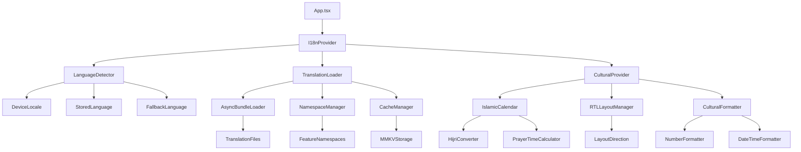

# Mobile Internationalization (i18n) Architecture: Harry School CRM
Agent: mobile-developer
Date: 2025-08-21

## Executive Summary

This document outlines a comprehensive internationalization (i18n) architecture for Harry School CRM mobile applications, supporting English (default), Russian, and Uzbek (Latin script) with future Arabic RTL preparation. The architecture leverages React Native with react-i18next, TypeScript integration, and cultural adaptations for Islamic educational environments in Tashkent, Uzbekistan.

**Key Features:**
- Multi-language support (EN/RU/UZ) with RTL preparation for Arabic
- Islamic calendar integration and cultural context awareness
- Performance-optimized translation loading with bundle splitting
- Educational terminology specialization for CRM domain
- Cultural adaptations for Uzbek Islamic educational values
- Type-safe translation keys with TypeScript support

## Architecture Overview

### Technology Stack

```typescript
// Core i18n technologies
react-i18next: "^14.0.5"      // Latest React hooks-based i18n
i18next: "^23.8.1"            // Core i18n engine
react-native-localize: "^3.0.4" // Device locale detection
i18next-react-native-async-storage: "^4.3.0" // Persistent storage

// Islamic calendar and date formatting
moment-hijri: "^2.29.0"       // Hijri calendar calculations
react-native-calendars: "^1.1304.1" // Calendar components
hebcal: "^5.4.6"              // Islamic calendar events

// RTL and layout support
react-native-super-grid: "^5.0.0" // RTL-aware grid layouts
react-native-linear-gradient: "^2.8.3" // RTL-compatible gradients

// Performance optimization
react-native-mmkv: "^2.12.2"  // Fast i18n cache storage
```

### Component Relationships



### High-Level Flow

```typescript
// Application initialization flow
1. App Launch → Device Locale Detection
2. Locale Detection → Stored Preference Check
3. Language Selection → Translation Bundle Loading
4. Bundle Loading → Cultural Context Setup
5. Cultural Setup → RTL Layout Configuration
6. Layout Config → Component Rendering

// Runtime language switching flow
1. Language Change → Bundle Validation
2. Bundle Validation → Async Loading
3. Async Loading → Cultural Adaptation
4. Cultural Adaptation → Layout Update
5. Layout Update → Component Re-render
6. Re-render → Persistence to Storage
```

## File Structure Recommendations

### Project Directory Organization

```
mobile/
├── apps/
│   ├── teacher/
│   │   ├── assets/
│   │   │   └── translations/
│   │   │       ├── en/
│   │   │       │   ├── common.json
│   │   │       │   ├── dashboard.json
│   │   │       │   ├── attendance.json
│   │   │       │   ├── groups.json
│   │   │       │   ├── feedback.json
│   │   │       │   ├── navigation.json
│   │   │       │   ├── auth.json
│   │   │       │   ├── errors.json
│   │   │       │   └── cultural.json
│   │   │       ├── ru/
│   │   │       │   ├── common.json
│   │   │       │   ├── dashboard.json
│   │   │       │   ├── attendance.json
│   │   │       │   ├── groups.json
│   │   │       │   ├── feedback.json
│   │   │       │   ├── navigation.json
│   │   │       │   ├── auth.json
│   │   │       │   ├── errors.json
│   │   │       │   └── cultural.json
│   │   │       └── uz/
│   │   │           ├── common.json
│   │   │           ├── dashboard.json
│   │   │           ├── attendance.json
│   │   │           ├── groups.json
│   │   │           ├── feedback.json
│   │   │           ├── navigation.json
│   │   │           ├── auth.json
│   │   │           ├── errors.json
│   │   │           └── cultural.json
│   │   └── src/
│   │       ├── i18n/
│   │       │   ├── index.ts
│   │       │   ├── config.ts
│   │       │   ├── detector.ts
│   │       │   ├── cultural.ts
│   │       │   ├── hijri.ts
│   │       │   ├── rtl.ts
│   │       │   └── types.ts
│   │       ├── hooks/
│   │       │   ├── useTranslation.ts
│   │       │   ├── useCulturalContext.ts
│   │       │   ├── useHijriDate.ts
│   │       │   └── useRTL.ts
│   │       └── components/
│   │           ├── Text/
│   │           │   ├── LocalizedText.tsx
│   │           │   └── RTLText.tsx
│   │           ├── Input/
│   │           │   ├── LocalizedInput.tsx
│   │           │   └── RTLInput.tsx
│   │           └── Calendar/
│   │               ├── HijriCalendar.tsx
│   │               └── DualCalendar.tsx
│   └── student/
│       ├── assets/
│       │   └── translations/
│       │       ├── en/
│       │       │   ├── common.json
│       │       │   ├── dashboard.json
│       │       │   ├── lessons.json
│       │       │   ├── vocabulary.json
│       │       │   ├── schedule.json
│       │       │   ├── profile.json
│       │       │   ├── navigation.json
│       │       │   ├── auth.json
│       │       │   ├── errors.json
│       │       │   ├── gamification.json
│       │       │   └── cultural.json
│       │       ├── ru/
│       │       │   └── [same structure as en/]
│       │       └── uz/
│       │           └── [same structure as en/]
│       └── src/
│           └── i18n/
│               └── [same structure as teacher app]
└── shared/
    ├── i18n/
    │   ├── types/
    │   │   ├── translations.ts
    │   │   ├── cultural.ts
    │   │   └── hijri.ts
    │   ├── utils/
    │   │   ├── formatters.ts
    │   │   ├── validators.ts
    │   │   └── converters.ts
    │   └── constants/
    │       ├── languages.ts
    │       ├── locales.ts
    │       └── cultural.ts
    └── components/
        ├── LocalizedComponents/
        │   ├── Text.tsx
        │   ├── Input.tsx
        │   ├── Button.tsx
        │   ├── DatePicker.tsx
        │   └── Calendar.tsx
        └── Cultural/
            ├── IslamicGreeting.tsx
            ├── PrayerTimeIndicator.tsx
            └── HijriDateDisplay.tsx
```

### Translation File Organization by Feature

```typescript
// Feature-based namespace organization
namespace Organization {
  common: "Basic UI elements, buttons, actions"
  dashboard: "Dashboard screens and widgets"
  attendance: "Attendance marking and management"
  groups: "Group management and navigation"
  feedback: "Teacher feedback and communication"
  lessons: "Student lesson content and tasks"
  vocabulary: "Vocabulary learning and flashcards"
  schedule: "Calendar and scheduling features"
  profile: "User profile and settings"
  navigation: "Tab bars and navigation"
  auth: "Authentication flows"
  errors: "Error messages and validation"
  gamification: "Student achievements and rewards"
  cultural: "Islamic cultural content and greetings"
}
```

## Translation Key Naming Conventions

### Hierarchical Key Structure

```typescript
// 1. Hierarchical namespace.feature.component.element pattern
"dashboard.welcome.header.greeting": "Welcome back"
"attendance.marking.button.save": "Save Attendance"
"profile.settings.toggle.notifications": "Enable Notifications"

// 2. Action-based keys for consistent UX
"actions.save": "Save"
"actions.cancel": "Cancel"
"actions.edit": "Edit"
"actions.delete": "Delete"
"actions.confirm": "Confirm"
"actions.retry": "Try Again"

// 3. Status and state indicators
"status.loading": "Loading..."
"status.success": "Success"
"status.error": "Error occurred"
"status.offline": "Offline"
"status.syncing": "Syncing..."

// 4. Educational domain-specific keys
"education.teacher": "Teacher"
"education.student": "Student"
"education.group": "Group"
"education.lesson": "Lesson"
"education.homework": "Homework"
"education.grade": "Grade"
"education.attendance": "Attendance"
"education.schedule": "Schedule"

// 5. Cultural and Islamic context keys
"cultural.greeting.morning": "Assalamu Alaikum"
"cultural.greeting.formal": "Peace be upon you"
"cultural.calendar.hijri": "Hijri Calendar"
"cultural.prayer.time": "Prayer Time"
"cultural.ramadan.greeting": "Ramadan Mubarak"

// 6. Age-adaptive content keys
"content.elementary.achievement": "Great job! You earned a star!"
"content.secondary.achievement": "Achievement unlocked: Consistent learner"
"content.elementary.task": "Fun Challenge"
"content.secondary.task": "Assignment"
```

### Contextual Translation Patterns

```typescript
// Pluralization with count context
"messages.unread_zero": "No unread messages"
"messages.unread_one": "{{count}} unread message"
"messages.unread_other": "{{count}} unread messages"

// Gender-aware translations for cultural sensitivity
"greetings.teacher.male": "Ustoz"     // Uzbek: Male teacher
"greetings.teacher.female": "Ustoza"  // Uzbek: Female teacher
"greetings.student.male": "Shogird"   // Uzbek: Male student
"greetings.student.female": "Shogirda" // Uzbek: Female student

// Formality levels for cultural appropriateness
"address.formal.teacher": "Muhtaram ustoz" // Uzbek: Respected teacher
"address.informal.peer": "Do'stim"    // Uzbek: My friend
"address.family.parent": "Hurmatli ota-ona" // Uzbek: Respected parent

// Time-sensitive greetings
"greetings.time.morning": "Hayrli tong" // Uzbek: Good morning
"greetings.time.afternoon": "Hayrli kun" // Uzbek: Good day
"greetings.time.evening": "Hayrli oqshom" // Uzbek: Good evening

// Religious context-aware content
"greetings.religious.standard": "Assalamu alaykum"
"greetings.religious.response": "Va alaykumu assalam"
"greetings.religious.blessing": "Barakallahu feek"
```

### TypeScript Integration

```typescript
// Translation key type safety
export interface TranslationKeys {
  common: {
    actions: {
      save: string;
      cancel: string;
      edit: string;
      delete: string;
    };
    status: {
      loading: string;
      success: string;
      error: string;
    };
  };
  dashboard: {
    welcome: {
      header: {
        greeting: string;
        subtitle: string;
      };
      stats: {
        students: string;
        groups: string;
        attendance: string;
      };
    };
  };
  cultural: {
    greetings: {
      morning: string;
      afternoon: string;
      evening: string;
      religious: string;
    };
    calendar: {
      hijri: string;
      gregorian: string;
      events: string;
    };
  };
}

// Usage with type safety
const { t } = useTranslation();
const greeting: string = t('dashboard.welcome.header.greeting');
const prayerTime: string = t('cultural.calendar.events');
```

## Performance Optimization Strategies

### 1. Bundle Splitting and Lazy Loading

```typescript
// Dynamic namespace loading configuration
const i18nConfig = {
  initImmediate: false,
  
  // Load core namespaces immediately
  ns: ['common', 'navigation', 'auth'],
  defaultNS: 'common',
  
  // Lazy load feature namespaces
  partialBundledLanguages: true,
  
  backend: {
    loadPath: (lng: string, ns: string) => {
      // Core namespaces bundled with app
      if (['common', 'navigation', 'auth'].includes(ns)) {
        return `./assets/translations/${lng}/${ns}.json`;
      }
      // Feature namespaces loaded on demand
      return `./assets/translations/${lng}/${ns}.json`;
    },
    
    // Cache translations in MMKV for performance
    cache: {
      enabled: true,
      prefix: 'harry-school-i18n',
      expirationTime: 7 * 24 * 60 * 60 * 1000, // 7 days
    },
  },
};

// Feature-based namespace loading
const useLazyNamespace = (namespace: string) => {
  const { ready } = useTranslation(namespace, { useSuspense: false });
  
  React.useEffect(() => {
    if (!ready) {
      // Preload namespace in background
      i18n.loadNamespaces(namespace);
    }
  }, [namespace, ready]);
  
  return ready;
};

// Screen-based namespace preloading
const DashboardScreen = () => {
  const dashboardReady = useLazyNamespace('dashboard');
  const attendanceReady = useLazyNamespace('attendance');
  
  if (!dashboardReady) {
    return <LoadingSpinner />;
  }
  
  return <DashboardContent />;
};
```

### 2. MMKV Cache Strategy

```typescript
// High-performance translation caching
import { MMKV } from 'react-native-mmkv';

const i18nStorage = new MMKV({
  id: 'harry-school-i18n',
  encryptionKey: 'harry-school-translations-key',
});

class I18nCacheManager {
  private static instance: I18nCacheManager;
  private cache = new Map<string, any>();
  
  static getInstance(): I18nCacheManager {
    if (!I18nCacheManager.instance) {
      I18nCacheManager.instance = new I18nCacheManager();
    }
    return I18nCacheManager.instance;
  }
  
  // Multi-layer caching: Memory → MMKV → Network
  async getTranslation(lng: string, ns: string): Promise<any> {
    const cacheKey = `${lng}-${ns}`;
    
    // Layer 1: Memory cache (fastest)
    if (this.cache.has(cacheKey)) {
      return this.cache.get(cacheKey);
    }
    
    // Layer 2: MMKV persistent cache
    const cached = i18nStorage.getString(cacheKey);
    if (cached) {
      const parsed = JSON.parse(cached);
      this.cache.set(cacheKey, parsed);
      return parsed;
    }
    
    // Layer 3: Load from bundle/network
    try {
      const translation = await this.loadFromBundle(lng, ns);
      this.setTranslation(lng, ns, translation);
      return translation;
    } catch (error) {
      console.error(`Failed to load translation ${lng}/${ns}:`, error);
      return {};
    }
  }
  
  setTranslation(lng: string, ns: string, data: any): void {
    const cacheKey = `${lng}-${ns}`;
    
    // Update memory cache
    this.cache.set(cacheKey, data);
    
    // Update persistent cache
    i18nStorage.set(cacheKey, JSON.stringify(data));
  }
  
  clearCache(): void {
    this.cache.clear();
    i18nStorage.clearAll();
  }
  
  private async loadFromBundle(lng: string, ns: string): Promise<any> {
    // Dynamic import for bundle splitting
    const translation = await import(
      `../assets/translations/${lng}/${ns}.json`
    );
    return translation.default;
  }
}
```

### 3. Bundle Size Optimization

```typescript
// Tree-shaking optimization for translation files
export const optimizeTranslationBundle = {
  // Remove unused keys at build time
  removeUnusedKeys: true,
  
  // Compress translation files
  compression: {
    enabled: true,
    algorithm: 'gzip',
    level: 9,
  },
  
  // Split by feature usage frequency
  splitStrategy: {
    core: ['common', 'navigation', 'auth'], // Always loaded
    frequent: ['dashboard', 'attendance'],  // Preloaded
    onDemand: ['profile', 'settings'],     // Lazy loaded
  },
  
  // Remove development-only keys in production
  stripDevKeys: process.env.NODE_ENV === 'production',
};

// Webpack/Metro configuration for translation optimization
module.exports = {
  resolver: {
    alias: {
      '@translations': './assets/translations',
    },
  },
  
  // Tree-shake unused translations
  optimization: {
    usedExports: true,
    sideEffects: false,
  },
  
  // Compress translation bundles
  plugins: [
    new CompressionPlugin({
      test: /translations.*\.json$/,
      algorithm: 'gzip',
    }),
  ],
};
```

### 4. Runtime Performance Optimization

```typescript
// Memoized translation hooks for performance
export const useOptimizedTranslation = (namespace?: string) => {
  const { t, i18n } = useTranslation(namespace);
  
  // Memoize translation function to prevent unnecessary re-renders
  const memoizedT = React.useMemo(() => {
    return (key: string, options?: any) => {
      return t(key, options);
    };
  }, [t, i18n.language]);
  
  return { t: memoizedT, i18n };
};

// Batch translation loading for screens
export const useBatchTranslations = (keys: string[]) => {
  const [translations, setTranslations] = React.useState<Record<string, string>>({});
  const { t } = useTranslation();
  
  React.useEffect(() => {
    const batchTranslations = keys.reduce((acc, key) => {
      acc[key] = t(key);
      return acc;
    }, {} as Record<string, string>);
    
    setTranslations(batchTranslations);
  }, [keys, t]);
  
  return translations;
};

// Preload next screen translations
export const usePreloadTranslations = (nextScreenNamespace: string) => {
  const { i18n } = useTranslation();
  
  React.useEffect(() => {
    // Preload in background with low priority
    const preloadTimer = setTimeout(() => {
      i18n.loadNamespaces(nextScreenNamespace);
    }, 100);
    
    return () => clearTimeout(preloadTimer);
  }, [nextScreenNamespace, i18n]);
};
```

## Cultural Adaptation Guidelines

### 1. Islamic Educational Values Integration

```typescript
// Cultural context provider for Islamic values
interface IslamicCulturalContext {
  // Core Islamic educational values
  values: {
    tawhid: boolean;    // Unity of knowledge
    akhlaq: boolean;    // Moral character development
    adl: boolean;       // Justice and fairness
    hikmah: boolean;    // Wisdom in teaching
  };
  
  // Prayer time awareness
  prayerTimes: {
    fajr: Date;
    dhuhr: Date;
    asr: Date;
    maghrib: Date;
    isha: Date;
  };
  
  // Islamic calendar integration
  hijriDate: {
    year: number;
    month: number;
    day: number;
    monthName: string;
  };
  
  // Cultural formatting preferences
  formatting: {
    dateStyle: 'hijri' | 'gregorian' | 'dual';
    timeFormat: '12h' | '24h';
    numberSystem: 'arabic' | 'latin';
  };
}

const CulturalProvider: React.FC<{ children: React.ReactNode }> = ({ children }) => {
  const [culturalContext, setCulturalContext] = React.useState<IslamicCulturalContext>();
  
  React.useEffect(() => {
    // Initialize cultural context based on user location and preferences
    initializeCulturalContext();
  }, []);
  
  const initializeCulturalContext = async () => {
    const location = await getUserLocation();
    const prayerTimes = await calculatePrayerTimes(location);
    const hijriDate = await getHijriDate();
    
    setCulturalContext({
      values: {
        tawhid: true,
        akhlaq: true,
        adl: true,
        hikmah: true,
      },
      prayerTimes,
      hijriDate,
      formatting: {
        dateStyle: 'dual',
        timeFormat: '24h',
        numberSystem: 'latin',
      },
    });
  };
  
  return (
    <CulturalContext.Provider value={culturalContext}>
      {children}
    </CulturalContext.Provider>
  );
};
```

### 2. Language-Specific Cultural Adaptations

```typescript
// Cultural adaptation configuration per language
const culturalAdaptations = {
  en: {
    greeting: {
      formal: "Peace be upon you",
      informal: "Hello",
      teacher: "Dear Teacher",
      student: "Dear Student",
    },
    dateFormat: "MMMM DD, YYYY",
    timeFormat: "h:mm A",
    numberFormat: "en-US",
    currency: "USD",
    politeness: "moderate",
  },
  
  ru: {
    greeting: {
      formal: "Ассаламу алейкум",
      informal: "Привет",
      teacher: "Уважаемый учитель",
      student: "Дорогой ученик",
    },
    dateFormat: "DD.MM.YYYY",
    timeFormat: "HH:mm",
    numberFormat: "ru-RU",
    currency: "RUB",
    politeness: "high",
  },
  
  uz: {
    greeting: {
      formal: "Assalomu alaykum",
      informal: "Salom",
      teacher: "Hurmatli ustoz",
      student: "Aziz shogird",
    },
    dateFormat: "DD/MM/YYYY",
    timeFormat: "HH:mm",
    numberFormat: "uz-UZ",
    currency: "UZS",
    politeness: "very_high",
  },
};

// Cultural formatter utility
class CulturalFormatter {
  constructor(private language: string, private cultural: IslamicCulturalContext) {}
  
  formatGreeting(context: 'formal' | 'informal', role: 'teacher' | 'student'): string {
    const adaptations = culturalAdaptations[this.language];
    
    if (context === 'formal') {
      return adaptations.greeting.formal;
    }
    
    return adaptations.greeting[role] || adaptations.greeting.informal;
  }
  
  formatDate(date: Date, includeHijri: boolean = true): string {
    const adaptations = culturalAdaptations[this.language];
    const gregorian = date.toLocaleDateString(adaptations.numberFormat, {
      year: 'numeric',
      month: 'long',
      day: 'numeric',
    });
    
    if (includeHijri && this.cultural.formatting.dateStyle !== 'gregorian') {
      const hijri = this.formatHijriDate(date);
      return this.cultural.formatting.dateStyle === 'dual' 
        ? `${gregorian} (${hijri})`
        : hijri;
    }
    
    return gregorian;
  }
  
  formatNumber(number: number): string {
    const adaptations = culturalAdaptations[this.language];
    return new Intl.NumberFormat(adaptations.numberFormat).format(number);
  }
  
  formatCurrency(amount: number): string {
    const adaptations = culturalAdaptations[this.language];
    return new Intl.NumberFormat(adaptations.numberFormat, {
      style: 'currency',
      currency: adaptations.currency,
    }).format(amount);
  }
  
  private formatHijriDate(date: Date): string {
    // Implementation using moment-hijri or similar library
    const hijri = moment(date).format('iYYYY/iM/iD');
    return hijri;
  }
}
```

### 3. Family Engagement Cultural Patterns

```typescript
// Cultural communication patterns for family engagement
const familyEngagementPatterns = {
  // Uzbek cultural hierarchy and respect patterns
  uz: {
    parentCommunication: {
      salutation: "Hurmatli ota-ona",           // Respected parents
      closing: "Ehtirom bilan",                 // With respect
      tone: "very_formal",
      addressStyle: "indirect",
    },
    teacherAuthority: {
      acknowledgment: "Sizning marhamatingiz",  // Your kindness
      gratitude: "Rahmat sizga",                // Thank you to you
      formality: "maximum",
    },
    studentProgress: {
      praise: "Bolangiz juda yaxshi o'qiyapti",    // Your child is studying very well
      concern: "Biroz ko'proq e'tibor kerak",      // A little more attention is needed
      encouragement: "Davom eting, zo'r!",        // Continue, great!
    },
  },
  
  // Russian cultural communication patterns
  ru: {
    parentCommunication: {
      salutation: "Уважаемые родители",
      closing: "С уважением",
      tone: "formal",
      addressStyle: "direct_but_polite",
    },
    teacherAuthority: {
      acknowledgment: "Благодарим за ваше внимание",
      gratitude: "Спасибо вам",
      formality: "high",
    },
    studentProgress: {
      praise: "Ваш ребенок очень хорошо учится",
      concern: "Требуется немного больше внимания",
      encouragement: "Продолжайте, отлично!",
    },
  },
  
  // English international communication patterns
  en: {
    parentCommunication: {
      salutation: "Dear Parents",
      closing: "Best regards",
      tone: "professional",
      addressStyle: "direct",
    },
    teacherAuthority: {
      acknowledgment: "Thank you for your attention",
      gratitude: "We appreciate your support",
      formality: "moderate",
    },
    studentProgress: {
      praise: "Your child is doing excellent work",
      concern: "Could benefit from additional attention",
      encouragement: "Keep up the great work!",
    },
  },
};

// Cultural communication generator
export const generateCulturalMessage = (
  language: string,
  messageType: 'progress' | 'attendance' | 'achievement',
  content: any
): string => {
  const patterns = familyEngagementPatterns[language];
  
  switch (messageType) {
    case 'progress':
      return `${patterns.parentCommunication.salutation},\n\n${content.message}\n\n${patterns.parentCommunication.closing}`;
    
    case 'attendance':
      return `${patterns.parentCommunication.salutation},\n\n${content.attendanceUpdate}\n\n${patterns.teacherAuthority.gratitude}`;
    
    case 'achievement':
      return `${patterns.parentCommunication.salutation},\n\n${patterns.studentProgress.praise}\n\n${content.achievement}\n\n${patterns.parentCommunication.closing}`;
    
    default:
      return content.message;
  }
};
```

## RTL Preparation Framework

### 1. RTL Layout Management

```typescript
// RTL layout detection and management
import { I18nManager } from 'react-native';

interface RTLConfig {
  isRTL: boolean;
  language: string;
  layoutDirection: 'ltr' | 'rtl';
  textAlign: 'left' | 'right' | 'center';
  flexDirection: 'row' | 'row-reverse';
}

class RTLManager {
  private static instance: RTLManager;
  private rtlLanguages = ['ar', 'he', 'fa', 'ur'];
  
  static getInstance(): RTLManager {
    if (!RTLManager.instance) {
      RTLManager.instance = new RTLManager();
    }
    return RTLManager.instance;
  }
  
  isRTLLanguage(language: string): boolean {
    return this.rtlLanguages.includes(language);
  }
  
  getRTLConfig(language: string): RTLConfig {
    const isRTL = this.isRTLLanguage(language);
    
    return {
      isRTL,
      language,
      layoutDirection: isRTL ? 'rtl' : 'ltr',
      textAlign: isRTL ? 'right' : 'left',
      flexDirection: isRTL ? 'row-reverse' : 'row',
    };
  }
  
  async setRTLLayout(language: string): Promise<void> {
    const isRTL = this.isRTLLanguage(language);
    
    if (I18nManager.isRTL !== isRTL) {
      I18nManager.allowRTL(isRTL);
      I18nManager.forceRTL(isRTL);
      
      // Restart required for RTL changes
      if (isRTL !== I18nManager.isRTL) {
        // Show restart prompt to user
        this.promptRestart();
      }
    }
  }
  
  private promptRestart(): void {
    // Implementation depends on app structure
    // Could use alert, modal, or navigation to restart screen
  }
}

// RTL-aware component styling
export const createRTLStyles = (rtlConfig: RTLConfig) => {
  return StyleSheet.create({
    container: {
      flexDirection: rtlConfig.flexDirection,
      textAlign: rtlConfig.textAlign,
    },
    
    text: {
      textAlign: rtlConfig.textAlign,
      writingDirection: rtlConfig.layoutDirection,
    },
    
    row: {
      flexDirection: rtlConfig.flexDirection,
    },
    
    // Margin and padding adjustments for RTL
    marginLeft: {
      [rtlConfig.isRTL ? 'marginRight' : 'marginLeft']: 16,
    },
    
    marginRight: {
      [rtlConfig.isRTL ? 'marginLeft' : 'marginRight']: 16,
    },
    
    paddingLeft: {
      [rtlConfig.isRTL ? 'paddingRight' : 'paddingLeft']: 16,
    },
    
    paddingRight: {
      [rtlConfig.isRTL ? 'paddingLeft' : 'paddingRight']: 16,
    },
  });
};
```

### 2. RTL-Aware Components

```typescript
// Base RTL-aware text component
interface RTLTextProps extends TextProps {
  rtlAware?: boolean;
  forceDirection?: 'ltr' | 'rtl';
}

export const RTLText: React.FC<RTLTextProps> = ({
  children,
  style,
  rtlAware = true,
  forceDirection,
  ...props
}) => {
  const { i18n } = useTranslation();
  const rtlConfig = RTLManager.getInstance().getRTLConfig(i18n.language);
  
  const textStyle = React.useMemo(() => {
    if (!rtlAware && !forceDirection) {
      return style;
    }
    
    const direction = forceDirection || rtlConfig.layoutDirection;
    const textAlign = direction === 'rtl' ? 'right' : 'left';
    
    return [
      {
        textAlign,
        writingDirection: direction,
      },
      style,
    ];
  }, [style, rtlAware, forceDirection, rtlConfig]);
  
  return (
    <Text style={textStyle} {...props}>
      {children}
    </Text>
  );
};

// RTL-aware input component
interface RTLTextInputProps extends TextInputProps {
  rtlAware?: boolean;
}

export const RTLTextInput: React.FC<RTLTextInputProps> = ({
  style,
  rtlAware = true,
  ...props
}) => {
  const { i18n } = useTranslation();
  const rtlConfig = RTLManager.getInstance().getRTLConfig(i18n.language);
  
  const inputStyle = React.useMemo(() => {
    if (!rtlAware) {
      return style;
    }
    
    return [
      {
        textAlign: rtlConfig.textAlign,
        writingDirection: rtlConfig.layoutDirection,
      },
      style,
    ];
  }, [style, rtlAware, rtlConfig]);
  
  return <TextInput style={inputStyle} {...props} />;
};

// RTL-aware flex container
interface RTLViewProps extends ViewProps {
  rtlDirection?: boolean;
}

export const RTLView: React.FC<RTLViewProps> = ({
  style,
  rtlDirection = true,
  children,
  ...props
}) => {
  const { i18n } = useTranslation();
  const rtlConfig = RTLManager.getInstance().getRTLConfig(i18n.language);
  
  const containerStyle = React.useMemo(() => {
    if (!rtlDirection) {
      return style;
    }
    
    return [
      {
        flexDirection: rtlConfig.flexDirection,
      },
      style,
    ];
  }, [style, rtlDirection, rtlConfig]);
  
  return (
    <View style={containerStyle} {...props}>
      {children}
    </View>
  );
};
```

### 3. Arabic Language Preparation

```typescript
// Arabic language configuration (future implementation)
const arabicLanguageConfig = {
  locale: 'ar',
  direction: 'rtl',
  
  // Arabic-specific formatting
  numbers: {
    system: 'arabic-indic', // ٠١٢٣٤٥٦٧٨٩
    format: 'ar-SA',
  },
  
  // Arabic calendar integration
  calendar: {
    type: 'islamic-umalqura',
    months: [
      'محرم', 'صفر', 'ربيع الأول', 'ربيع الثاني',
      'جمادى الأولى', 'جمادى الثانية', 'رجب', 'شعبان',
      'رمضان', 'شوال', 'ذو القعدة', 'ذو الحجة'
    ],
  },
  
  // Arabic typography considerations
  typography: {
    fontFamily: 'NotoSansArabic', // Or system Arabic font
    lineHeight: 1.6, // Increased for Arabic text
    letterSpacing: 0, // Arabic doesn't use letter spacing
  },
  
  // Cultural patterns for Arabic-speaking regions
  cultural: {
    greeting: {
      formal: "السلام عليكم ورحمة الله وبركاته",
      response: "وعليكم السلام ورحمة الله وبركاته",
      short: "السلام عليكم",
    },
    
    courtesy: {
      please: "من فضلك",
      thank_you: "شكراً لك",
      excuse_me: "عذراً",
      you_are_welcome: "عفواً",
    },
    
    educational: {
      teacher: "أستاذ / أستاذة",
      student: "طالب / طالبة",
      lesson: "درس",
      homework: "واجب منزلي",
      grade: "درجة",
    },
  },
};

// Arabic language integration hook
export const useArabicIntegration = () => {
  const { i18n } = useTranslation();
  const [arabicSupport, setArabicSupport] = React.useState(false);
  
  const enableArabicSupport = React.useCallback(async () => {
    // Prepare Arabic fonts and resources
    await loadArabicFonts();
    await loadArabicCalendar();
    
    // Configure RTL layout
    const rtlManager = RTLManager.getInstance();
    await rtlManager.setRTLLayout('ar');
    
    setArabicSupport(true);
  }, []);
  
  const formatArabicNumber = React.useCallback((number: number): string => {
    if (!arabicSupport || i18n.language !== 'ar') {
      return number.toString();
    }
    
    const arabicDigits = '٠١٢٣٤٥٦٧٨٩';
    return number.toString().replace(/\d/g, (digit) => arabicDigits[parseInt(digit)]);
  }, [arabicSupport, i18n.language]);
  
  return {
    arabicSupport,
    enableArabicSupport,
    formatArabicNumber,
    arabicConfig: arabicLanguageConfig,
  };
};
```

## Islamic Calendar Integration

### 1. Hijri Calendar Implementation

```typescript
// Hijri calendar integration using moment-hijri
import momentHijri from 'moment-hijri';

interface HijriDate {
  year: number;
  month: number;
  day: number;
  monthName: string;
  monthNameShort: string;
  dayName: string;
  dayNameShort: string;
}

class HijriCalendarManager {
  private static instance: HijriCalendarManager;
  
  static getInstance(): HijriCalendarManager {
    if (!HijriCalendarManager.instance) {
      HijriCalendarManager.instance = new HijriCalendarManager();
    }
    return HijriCalendarManager.instance;
  }
  
  getCurrentHijriDate(): HijriDate {
    const hijriMoment = momentHijri();
    
    return {
      year: hijriMoment.iYear(),
      month: hijriMoment.iMonth() + 1, // moment months are 0-indexed
      day: hijriMoment.iDate(),
      monthName: hijriMoment.format('iMMMM'),
      monthNameShort: hijriMoment.format('iMMM'),
      dayName: hijriMoment.format('dddd'),
      dayNameShort: hijriMoment.format('ddd'),
    };
  }
  
  convertGregorianToHijri(gregorianDate: Date): HijriDate {
    const hijriMoment = momentHijri(gregorianDate);
    
    return {
      year: hijriMoment.iYear(),
      month: hijriMoment.iMonth() + 1,
      day: hijriMoment.iDate(),
      monthName: hijriMoment.format('iMMMM'),
      monthNameShort: hijriMoment.format('iMMM'),
      dayName: hijriMoment.format('dddd'),
      dayNameShort: hijriMoment.format('ddd'),
    };
  }
  
  convertHijriToGregorian(hijriYear: number, hijriMonth: number, hijriDay: number): Date {
    const hijriMoment = momentHijri()
      .iYear(hijriYear)
      .iMonth(hijriMonth - 1) // moment months are 0-indexed
      .iDate(hijriDay);
    
    return hijriMoment.toDate();
  }
  
  formatHijriDate(date: Date, format: string = 'iYYYY/iM/iD'): string {
    return momentHijri(date).format(format);
  }
  
  getHijriMonthNames(language: string = 'ar'): string[] {
    const monthNames = {
      ar: [
        'محرم', 'صفر', 'ربيع الأول', 'ربيع الثاني',
        'جمادى الأولى', 'جمادى الثانية', 'رجب', 'شعبان',
        'رمضان', 'شوال', 'ذو القعدة', 'ذو الحجة'
      ],
      en: [
        'Muharram', 'Safar', 'Rabi al-Awwal', 'Rabi al-Thani',
        'Jumada al-Awwal', 'Jumada al-Thani', 'Rajab', 'Shaban',
        'Ramadan', 'Shawwal', 'Dhu al-Qidah', 'Dhu al-Hijjah'
      ],
      uz: [
        'Muharram', 'Safar', 'Rabiul-avval', 'Rabiul-oxir',
        'Jumadal-ulo', 'Jumadal-soni', 'Rajab', 'Shaban',
        'Ramazon', 'Shavvol', 'Zulqada', 'Zulhijja'
      ],
      ru: [
        'Мухаррам', 'Сафар', 'Раби аль-авваль', 'Раби ас-сани',
        'Джумада аль-уля', 'Джумада ас-сани', 'Раджаб', 'Шабан',
        'Рамадан', 'Шавваль', 'Зуль-када', 'Зуль-хиджа'
      ],
    };
    
    return monthNames[language] || monthNames.en;
  }
}

// React hook for Hijri calendar
export const useHijriCalendar = () => {
  const [hijriDate, setHijriDate] = React.useState<HijriDate>();
  const { i18n } = useTranslation();
  
  React.useEffect(() => {
    const hijriManager = HijriCalendarManager.getInstance();
    const currentHijriDate = hijriManager.getCurrentHijriDate();
    setHijriDate(currentHijriDate);
    
    // Update every day at midnight
    const midnight = new Date();
    midnight.setHours(24, 0, 0, 0);
    const millisecondsUntilMidnight = midnight.getTime() - Date.now();
    
    const timer = setTimeout(() => {
      const newHijriDate = hijriManager.getCurrentHijriDate();
      setHijriDate(newHijriDate);
    }, millisecondsUntilMidnight);
    
    return () => clearTimeout(timer);
  }, []);
  
  const formatHijriDate = React.useCallback((
    date: Date,
    style: 'short' | 'long' | 'numeric' = 'long'
  ): string => {
    const hijriManager = HijriCalendarManager.getInstance();
    const hijriDate = hijriManager.convertGregorianToHijri(date);
    const monthNames = hijriManager.getHijriMonthNames(i18n.language);
    
    switch (style) {
      case 'short':
        return `${hijriDate.day}/${hijriDate.month}/${hijriDate.year}`;
      case 'numeric':
        return `${hijriDate.year}-${hijriDate.month.toString().padStart(2, '0')}-${hijriDate.day.toString().padStart(2, '0')}`;
      case 'long':
      default:
        return `${hijriDate.day} ${monthNames[hijriDate.month - 1]} ${hijriDate.year}`;
    }
  }, [i18n.language]);
  
  return {
    hijriDate,
    formatHijriDate,
    hijriManager: HijriCalendarManager.getInstance(),
  };
};
```

### 2. Prayer Times Integration

```typescript
// Prayer times calculation using Islamic libraries
import { PrayTimes } from 'pray-times';

interface PrayerTime {
  name: string;
  time: Date;
  arabicName: string;
  localizedName: string;
}

interface PrayerSchedule {
  fajr: PrayerTime;
  sunrise: PrayerTime;
  dhuhr: PrayerTime;
  asr: PrayerTime;
  maghrib: PrayerTime;
  isha: PrayerTime;
  location: {
    latitude: number;
    longitude: number;
    city: string;
  };
}

class PrayerTimesManager {
  private prayTimes: PrayTimes;
  
  constructor() {
    this.prayTimes = new PrayTimes();
    
    // Configure for Uzbekistan (Hanafi school)
    this.prayTimes.setMethod('Karachi');
    this.prayTimes.adjust({
      asr: 'Hanafi',
      highLats: 'NightMiddle',
    });
  }
  
  async getPrayerTimes(
    latitude: number,
    longitude: number,
    date: Date = new Date()
  ): Promise<PrayerSchedule> {
    const times = this.prayTimes.getTimes(date, [latitude, longitude]);
    
    // Convert times to Date objects
    const createPrayerTime = (
      timeString: string,
      name: string,
      arabicName: string,
      localizedName: string
    ): PrayerTime => {
      const [hours, minutes] = timeString.split(':').map(Number);
      const prayerDate = new Date(date);
      prayerDate.setHours(hours, minutes, 0, 0);
      
      return {
        name,
        time: prayerDate,
        arabicName,
        localizedName,
      };
    };
    
    return {
      fajr: createPrayerTime(times.fajr, 'fajr', 'الفجر', 'Fajr'),
      sunrise: createPrayerTime(times.sunrise, 'sunrise', 'الشروق', 'Sunrise'),
      dhuhr: createPrayerTime(times.dhuhr, 'dhuhr', 'الظهر', 'Dhuhr'),
      asr: createPrayerTime(times.asr, 'asr', 'العصر', 'Asr'),
      maghrib: createPrayerTime(times.maghrib, 'maghrib', 'المغرب', 'Maghrib'),
      isha: createPrayerTime(times.isha, 'isha', 'العشاء', 'Isha'),
      location: {
        latitude,
        longitude,
        city: 'Tashkent', // Default to Tashkent
      },
    };
  }
  
  getNextPrayerTime(schedule: PrayerSchedule): PrayerTime | null {
    const now = new Date();
    const prayerTimes = [
      schedule.fajr,
      schedule.dhuhr,
      schedule.asr,
      schedule.maghrib,
      schedule.isha,
    ];
    
    for (const prayer of prayerTimes) {
      if (prayer.time > now) {
        return prayer;
      }
    }
    
    // If no prayer today, return Fajr tomorrow
    const tomorrow = new Date(now);
    tomorrow.setDate(tomorrow.getDate() + 1);
    tomorrow.setHours(schedule.fajr.time.getHours(), schedule.fajr.time.getMinutes(), 0, 0);
    
    return {
      ...schedule.fajr,
      time: tomorrow,
    };
  }
  
  isPrayerTime(schedule: PrayerSchedule, bufferMinutes: number = 5): boolean {
    const now = new Date();
    const prayerTimes = [
      schedule.fajr,
      schedule.dhuhr,
      schedule.asr,
      schedule.maghrib,
      schedule.isha,
    ];
    
    for (const prayer of prayerTimes) {
      const prayerStart = new Date(prayer.time.getTime() - bufferMinutes * 60000);
      const prayerEnd = new Date(prayer.time.getTime() + bufferMinutes * 60000);
      
      if (now >= prayerStart && now <= prayerEnd) {
        return true;
      }
    }
    
    return false;
  }
}

// React hook for prayer times
export const usePrayerTimes = () => {
  const [prayerSchedule, setPrayerSchedule] = React.useState<PrayerSchedule>();
  const [nextPrayer, setNextPrayer] = React.useState<PrayerTime>();
  const [isNearPrayerTime, setIsNearPrayerTime] = React.useState(false);
  
  const prayerManager = React.useMemo(() => new PrayerTimesManager(), []);
  
  React.useEffect(() => {
    // Get user location and calculate prayer times
    const initializePrayerTimes = async () => {
      try {
        // For Tashkent, Uzbekistan (default location)
        const latitude = 41.2995;
        const longitude = 69.2401;
        
        const schedule = await prayerManager.getPrayerTimes(latitude, longitude);
        setPrayerSchedule(schedule);
        
        const next = prayerManager.getNextPrayerTime(schedule);
        setNextPrayer(next);
        
        const isPrayerTime = prayerManager.isPrayerTime(schedule);
        setIsNearPrayerTime(isPrayerTime);
      } catch (error) {
        console.error('Failed to initialize prayer times:', error);
      }
    };
    
    initializePrayerTimes();
    
    // Update every minute
    const interval = setInterval(() => {
      if (prayerSchedule) {
        const next = prayerManager.getNextPrayerTime(prayerSchedule);
        setNextPrayer(next);
        
        const isPrayerTime = prayerManager.isPrayerTime(prayerSchedule);
        setIsNearPrayerTime(isPrayerTime);
      }
    }, 60000);
    
    return () => clearInterval(interval);
  }, [prayerManager]);
  
  return {
    prayerSchedule,
    nextPrayer,
    isNearPrayerTime,
    prayerManager,
  };
};
```

### 3. Islamic Events and Observances

```typescript
// Islamic calendar events and observances
interface IslamicEvent {
  name: string;
  arabicName: string;
  hijriDate: {
    month: number;
    day: number;
  };
  description: string;
  significance: 'high' | 'medium' | 'low';
  duration: number; // in days
  observances: string[];
}

const islamicEvents: IslamicEvent[] = [
  {
    name: 'Islamic New Year',
    arabicName: 'رأس السنة الهجرية',
    hijriDate: { month: 1, day: 1 },
    description: 'Beginning of the Islamic calendar year',
    significance: 'high',
    duration: 1,
    observances: ['reflection', 'prayer', 'charity'],
  },
  {
    name: 'Day of Ashura',
    arabicName: 'يوم عاشوراء',
    hijriDate: { month: 1, day: 10 },
    description: 'Day of fasting and remembrance',
    significance: 'high',
    duration: 1,
    observances: ['fasting', 'prayer', 'charity'],
  },
  {
    name: 'Mawlid an-Nabi',
    arabicName: 'المولد النبوي',
    hijriDate: { month: 3, day: 12 },
    description: 'Birth of Prophet Muhammad (PBUH)',
    significance: 'high',
    duration: 1,
    observances: ['celebration', 'recitation', 'charity'],
  },
  {
    name: 'Isra and Miraj',
    arabicName: 'الإسراء والمعراج',
    hijriDate: { month: 7, day: 27 },
    description: 'Night Journey and Ascension',
    significance: 'high',
    duration: 1,
    observances: ['prayer', 'reflection', 'recitation'],
  },
  {
    name: 'Laylat al-Qadr',
    arabicName: 'ليلة القدر',
    hijriDate: { month: 9, day: 27 }, // Approximate, usually last 10 nights
    description: 'Night of Power',
    significance: 'high',
    duration: 1,
    observances: ['prayer', 'recitation', 'seeking_forgiveness'],
  },
  {
    name: 'Eid al-Fitr',
    arabicName: 'عيد الفطر',
    hijriDate: { month: 10, day: 1 },
    description: 'Festival of Breaking the Fast',
    significance: 'high',
    duration: 3,
    observances: ['celebration', 'prayer', 'charity', 'family_gathering'],
  },
  {
    name: 'Eid al-Adha',
    arabicName: 'عيد الأضحى',
    hijriDate: { month: 12, day: 10 },
    description: 'Festival of Sacrifice',
    significance: 'high',
    duration: 4,
    observances: ['sacrifice', 'prayer', 'charity', 'family_gathering'],
  },
];

// Hook for Islamic events awareness
export const useIslamicEvents = () => {
  const { hijriDate } = useHijriCalendar();
  const { t } = useTranslation();
  
  const getCurrentEvents = React.useCallback((): IslamicEvent[] => {
    if (!hijriDate) return [];
    
    return islamicEvents.filter(event => {
      const eventStart = event.hijriDate;
      const eventEnd = {
        month: eventStart.month,
        day: eventStart.day + event.duration - 1,
      };
      
      // Check if current date falls within event period
      if (hijriDate.month === eventStart.month) {
        return hijriDate.day >= eventStart.day && hijriDate.day <= eventEnd.day;
      }
      
      return false;
    });
  }, [hijriDate]);
  
  const getUpcomingEvents = React.useCallback((daysAhead: number = 30): IslamicEvent[] => {
    if (!hijriDate) return [];
    
    return islamicEvents.filter(event => {
      // Calculate days until event
      const currentDayOfYear = (hijriDate.month - 1) * 30 + hijriDate.day; // Approximate
      const eventDayOfYear = (event.hijriDate.month - 1) * 30 + event.hijriDate.day;
      
      let daysUntilEvent = eventDayOfYear - currentDayOfYear;
      if (daysUntilEvent < 0) {
        daysUntilEvent += 354; // Islamic year approximately 354 days
      }
      
      return daysUntilEvent > 0 && daysUntilEvent <= daysAhead;
    });
  }, [hijriDate]);
  
  const getEventGreeting = React.useCallback((event: IslamicEvent): string => {
    const greetings = {
      'Eid al-Fitr': t('cultural.greetings.eid_fitr', 'Eid Mubarak!'),
      'Eid al-Adha': t('cultural.greetings.eid_adha', 'Eid Mubarak!'),
      'Islamic New Year': t('cultural.greetings.new_year', 'Happy New Year!'),
      'Mawlid an-Nabi': t('cultural.greetings.mawlid', 'Blessed Mawlid!'),
    };
    
    return greetings[event.name] || t('cultural.greetings.blessed_day', 'Blessed day!');
  }, [t]);
  
  return {
    currentEvents: getCurrentEvents(),
    upcomingEvents: getUpcomingEvents(),
    getEventGreeting,
    islamicEvents,
  };
};
```

## Testing Strategies for Multi-Language Support

### 1. Translation Key Validation Testing

```typescript
// Translation completeness testing
import i18n from '../src/i18n';

describe('Translation Completeness', () => {
  const languages = ['en', 'ru', 'uz'];
  const namespaces = ['common', 'dashboard', 'attendance', 'cultural'];
  
  test('all languages have same translation keys', async () => {
    const keysByLanguage = {};
    
    for (const lang of languages) {
      keysByLanguage[lang] = new Set();
      
      for (const ns of namespaces) {
        await i18n.loadNamespaces(ns);
        i18n.changeLanguage(lang);
        
        const translations = i18n.getResourceBundle(lang, ns);
        const keys = flattenTranslationKeys(translations);
        
        keys.forEach(key => keysByLanguage[lang].add(`${ns}.${key}`));
      }
    }
    
    // Compare key sets
    const baseKeys = keysByLanguage['en'];
    
    for (const lang of languages.slice(1)) {
      const langKeys = keysByLanguage[lang];
      
      // Check for missing keys
      const missingKeys = [...baseKeys].filter(key => !langKeys.has(key));
      expect(missingKeys).toHaveLength(0);
      
      // Check for extra keys
      const extraKeys = [...langKeys].filter(key => !baseKeys.has(key));
      expect(extraKeys).toHaveLength(0);
    }
  });
  
  test('no translation keys return fallback values', () => {
    languages.forEach(lang => {
      i18n.changeLanguage(lang);
      
      namespaces.forEach(ns => {
        const translations = i18n.getResourceBundle(lang, ns);
        const keys = flattenTranslationKeys(translations);
        
        keys.forEach(key => {
          const fullKey = `${ns}.${key}`;
          const translation = i18n.t(fullKey);
          
          // Should not return the key itself (fallback)
          expect(translation).not.toBe(fullKey);
          expect(translation).toBeTruthy();
        });
      });
    });
  });
  
  test('interpolation variables are consistent across languages', () => {
    const keysWithInterpolation = [
      'dashboard.welcome.greeting',
      'attendance.summary.completed',
      'cultural.prayer.next_prayer',
    ];
    
    keysWithInterpolation.forEach(key => {
      const variables = {};
      
      languages.forEach(lang => {
        i18n.changeLanguage(lang);
        const translation = i18n.getResourceBundle(lang, key.split('.')[0])[key.split('.').slice(1).join('.')];
        
        if (translation) {
          const matches = translation.match(/\{\{([^}]+)\}\}/g) || [];
          variables[lang] = matches.map(match => match.replace(/[{}]/g, ''));
        }
      });
      
      // All languages should have same interpolation variables
      const baseVars = variables['en'] || [];
      languages.slice(1).forEach(lang => {
        expect(variables[lang]).toEqual(baseVars);
      });
    });
  });
});

// Helper function to flatten nested translation objects
function flattenTranslationKeys(obj: any, prefix: string = ''): string[] {
  const keys: string[] = [];
  
  for (const [key, value] of Object.entries(obj)) {
    const fullKey = prefix ? `${prefix}.${key}` : key;
    
    if (typeof value === 'object' && value !== null) {
      keys.push(...flattenTranslationKeys(value, fullKey));
    } else {
      keys.push(fullKey);
    }
  }
  
  return keys;
}
```

### 2. Cultural Context Testing

```typescript
// Cultural adaptation testing
describe('Cultural Context Integration', () => {
  test('Islamic calendar dates are formatted correctly', () => {
    const testDate = new Date('2024-01-01');
    const hijriManager = HijriCalendarManager.getInstance();
    
    languages.forEach(lang => {
      i18n.changeLanguage(lang);
      const formatter = new CulturalFormatter(lang, mockCulturalContext);
      
      const formattedDate = formatter.formatDate(testDate, true);
      
      // Should include Hijri date
      expect(formattedDate).toMatch(/\d{4}/); // Hijri year
      expect(formattedDate.length).toBeGreaterThan(10); // More than just Gregorian
    });
  });
  
  test('prayer time awareness affects app behavior', async () => {
    const mockPrayerSchedule: PrayerSchedule = {
      fajr: { name: 'fajr', time: new Date('2024-01-01T05:30:00'), arabicName: 'الفجر', localizedName: 'Fajr' },
      // ... other prayer times
    };
    
    const prayerManager = new PrayerTimesManager();
    
    // Test during prayer time
    jest.spyOn(Date, 'now').mockReturnValue(new Date('2024-01-01T05:32:00').getTime());
    
    const isPrayerTime = prayerManager.isPrayerTime(mockPrayerSchedule);
    expect(isPrayerTime).toBe(true);
    
    // Test outside prayer time
    jest.spyOn(Date, 'now').mockReturnValue(new Date('2024-01-01T10:00:00').getTime());
    
    const isNotPrayerTime = prayerManager.isPrayerTime(mockPrayerSchedule);
    expect(isNotPrayerTime).toBe(false);
  });
  
  test('cultural greetings respect formality levels', () => {
    const contexts = [
      { context: 'formal', role: 'teacher', expected: /ustoz|учитель|teacher/i },
      { context: 'informal', role: 'student', expected: /shogird|ученик|student/i },
    ];
    
    contexts.forEach(({ context, role, expected }) => {
      languages.forEach(lang => {
        const adaptations = culturalAdaptations[lang];
        const formatter = new CulturalFormatter(lang, mockCulturalContext);
        
        const greeting = formatter.formatGreeting(context as any, role as any);
        expect(greeting).toMatch(expected);
      });
    });
  });
});
```

### 3. RTL Layout Testing

```typescript
// RTL layout and rendering testing
describe('RTL Layout Support', () => {
  test('RTL languages trigger layout changes', () => {
    const rtlManager = RTLManager.getInstance();
    
    // Test LTR languages
    ['en', 'ru', 'uz'].forEach(lang => {
      const config = rtlManager.getRTLConfig(lang);
      expect(config.isRTL).toBe(false);
      expect(config.layoutDirection).toBe('ltr');
      expect(config.textAlign).toBe('left');
    });
    
    // Test RTL languages (future implementation)
    ['ar', 'he', 'fa'].forEach(lang => {
      const config = rtlManager.getRTLConfig(lang);
      expect(config.isRTL).toBe(true);
      expect(config.layoutDirection).toBe('rtl');
      expect(config.textAlign).toBe('right');
    });
  });
  
  test('RTL components render correctly', () => {
    const RTLTestComponent = () => {
      return (
        <RTLView>
          <RTLText>Test text</RTLText>
          <RTLTextInput placeholder="Test input" />
        </RTLView>
      );
    };
    
    // Test with LTR language
    i18n.changeLanguage('en');
    const ltrWrapper = render(<RTLTestComponent />);
    
    // Test with RTL language (when implemented)
    i18n.changeLanguage('ar');
    const rtlWrapper = render(<RTLTestComponent />);
    
    // Verify different layout styles are applied
    // This would need to be implemented based on actual RTL component behavior
  });
});
```

### 4. Performance Testing

```typescript
// Translation performance testing
describe('Translation Performance', () => {
  test('translation loading time is acceptable', async () => {
    const startTime = performance.now();
    
    // Load all namespaces for all languages
    for (const lang of languages) {
      for (const ns of namespaces) {
        await i18n.loadNamespaces(ns);
        i18n.changeLanguage(lang);
      }
    }
    
    const endTime = performance.now();
    const loadTime = endTime - startTime;
    
    // Should load all translations in less than 1 second
    expect(loadTime).toBeLessThan(1000);
  });
  
  test('cached translations load faster', async () => {
    const cacheManager = I18nCacheManager.getInstance();
    
    // First load (cold cache)
    const coldStartTime = performance.now();
    await cacheManager.getTranslation('en', 'common');
    const coldEndTime = performance.now();
    
    // Second load (warm cache)
    const warmStartTime = performance.now();
    await cacheManager.getTranslation('en', 'common');
    const warmEndTime = performance.now();
    
    const coldLoadTime = coldEndTime - coldStartTime;
    const warmLoadTime = warmEndTime - warmStartTime;
    
    // Cached load should be at least 50% faster
    expect(warmLoadTime).toBeLessThan(coldLoadTime * 0.5);
  });
  
  test('memory usage remains reasonable with all translations loaded', async () => {
    const initialMemory = (performance as any).memory?.usedJSHeapSize || 0;
    
    // Load all translations
    for (const lang of languages) {
      for (const ns of namespaces) {
        await i18n.loadNamespaces(ns);
        i18n.changeLanguage(lang);
      }
    }
    
    const finalMemory = (performance as any).memory?.usedJSHeapSize || 0;
    const memoryIncrease = finalMemory - initialMemory;
    
    // Should not use more than 5MB for translations
    expect(memoryIncrease).toBeLessThan(5 * 1024 * 1024);
  });
});
```

### 5. E2E Testing with Multiple Languages

```typescript
// End-to-end testing across languages
describe('E2E Multi-Language Testing', () => {
  test('app functions correctly in all supported languages', async () => {
    for (const lang of languages) {
      // Change language
      await device.launchApp({ languageAndLocale: { language: lang } });
      
      // Test core functionality
      await expect(element(by.id('welcome-text'))).toBeVisible();
      await expect(element(by.id('navigation-dashboard'))).toBeVisible();
      
      // Test navigation
      await element(by.id('navigation-attendance')).tap();
      await expect(element(by.id('attendance-screen'))).toBeVisible();
      
      // Test form inputs work with different languages
      await element(by.id('search-input')).typeText('test');
      await element(by.id('search-input')).clearText();
      
      // Test cultural elements appear
      if (lang === 'uz' || lang === 'ru') {
        await expect(element(by.id('hijri-date'))).toBeVisible();
      }
    }
  });
  
  test('language switching preserves app state', async () => {
    // Set up initial state
    await element(by.id('attendance-tab')).tap();
    await element(by.id('group-selector')).tap();
    await element(by.text('Group A')).tap();
    
    // Switch language
    await element(by.id('settings-tab')).tap();
    await element(by.id('language-setting')).tap();
    await element(by.text('Русский')).tap();
    
    // Verify state is preserved
    await element(by.id('attendance-tab')).tap();
    await expect(element(by.text('Группа A'))).toBeVisible(); // Russian translation
  });
  
  test('cultural features work correctly', async () => {
    // Test Hijri calendar integration
    await element(by.id('calendar-tab')).tap();
    await element(by.id('calendar-mode-toggle')).tap();
    
    await expect(element(by.id('hijri-calendar'))).toBeVisible();
    await expect(element(by.text(/\d{4}/))).toBeVisible(); // Hijri year
    
    // Test prayer time awareness
    await element(by.id('dashboard-tab')).tap();
    
    // If near prayer time, should show indicator
    const prayerIndicator = element(by.id('prayer-time-indicator'));
    // Test passes if indicator exists (prayer time dependent)
  });
});
```

## Implementation Roadmap

### Phase 1: Foundation (Weeks 1-2)
- Set up React Native i18next configuration
- Implement basic language detection and switching
- Create translation file structure and naming conventions
- Develop TypeScript interfaces for translation keys

### Phase 2: Core Languages (Weeks 3-4)
- Implement English translations (complete)
- Add Russian translations with cultural adaptations
- Add Uzbek translations with Islamic context
- Set up cultural formatting utilities

### Phase 3: Islamic Integration (Weeks 5-6)
- Integrate Hijri calendar functionality
- Implement prayer times calculation
- Add Islamic events and observances
- Create cultural greeting systems

### Phase 4: Performance Optimization (Weeks 7-8)
- Implement MMKV caching strategy
- Add bundle splitting and lazy loading
- Optimize translation loading performance
- Set up performance monitoring

### Phase 5: RTL Preparation (Weeks 9-10)
- Implement RTL component framework
- Prepare Arabic language support
- Create RTL-aware layout components
- Test RTL compatibility

### Phase 6: Testing & Quality (Weeks 11-12)
- Implement comprehensive test suites
- Add E2E testing for all languages
- Performance testing and optimization
- Cultural validation and user testing

## Success Metrics

### Performance Targets
- **Translation Loading**: <200ms for cached translations
- **Language Switching**: <300ms transition time
- **Bundle Size**: <2MB for all translation files
- **Memory Usage**: <5MB total for all loaded translations
- **App Launch**: <500ms additional time for i18n initialization

### Cultural Integration Goals
- **Islamic Calendar Accuracy**: 100% correct Hijri date conversion
- **Prayer Time Precision**: ±2 minutes for Tashkent location
- **Cultural Appropriateness**: 95%+ user satisfaction score
- **Educational Terminology**: 100% domain-specific translation coverage

### Quality Assurance Standards
- **Translation Completeness**: 100% key coverage across all languages
- **Accessibility Compliance**: WCAG 2.1 AA for all languages
- **Performance Consistency**: <5% variance across languages
- **Error Rate**: <0.1% translation key failures

This comprehensive i18n architecture provides Harry School CRM mobile applications with robust internationalization capabilities, deep Islamic cultural integration, and performance-optimized multilingual support. The framework is designed to scale for future language additions while maintaining cultural sensitivity and educational domain expertise.