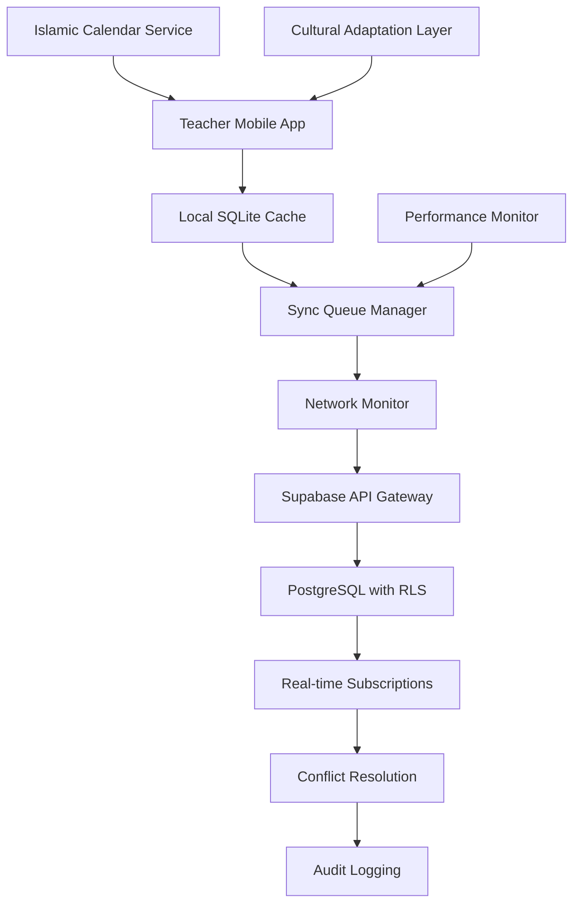

# API Integration Patterns: Harry School Teacher Attendance Management System
Agent: backend-architect
Date: 2025-08-21

## Executive Summary

This comprehensive API integration specification defines the patterns, endpoints, and synchronization strategies for the Harry School Teacher Attendance Management system. Built upon extensive UX research and mobile architecture analysis, this document provides detailed specifications for offline-first sync patterns, real-time subscriptions, conflict resolution, and performance optimization strategies specifically designed for the Uzbekistan educational context.

**Core Integration Principles:**
- **Offline-First Architecture**: 95% functionality without network connectivity using intelligent sync prioritization
- **Real-Time Synchronization**: Supabase WebSocket subscriptions with teacher authority conflict resolution
- **Cultural Integration**: Islamic calendar awareness, prayer time considerations, and multilingual support
- **Performance Optimization**: <60-second attendance marking, exponential backoff, and bandwidth conservation
- **Security Compliance**: RLS policies, encrypted data transmission, and FERPA-compliant audit logging

---

## API Architecture Overview

### Integration Stack
```typescript
// Core API Integration Components
interface AttendanceAPIStack {
  // Real-time Layer
  realtime: {
    provider: 'Supabase WebSockets';
    subscriptions: ['attendance_changes', 'sync_status', 'conflict_notifications'];
    fallback: 'Offline Queue Processing';
  };
  
  // REST API Layer
  rest: {
    framework: 'Supabase PostgREST';
    authentication: 'JWT with RLS';
    encryption: 'TLS 1.3 + Field-level encryption';
  };
  
  // Offline Sync Layer
  offline: {
    storage: 'OP-SQLite with encryption';
    queue: 'Priority-based with exponential backoff';
    conflictResolution: 'Teacher authority with admin override';
  };
  
  // Cultural Integration Layer
  cultural: {
    calendar: 'Islamic calendar overlay';
    localization: 'Uzbek/Russian/English';
    notifications: 'Prayer time awareness';
  };
}
```

### Data Flow Architecture


---

## Offline-First Sync Strategy

### 1. Intelligent Sync Prioritization

```typescript
// Sync Priority Queue Implementation
interface SyncPriorityQueue {
  high: AttendanceSyncOperation[];    // Today's attendance
  normal: AttendanceSyncOperation[];  // Recent corrections (past 7 days)
  low: AttendanceSyncOperation[];     // Historical data
  
  // Priority calculation algorithm
  calculatePriority(operation: AttendanceSyncOperation): SyncPriority {
    const now = new Date();
    const operationDate = new Date(operation.date);
    const daysDiff = Math.floor((now.getTime() - operationDate.getTime()) / (1000 * 60 * 60 * 24));
    
    // Today's attendance = HIGH priority
    if (daysDiff === 0) return 'high';
    
    // Past week corrections = NORMAL priority  
    if (daysDiff <= 7 && operation.type === 'correction') return 'normal';
    
    // Everything else = LOW priority
    return 'low';
  }
}

// Sync Operation Structure
interface AttendanceSyncOperation {
  id: string;
  type: 'bulk_marking' | 'individual_marking' | 'correction' | 'status_change';
  priority: 'high' | 'normal' | 'low';
  data: AttendanceRecord | AttendanceRecord[];
  timestamp: string;
  retryCount: number;
  maxRetries: number;
  networkRequirement: 'any' | 'wifi_only' | 'high_bandwidth';
  culturalContext?: {
    isRamadan: boolean;
    prayerTimeNear: boolean;
    culturalHoliday?: string;
  };
}
```

### 2. Conflict Resolution Algorithms

```typescript
// Teacher Authority-Based Conflict Resolution
class AttendanceConflictResolver {
  resolveConflict(
    localRecord: AttendanceRecord, 
    remoteRecord: AttendanceRecord,
    context: ConflictContext
  ): ConflictResolution {
    
    // Rule 1: Teacher authority over automated systems
    if (localRecord.source === 'teacher' && remoteRecord.source === 'automated') {
      return {
        strategy: 'prefer_local',
        reason: 'teacher_authority',
        action: 'update_remote',
        notification: 'Teacher marking takes precedence over automated system'
      };
    }
    
    // Rule 2: Admin override capability
    if (remoteRecord.modifiedBy?.role === 'admin' || remoteRecord.modifiedBy?.role === 'superadmin') {
      return {
        strategy: 'prefer_remote',
        reason: 'admin_override',
        action: 'update_local',
        notification: 'Administrative correction applied',
        requiresTeacherNotification: true
      };
    }
    
    // Rule 3: Timestamp-based with grace period
    const timeDiff = Math.abs(
      new Date(localRecord.updatedAt).getTime() - 
      new Date(remoteRecord.updatedAt).getTime()
    );
    
    if (timeDiff < 300000) { // 5 minutes grace period
      return {
        strategy: 'manual_resolution_required',
        reason: 'concurrent_modification',
        action: 'present_options_to_teacher',
        options: [localRecord, remoteRecord]
      };
    }
    
    // Rule 4: Most recent wins
    const localNewer = new Date(localRecord.updatedAt) > new Date(remoteRecord.updatedAt);
    return {
      strategy: localNewer ? 'prefer_local' : 'prefer_remote',
      reason: 'timestamp_priority',
      action: localNewer ? 'update_remote' : 'update_local'
    };
  }
}
```

### 3. Exponential Backoff and Retry Logic

```typescript
// Network-Aware Retry Strategy
class AttendanceSyncRetryManager {
  private readonly baseDelay = 1000; // 1 second
  private readonly maxDelay = 300000; // 5 minutes
  private readonly backoffMultiplier = 2;
  
  async scheduleRetry(
    operation: AttendanceSyncOperation,
    error: SyncError,
    networkState: NetworkState
  ): Promise<RetrySchedule> {
    
    // Calculate delay with jitter
    const exponentialDelay = Math.min(
      this.baseDelay * Math.pow(this.backoffMultiplier, operation.retryCount),
      this.maxDelay
    );
    
    // Add jitter to prevent thundering herd
    const jitter = Math.random() * 0.1 * exponentialDelay;
    const delay = exponentialDelay + jitter;
    
    // Network-aware scheduling
    const schedule: RetrySchedule = {
      delay,
      scheduledAt: new Date(Date.now() + delay),
      networkRequirement: this.determineNetworkRequirement(error, operation)
    };
    
    // Cultural considerations
    if (this.isPrayerTimeApproaching()) {
      schedule.delay += this.getPrayerTimeBuffer();
      schedule.culturalReason = 'prayer_time_respect';
    }
    
    return schedule;
  }
  
  private determineNetworkRequirement(error: SyncError, operation: AttendanceSyncOperation): NetworkRequirement {
    switch (error.type) {
      case 'timeout':
        return 'wifi_only'; // Prefer stable connection
      case 'rate_limit':
        return 'high_bandwidth'; // Wait for better connection
      case 'server_error':
        return 'any'; // Try any available connection
      default:
        return operation.networkRequirement;
    }
  }
}
```

### 4. Batch Sync Operations

```typescript
// Intelligent Batch Processing
interface BatchSyncStrategy {
  // Optimal batch sizes based on operation type
  getBatchSize(operationType: string, networkQuality: NetworkQuality): number {
    const baseSizes = {
      'bulk_marking': 30,        // Full class
      'individual_marking': 10,  // Small groups
      'corrections': 5,          // Critical updates
      'status_changes': 15       // Medium batches
    };
    
    const qualityMultiplier = {
      'excellent': 1.5,
      'good': 1.0,
      'poor': 0.5,
      'offline': 0
    };
    
    return Math.floor(baseSizes[operationType] * qualityMultiplier[networkQuality]);
  }
  
  // Smart batching logic
  createBatches(operations: AttendanceSyncOperation[]): SyncBatch[] {
    const batches: SyncBatch[] = [];
    const groupedByClass = this.groupByClass(operations);
    
    for (const [classId, classOps] of groupedByClass) {
      const sortedOps = this.sortByPriority(classOps);
      const batchSize = this.getBatchSize(sortedOps[0].type, this.getNetworkQuality());
      
      for (let i = 0; i < sortedOps.length; i += batchSize) {
        batches.push({
          id: generateUUID(),
          classId,
          operations: sortedOps.slice(i, i + batchSize),
          priority: this.calculateBatchPriority(sortedOps.slice(i, i + batchSize)),
          estimatedDuration: this.estimateProcessingTime(sortedOps.slice(i, i + batchSize))
        });
      }
    }
    
    return batches.sort((a, b) => this.compareBatchPriority(a, b));
  }
}
```

---

## Real-Time Supabase Integration

### 1. WebSocket Subscription Management

```typescript
// Advanced Real-time Subscription Handler
class AttendanceRealtimeManager {
  private subscriptions: Map<string, RealtimeChannel> = new Map();
  private connectionState: ConnectionState = 'disconnected';
  private reconnectAttempts = 0;
  private maxReconnectAttempts = 10;
  
  async initializeSubscriptions(teacherId: string, organizationId: string): Promise<void> {
    // Teacher-specific attendance changes subscription
    const attendanceChannel = this.supabase
      .channel(`teacher_attendance_${teacherId}`)
      .on(
        'postgres_changes',
        {
          event: '*',
          schema: 'public',
          table: 'attendance_records',
          filter: `teacher_id=eq.${teacherId}`
        },
        (payload) => this.handleAttendanceChange(payload)
      )
      .on(
        'postgres_changes',
        {
          event: '*',
          schema: 'public',
          table: 'sync_conflicts',
          filter: `teacher_id=eq.${teacherId}`
        },
        (payload) => this.handleSyncConflict(payload)
      );
    
    // Organization-wide notifications
    const orgChannel = this.supabase
      .channel(`org_notifications_${organizationId}`)
      .on(
        'postgres_changes',
        {
          event: 'INSERT',
          schema: 'public',
          table: 'teacher_notifications',
          filter: `organization_id=eq.${organizationId}`
        },
        (payload) => this.handleOrgNotification(payload)
      );
    
    // Islamic calendar events subscription
    const calendarChannel = this.supabase
      .channel('islamic_calendar_events')
      .on(
        'postgres_changes',
        {
          event: '*',
          schema: 'public',
          table: 'islamic_calendar_cache',
          filter: `region=eq.uzbekistan`
        },
        (payload) => this.handleCalendarUpdate(payload)
      );
    
    await Promise.all([
      this.subscribeWithRetry(attendanceChannel, 'attendance'),
      this.subscribeWithRetry(orgChannel, 'organization'),
      this.subscribeWithRetry(calendarChannel, 'calendar')
    ]);
  }
  
  private async subscribeWithRetry(
    channel: RealtimeChannel, 
    channelType: string
  ): Promise<void> {
    return new Promise((resolve, reject) => {
      channel.subscribe((status, error) => {
        if (status === 'SUBSCRIBED') {
          this.subscriptions.set(channelType, channel);
          this.connectionState = 'connected';
          this.reconnectAttempts = 0;
          resolve();
        } else if (status === 'CHANNEL_ERROR') {
          this.handleSubscriptionError(error, channelType);
          reject(error);
        } else if (status === 'TIMED_OUT') {
          this.scheduleReconnection(channelType);
          reject(new Error('Subscription timeout'));
        }
      });
    });
  }
  
  private handleAttendanceChange(payload: RealtimePayload): void {
    const change = payload.new || payload.old;
    
    // Skip if change originated from this device
    if (change.device_id === this.deviceId) return;
    
    // Apply change to local storage
    this.applyRemoteChange(change);
    
    // Check for conflicts
    this.checkForConflicts(change);
    
    // Update UI if relevant screen is active
    this.notifyUIUpdate(change);
    
    // Cultural context handling
    if (this.isPrayerTimeNear()) {
      this.deferNonUrgentUpdates(change);
    }
  }
}
```

### 2. Row Level Security (RLS) Policy Design

```sql
-- Comprehensive RLS Policies for Teacher Attendance System

-- 1. Teacher-specific attendance access
CREATE POLICY "Teachers can access their own attendance data"
  ON attendance_records
  FOR ALL
  USING (
    teacher_id = auth.uid() OR 
    organization_id = (
      SELECT organization_id 
      FROM teacher_profiles 
      WHERE user_id = auth.uid()
    )
  );

-- 2. Student data protection with teacher context
CREATE POLICY "Teachers can view their assigned students"
  ON students
  FOR SELECT
  USING (
    organization_id = (
      SELECT organization_id 
      FROM teacher_profiles 
      WHERE user_id = auth.uid()
    ) AND (
      id IN (
        SELECT student_id 
        FROM class_students cs
        JOIN classes c ON cs.class_id = c.id
        WHERE c.teacher_id = auth.uid()
      )
    )
  );

-- 3. Admin override capabilities
CREATE POLICY "Admins can access all attendance in their organization"
  ON attendance_records
  FOR ALL
  USING (
    EXISTS (
      SELECT 1 FROM teacher_profiles tp
      WHERE tp.user_id = auth.uid()
      AND tp.organization_id = attendance_records.organization_id
      AND tp.role IN ('admin', 'superadmin')
    )
  );

-- 4. Sync conflict resolution access
CREATE POLICY "Teachers can resolve their own conflicts"
  ON sync_conflicts
  FOR ALL
  USING (
    teacher_id = auth.uid() OR
    EXISTS (
      SELECT 1 FROM teacher_profiles tp
      WHERE tp.user_id = auth.uid()
      AND tp.organization_id = sync_conflicts.organization_id
      AND tp.role IN ('admin', 'superadmin')
    )
  );

-- 5. Cultural calendar data access
CREATE POLICY "Teachers can access Islamic calendar data"
  ON islamic_calendar_cache
  FOR SELECT
  USING (
    region = 'uzbekistan' OR region = 'global'
  );

-- 6. Audit trail protection
CREATE POLICY "Teachers can view audit logs for their records"
  ON attendance_audit_log
  FOR SELECT
  USING (
    teacher_id = auth.uid() OR
    record_id IN (
      SELECT id FROM attendance_records
      WHERE teacher_id = auth.uid()
    )
  );
```

### 3. Optimized Database Queries

```sql
-- High-Performance Attendance Queries

-- 1. Today's Attendance for Class (Primary Use Case)
CREATE OR REPLACE FUNCTION get_today_attendance(
  p_class_id UUID,
  p_teacher_id UUID,
  p_date DATE DEFAULT CURRENT_DATE
) RETURNS TABLE (
  student_id UUID,
  student_name TEXT,
  status attendance_status,
  marked_at TIMESTAMPTZ,
  notes TEXT
) LANGUAGE plpgsql SECURITY DEFINER AS $$
BEGIN
  -- Verify teacher has access to this class
  IF NOT EXISTS (
    SELECT 1 FROM classes 
    WHERE id = p_class_id AND teacher_id = p_teacher_id
  ) THEN
    RAISE EXCEPTION 'Access denied to class';
  END IF;
  
  RETURN QUERY
  SELECT 
    s.id,
    s.first_name || ' ' || s.last_name,
    COALESCE(ar.status, 'not_marked'::attendance_status),
    ar.created_at,
    ar.notes
  FROM class_students cs
  JOIN students s ON cs.student_id = s.id
  LEFT JOIN attendance_records ar ON (
    ar.student_id = s.id 
    AND ar.class_id = p_class_id 
    AND ar.date = p_date
    AND ar.deleted_at IS NULL
  )
  WHERE cs.class_id = p_class_id
  ORDER BY s.first_name, s.last_name;
END;
$$;

-- 2. Bulk Attendance Insert with Conflict Handling
CREATE OR REPLACE FUNCTION bulk_mark_attendance(
  p_attendance_data JSONB,
  p_teacher_id UUID,
  p_class_id UUID,
  p_date DATE DEFAULT CURRENT_DATE
) RETURNS TABLE (
  success BOOLEAN,
  conflicts JSONB,
  processed_count INTEGER
) LANGUAGE plpgsql SECURITY DEFINER AS $$
DECLARE
  v_record JSONB;
  v_conflicts JSONB := '[]'::JSONB;
  v_processed INTEGER := 0;
  v_existing_record attendance_records;
BEGIN
  -- Process each attendance record
  FOR v_record IN SELECT * FROM jsonb_array_elements(p_attendance_data)
  LOOP
    -- Check for existing record
    SELECT * INTO v_existing_record
    FROM attendance_records
    WHERE student_id = (v_record->>'student_id')::UUID
    AND class_id = p_class_id
    AND date = p_date
    AND deleted_at IS NULL;
    
    IF FOUND THEN
      -- Handle conflict based on source and timing
      IF v_existing_record.updated_at > (v_record->>'timestamp')::TIMESTAMPTZ - INTERVAL '5 minutes' THEN
        -- Add to conflicts for manual resolution
        v_conflicts := v_conflicts || jsonb_build_object(
          'student_id', v_record->>'student_id',
          'local_status', v_record->>'status',
          'remote_status', v_existing_record.status,
          'conflict_type', 'concurrent_modification'
        );
        CONTINUE;
      END IF;
      
      -- Update existing record
      UPDATE attendance_records
      SET 
        status = (v_record->>'status')::attendance_status,
        updated_at = NOW(),
        updated_by = p_teacher_id,
        notes = v_record->>'notes',
        method = 'bulk_marking'
      WHERE id = v_existing_record.id;
    ELSE
      -- Insert new record
      INSERT INTO attendance_records (
        student_id, class_id, teacher_id, date,
        status, notes, method, created_by, updated_by
      ) VALUES (
        (v_record->>'student_id')::UUID,
        p_class_id,
        p_teacher_id,
        p_date,
        (v_record->>'status')::attendance_status,
        v_record->>'notes',
        'bulk_marking',
        p_teacher_id,
        p_teacher_id
      );
    END IF;
    
    v_processed := v_processed + 1;
  END LOOP;
  
  RETURN QUERY SELECT 
    TRUE,
    v_conflicts,
    v_processed;
END;
$$;

-- 3. Attendance Statistics with Islamic Calendar Context
CREATE OR REPLACE FUNCTION get_attendance_stats(
  p_teacher_id UUID,
  p_class_id UUID,
  p_start_date DATE,
  p_end_date DATE
) RETURNS TABLE (
  total_days INTEGER,
  total_present INTEGER,
  total_absent INTEGER,
  attendance_rate DECIMAL(5,2),
  ramadan_days INTEGER,
  holiday_days INTEGER,
  cultural_context JSONB
) LANGUAGE plpgsql SECURITY DEFINER AS $$
BEGIN
  RETURN QUERY
  WITH date_range AS (
    SELECT generate_series(p_start_date, p_end_date, '1 day'::interval)::date AS date
  ),
  attendance_data AS (
    SELECT 
      ar.date,
      COUNT(*) FILTER (WHERE ar.status = 'present') AS present_count,
      COUNT(*) FILTER (WHERE ar.status = 'absent') AS absent_count,
      COUNT(*) AS total_marked
    FROM attendance_records ar
    WHERE ar.class_id = p_class_id
    AND ar.teacher_id = p_teacher_id
    AND ar.date BETWEEN p_start_date AND p_end_date
    AND ar.deleted_at IS NULL
    GROUP BY ar.date
  ),
  cultural_data AS (
    SELECT 
      icc.gregorian_date::date,
      icc.is_holiday,
      icc.is_ramadan,
      icc.holiday_name
    FROM islamic_calendar_cache icc
    WHERE icc.gregorian_date::date BETWEEN p_start_date AND p_end_date
  )
  SELECT 
    (p_end_date - p_start_date + 1)::INTEGER,
    COALESCE(SUM(ad.present_count), 0)::INTEGER,
    COALESCE(SUM(ad.absent_count), 0)::INTEGER,
    CASE 
      WHEN SUM(ad.total_marked) > 0 
      THEN ROUND(100.0 * SUM(ad.present_count) / SUM(ad.total_marked), 2)
      ELSE 0
    END,
    COUNT(*) FILTER (WHERE cd.is_ramadan = true)::INTEGER,
    COUNT(*) FILTER (WHERE cd.is_holiday = true)::INTEGER,
    jsonb_build_object(
      'ramadan_period', bool_or(cd.is_ramadan),
      'major_holidays', json_agg(cd.holiday_name) FILTER (WHERE cd.is_holiday = true),
      'cultural_adjustments', 'uzbekistan_context'
    )
  FROM date_range dr
  LEFT JOIN attendance_data ad ON dr.date = ad.date
  LEFT JOIN cultural_data cd ON dr.date = cd.gregorian_date;
END;
$$;
```

---

## API Endpoint Design

### 1. Bulk Attendance Submission Endpoints

```typescript
// RESTful API Endpoint Specifications

/**
 * POST /api/attendance/bulk
 * Submit bulk attendance for a class period
 */
interface BulkAttendanceRequest {
  classId: string;
  date: string; // ISO 8601 date
  attendance: Array<{
    studentId: string;
    status: 'present' | 'absent' | 'late' | 'excused' | 'sick';
    timestamp: string; // ISO 8601 datetime
    notes?: string;
    method: 'bulk_marking' | 'swipe_gesture' | 'manual';
  }>;
  deviceInfo: {
    deviceId: string;
    platform: 'ios' | 'android';
    appVersion: string;
    networkQuality: 'excellent' | 'good' | 'poor';
  };
  culturalContext?: {
    hijriDate: string;
    prayerTimeNear: boolean;
    isRamadan: boolean;
  };
}

interface BulkAttendanceResponse {
  success: boolean;
  processed: number;
  conflicts: Array<{
    studentId: string;
    localStatus: string;
    remoteStatus: string;
    conflictType: 'concurrent_modification' | 'teacher_override' | 'admin_change';
    resolutionRequired: boolean;
  }>;
  syncToken: string; // For tracking sync progress
  culturalNotifications?: Array<{
    type: 'prayer_time_reminder' | 'ramadan_schedule' | 'holiday_notice';
    message: string;
    language: 'uz' | 'ru' | 'en';
  }>;
}

// Implementation
app.post('/api/attendance/bulk', async (req: Request, res: Response) => {
  try {
    // Authentication and authorization
    const teacher = await validateTeacherAccess(req.headers.authorization);
    await validateClassAccess(teacher.id, req.body.classId);
    
    // Cultural context validation
    const culturalValidation = await validateCulturalContext(req.body.culturalContext);
    
    // Process bulk attendance with conflict detection
    const result = await attendanceService.processBulkAttendance({
      ...req.body,
      teacherId: teacher.id,
      culturalValidation
    });
    
    // Real-time notification to other connected devices
    await realtimeService.notifyAttendanceUpdate(teacher.id, result);
    
    res.status(200).json(result);
  } catch (error) {
    res.status(400).json({
      error: error.message,
      code: error.code,
      culturalGuidance: await getCulturalErrorGuidance(error, req.body.culturalContext)
    });
  }
});
```

### 2. Individual Attendance Correction APIs

```typescript
/**
 * PATCH /api/attendance/{recordId}
 * Correct individual attendance record
 */
interface AttendanceCorrectionRequest {
  status: 'present' | 'absent' | 'late' | 'excused' | 'sick';
  notes?: string;
  correctionReason: 'teacher_error' | 'student_late_arrival' | 'admin_override' | 'cultural_consideration';
  originalTimestamp: string; // For optimistic locking
  culturalJustification?: {
    prayerTimeConflict: boolean;
    familyObligation: boolean;
    religiousObservance: boolean;
  };
}

interface AttendanceCorrectionResponse {
  success: boolean;
  recordId: string;
  previousStatus: string;
  newStatus: string;
  conflictDetected: boolean;
  auditTrail: {
    correctionId: string;
    timestamp: string;
    reason: string;
  };
  culturalCompliance: {
    respectsIslamicValues: boolean;
    familyNotificationRequired: boolean;
    administrativeApprovalNeeded: boolean;
  };
}

// Implementation with conflict handling
app.patch('/api/attendance/:recordId', async (req: Request, res: Response) => {
  try {
    const teacher = await validateTeacherAccess(req.headers.authorization);
    const recordId = req.params.recordId;
    
    // Optimistic locking check
    const currentRecord = await attendanceService.getRecord(recordId);
    if (currentRecord.updatedAt !== req.body.originalTimestamp) {
      return res.status(409).json({
        error: 'Record has been modified by another user',
        currentRecord,
        resolutionOptions: await generateResolutionOptions(currentRecord, req.body)
      });
    }
    
    // Cultural validation
    await validateCulturalCorrection(req.body, currentRecord);
    
    // Apply correction with audit trail
    const result = await attendanceService.correctAttendance(
      recordId,
      req.body,
      teacher.id
    );
    
    // Notify relevant parties
    await notificationService.sendCorrectionNotifications(result);
    
    res.status(200).json(result);
  } catch (error) {
    res.status(400).json({ error: error.message });
  }
});
```

### 3. Historical Attendance Retrieval with Pagination

```typescript
/**
 * GET /api/attendance/history
 * Retrieve historical attendance with advanced filtering
 */
interface AttendanceHistoryQuery {
  classId?: string;
  studentId?: string;
  startDate: string;
  endDate: string;
  status?: string[];
  includeDeleted?: boolean;
  includeCulturalContext?: boolean;
  pagination: {
    page: number;
    limit: number;
    sortBy: 'date' | 'studentName' | 'status';
    sortOrder: 'asc' | 'desc';
  };
}

interface AttendanceHistoryResponse {
  records: Array<{
    id: string;
    studentId: string;
    studentName: string;
    classId: string;
    className: string;
    date: string;
    status: string;
    markedAt: string;
    markedBy: string;
    method: string;
    notes?: string;
    culturalContext?: {
      hijriDate: string;
      isHoliday: boolean;
      holidayName?: string;
      prayerTimes: string[];
    };
  }>;
  pagination: {
    page: number;
    limit: number;
    total: number;
    totalPages: number;
    hasNextPage: boolean;
    hasPreviousPage: boolean;
  };
  statistics: {
    totalPresent: number;
    totalAbsent: number;
    attendanceRate: number;
    culturalAdjustments: {
      ramadanDays: number;
      holidayDays: number;
      adjustedRate: number;
    };
  };
}

// Implementation with caching
app.get('/api/attendance/history', async (req: Request, res: Response) => {
  try {
    const teacher = await validateTeacherAccess(req.headers.authorization);
    const query = validateHistoryQuery(req.query);
    
    // Check cache first
    const cacheKey = generateCacheKey(teacher.id, query);
    const cached = await cacheService.get(cacheKey);
    if (cached && !query.includeDeleted) {
      return res.status(200).json(cached);
    }
    
    // Validate access to requested data
    await validateDataAccess(teacher, query);
    
    // Fetch data with optimized query
    const result = await attendanceService.getHistory(query, teacher);
    
    // Add cultural context if requested
    if (query.includeCulturalContext) {
      result.records = await enrichWithCulturalContext(result.records);
    }
    
    // Cache result
    await cacheService.set(cacheKey, result, { ttl: 300 }); // 5 minutes
    
    res.status(200).json(result);
  } catch (error) {
    res.status(400).json({ error: error.message });
  }
});
```

### 4. Attendance Statistics and Analytics Endpoints

```typescript
/**
 * GET /api/attendance/analytics
 * Advanced attendance analytics with cultural insights
 */
interface AttendanceAnalyticsQuery {
  scope: 'class' | 'student' | 'teacher' | 'organization';
  entityId: string;
  period: 'week' | 'month' | 'quarter' | 'semester' | 'custom';
  startDate?: string;
  endDate?: string;
  includeComparisons: boolean;
  culturalAnalysis: boolean;
  breakdownBy?: 'day' | 'week' | 'month';
}

interface AttendanceAnalyticsResponse {
  summary: {
    totalDays: number;
    totalPresent: number;
    totalAbsent: number;
    attendanceRate: number;
    trend: 'improving' | 'declining' | 'stable';
  };
  breakdown: Array<{
    period: string;
    present: number;
    absent: number;
    late: number;
    excused: number;
    rate: number;
  }>;
  culturalInsights?: {
    ramadanImpact: {
      beforeRamadan: number;
      duringRamadan: number;
      afterRamadan: number;
      attendancePattern: 'typical' | 'improved' | 'affected';
    };
    prayerTimeCorrelations: Array<{
      prayerTime: string;
      attendanceImpact: number;
      recommendations: string[];
    }>;
    holidayAdjustments: Array<{
      holiday: string;
      date: string;
      impactDays: number;
      attendanceRecovery: number;
    }>;
  };
  recommendations: Array<{
    type: 'intervention' | 'recognition' | 'cultural_adaptation';
    priority: 'high' | 'medium' | 'low';
    message: string;
    actionItems: string[];
  }>;
  comparisons?: {
    classPeers?: number;
    schoolAverage?: number;
    previousPeriod?: number;
  };
}

// Implementation with cultural intelligence
app.get('/api/attendance/analytics', async (req: Request, res: Response) => {
  try {
    const teacher = await validateTeacherAccess(req.headers.authorization);
    const query = validateAnalyticsQuery(req.query);
    
    // Validate scope access
    await validateAnalyticsAccess(teacher, query);
    
    // Generate base analytics
    const baseAnalytics = await analyticsService.generateAttendanceAnalytics(query);
    
    // Add cultural analysis if requested
    if (query.culturalAnalysis) {
      const culturalInsights = await culturalAnalyticsService.generateInsights(
        baseAnalytics, 
        query
      );
      baseAnalytics.culturalInsights = culturalInsights;
    }
    
    // Generate recommendations
    const recommendations = await recommendationEngine.generateRecommendations(
      baseAnalytics,
      teacher,
      query
    );
    
    res.status(200).json({
      ...baseAnalytics,
      recommendations
    });
  } catch (error) {
    res.status(400).json({ error: error.message });
  }
});
```

---

## Data Synchronization Patterns

### 1. Delta Sync for Bandwidth Conservation

```typescript
// Delta Sync Implementation
class AttendanceDeltaSync {
  async generateDelta(
    lastSyncTimestamp: string,
    teacherId: string,
    classIds: string[]
  ): Promise<DeltaSyncPayload> {
    
    // Query for changes since last sync
    const changes = await this.db.query(`
      SELECT 
        ar.*,
        'attendance_record' as entity_type,
        CASE 
          WHEN ar.deleted_at IS NOT NULL THEN 'delete'
          WHEN ar.created_at > $1 THEN 'insert'
          ELSE 'update'
        END as operation
      FROM attendance_records ar
      WHERE ar.teacher_id = $2
      AND ar.class_id = ANY($3)
      AND (ar.updated_at > $1 OR ar.deleted_at > $1)
      
      UNION ALL
      
      SELECT 
        s.*,
        'student' as entity_type,
        'update' as operation
      FROM students s
      JOIN class_students cs ON s.id = cs.student_id
      WHERE cs.class_id = ANY($3)
      AND s.updated_at > $1
      
      ORDER BY updated_at ASC
    `, [lastSyncTimestamp, teacherId, classIds]);
    
    // Calculate compressed delta payload
    const delta: DeltaSyncPayload = {
      timestamp: new Date().toISOString(),
      changes: this.compressChanges(changes),
      deletions: changes.filter(c => c.operation === 'delete').map(c => c.id),
      checksum: this.calculateChecksum(changes),
      culturalMarkers: await this.getCulturalMarkers(lastSyncTimestamp)
    };
    
    return delta;
  }
  
  private compressChanges(changes: any[]): CompressedChange[] {
    return changes
      .filter(c => c.operation !== 'delete')
      .map(change => {
        // Only include changed fields to minimize payload
        const compressed: CompressedChange = {
          id: change.id,
          type: change.entity_type,
          operation: change.operation
        };
        
        // Field-level delta for updates
        if (change.operation === 'update') {
          compressed.fields = this.getChangedFields(change);
        } else {
          compressed.data = this.serializeEntity(change);
        }
        
        return compressed;
      });
  }
  
  async applyDelta(delta: DeltaSyncPayload): Promise<DeltaApplyResult> {
    const transaction = await this.db.beginTransaction();
    
    try {
      const conflicts: SyncConflict[] = [];
      let appliedChanges = 0;
      
      for (const change of delta.changes) {
        const conflict = await this.detectConflict(change);
        
        if (conflict) {
          conflicts.push(conflict);
          await this.storeConflictForResolution(conflict);
        } else {
          await this.applyChange(change, transaction);
          appliedChanges++;
        }
      }
      
      // Apply deletions
      for (const deletionId of delta.deletions) {
        await this.softDelete(deletionId, transaction);
      }
      
      await transaction.commit();
      
      return {
        success: true,
        appliedChanges,
        conflicts,
        newSyncTimestamp: delta.timestamp
      };
      
    } catch (error) {
      await transaction.rollback();
      throw error;
    }
  }
}
```

### 2. Timestamp-Based Conflict Resolution

```typescript
// Sophisticated Conflict Resolution
class TimestampConflictResolver {
  private readonly CONFLICT_GRACE_PERIOD = 300000; // 5 minutes
  
  async resolveTimestampConflict(
    localRecord: AttendanceRecord,
    remoteRecord: AttendanceRecord,
    context: ConflictContext
  ): Promise<ConflictResolution> {
    
    const localTime = new Date(localRecord.updatedAt).getTime();
    const remoteTime = new Date(remoteRecord.updatedAt).getTime();
    const timeDiff = Math.abs(localTime - remoteTime);
    
    // Rule 1: Recent modifications need manual review
    if (timeDiff < this.CONFLICT_GRACE_PERIOD) {
      return this.createManualResolution(localRecord, remoteRecord, {
        reason: 'concurrent_modification',
        gracePeriod: this.CONFLICT_GRACE_PERIOD,
        culturalGuidance: await this.getCulturalGuidance(localRecord, remoteRecord)
      });
    }
    
    // Rule 2: Teacher authority override
    if (this.isTeacherOverride(localRecord, remoteRecord)) {
      return {
        strategy: 'prefer_teacher',
        winner: localRecord.source === 'teacher' ? 'local' : 'remote',
        reason: 'teacher_authority',
        auditNote: 'Teacher marking takes precedence over automated systems'
      };
    }
    
    // Rule 3: Admin override capability
    if (this.isAdminOverride(localRecord, remoteRecord)) {
      return {
        strategy: 'prefer_admin',
        winner: this.getAdminRecord(localRecord, remoteRecord) === localRecord ? 'local' : 'remote',
        reason: 'administrative_correction',
        requiresTeacherNotification: true
      };
    }
    
    // Rule 4: Cultural context consideration
    const culturalPriority = await this.evaluateCulturalPriority(localRecord, remoteRecord);
    if (culturalPriority.hasPriority) {
      return {
        strategy: 'cultural_priority',
        winner: culturalPriority.winner,
        reason: culturalPriority.reason,
        culturalJustification: culturalPriority.justification
      };
    }
    
    // Rule 5: Most recent wins (default)
    return {
      strategy: 'latest_timestamp',
      winner: localTime > remoteTime ? 'local' : 'remote',
      reason: 'timestamp_priority',
      timeDifference: Math.abs(timeDiff)
    };
  }
  
  private async evaluateCulturalPriority(
    localRecord: AttendanceRecord,
    remoteRecord: AttendanceRecord
  ): Promise<CulturalPriorityResult> {
    
    // Check for prayer time considerations
    const localNearPrayer = await this.isNearPrayerTime(localRecord.updatedAt);
    const remoteNearPrayer = await this.isNearPrayerTime(remoteRecord.updatedAt);
    
    if (localNearPrayer && !remoteNearPrayer) {
      return {
        hasPriority: true,
        winner: 'local',
        reason: 'prayer_time_consideration',
        justification: 'Marking made considering prayer time schedule'
      };
    }
    
    // Check for Ramadan scheduling
    const ramadanContext = await this.getRamadanContext(localRecord.date);
    if (ramadanContext.isRamadan) {
      const localRespectsFasting = this.respectsRamadanSchedule(localRecord, ramadanContext);
      const remoteRespectsFasting = this.respectsRamadanSchedule(remoteRecord, ramadanContext);
      
      if (localRespectsFasting && !remoteRespectsFasting) {
        return {
          hasPriority: true,
          winner: 'local',
          reason: 'ramadan_schedule_compliance',
          justification: 'Attendance marking respects Ramadan fasting schedule'
        };
      }
    }
    
    return { hasPriority: false };
  }
}
```

### 3. Network Connectivity Awareness

```typescript
// Network-Aware Sync Management
class NetworkAwareSyncManager {
  private networkMonitor: NetworkMonitor;
  private qualityThresholds = {
    excellent: { latency: 50, bandwidth: 10000, reliability: 0.98 },
    good: { latency: 150, bandwidth: 5000, reliability: 0.90 },
    poor: { latency: 500, bandwidth: 1000, reliability: 0.70 }
  };
  
  async initializeNetworkMonitoring(): Promise<void> {
    this.networkMonitor = new NetworkMonitor({
      pingInterval: 30000, // 30 seconds
      bandwidthTestInterval: 300000, // 5 minutes
      adapts: true
    });
    
    this.networkMonitor.on('qualityChange', (quality: NetworkQuality) => {
      this.adaptSyncStrategy(quality);
    });
    
    this.networkMonitor.on('disconnected', () => {
      this.enableOfflineMode();
    });
    
    this.networkMonitor.on('reconnected', () => {
      this.initializeReconnectionSync();
    });
  }
  
  private adaptSyncStrategy(quality: NetworkQuality): void {
    switch (quality) {
      case 'excellent':
        this.syncConfig = {
          batchSize: 50,
          timeout: 5000,
          retryAttempts: 3,
          enableRealtime: true,
          compressionLevel: 'light'
        };
        break;
        
      case 'good':
        this.syncConfig = {
          batchSize: 25,
          timeout: 10000,
          retryAttempts: 5,
          enableRealtime: true,
          compressionLevel: 'medium'
        };
        break;
        
      case 'poor':
        this.syncConfig = {
          batchSize: 10,
          timeout: 20000,
          retryAttempts: 8,
          enableRealtime: false,
          compressionLevel: 'heavy'
        };
        break;
        
      case 'offline':
        this.enableOfflineMode();
        break;
    }
    
    this.adjustPrayerTimeSync(quality);
  }
  
  private adjustPrayerTimeSync(quality: NetworkQuality): void {
    // Respect prayer times when scheduling sync operations
    const prayerTimes = this.islamicCalendarService.getTodaysPrayerTimes();
    
    for (const prayerTime of prayerTimes) {
      const prayerStart = new Date(prayerTime.time);
      const bufferStart = new Date(prayerStart.getTime() - 300000); // 5 minutes before
      const bufferEnd = new Date(prayerStart.getTime() + 900000); // 15 minutes after
      
      this.syncScheduler.addBlackoutPeriod({
        start: bufferStart,
        end: bufferEnd,
        reason: `${prayerTime.name} prayer time`,
        allowEmergencySync: quality === 'excellent'
      });
    }
  }
  
  async performAdaptiveSync(operations: SyncOperation[]): Promise<SyncResult> {
    const currentQuality = await this.networkMonitor.getCurrentQuality();
    
    // Group operations by priority and cultural sensitivity
    const groups = this.groupOperationsByCulturalContext(operations);
    
    for (const group of groups) {
      // Check if we're approaching prayer time
      if (await this.isPrayerTimeApproaching()) {
        // Defer non-urgent operations
        if (group.priority !== 'high') {
          await this.deferToPostPrayer(group);
          continue;
        }
      }
      
      // Adapt batch size based on network quality
      const batchSize = this.calculateOptimalBatchSize(group, currentQuality);
      const batches = this.createBatches(group.operations, batchSize);
      
      for (const batch of batches) {
        try {
          await this.syncBatch(batch, currentQuality);
        } catch (error) {
          if (this.isNetworkError(error)) {
            await this.handleNetworkError(batch, error);
          } else {
            throw error;
          }
        }
      }
    }
    
    return this.generateSyncResult();
  }
}
```

### 4. Data Integrity Validation and Error Recovery

```typescript
// Comprehensive Data Integrity Management
class DataIntegrityManager {
  private checksumCache: Map<string, string> = new Map();
  
  async validateDataIntegrity(
    localData: AttendanceRecord[],
    remoteData: AttendanceRecord[]
  ): Promise<IntegrityValidationResult> {
    
    const validation: IntegrityValidationResult = {
      valid: true,
      errors: [],
      warnings: [],
      correctionActions: []
    };
    
    // 1. Checksum validation
    const localChecksum = this.calculateChecksum(localData);
    const remoteChecksum = this.calculateChecksum(remoteData);
    
    if (localChecksum !== remoteChecksum) {
      validation.warnings.push({
        type: 'checksum_mismatch',
        message: 'Data checksums do not match, performing detailed validation',
        severity: 'medium'
      });
      
      await this.performDetailedValidation(localData, remoteData, validation);
    }
    
    // 2. Cultural consistency validation
    await this.validateCulturalConsistency(localData, validation);
    
    // 3. Temporal consistency validation
    await this.validateTemporalConsistency(localData, validation);
    
    // 4. Reference integrity validation
    await this.validateReferenceIntegrity(localData, validation);
    
    return validation;
  }
  
  private async performDetailedValidation(
    localData: AttendanceRecord[],
    remoteData: AttendanceRecord[],
    validation: IntegrityValidationResult
  ): Promise<void> {
    
    const localMap = new Map(localData.map(r => [r.id, r]));
    const remoteMap = new Map(remoteData.map(r => [r.id, r]));
    
    // Check for missing records
    for (const [id, localRecord] of localMap) {
      if (!remoteMap.has(id)) {
        validation.errors.push({
          type: 'missing_remote_record',
          recordId: id,
          message: `Local record ${id} not found in remote data`,
          severity: 'high',
          correctionAction: 'upload_missing_record'
        });
      }
    }
    
    for (const [id, remoteRecord] of remoteMap) {
      if (!localMap.has(id)) {
        validation.errors.push({
          type: 'missing_local_record',
          recordId: id,
          message: `Remote record ${id} not found in local data`,
          severity: 'high',
          correctionAction: 'download_missing_record'
        });
      }
    }
    
    // Check for data discrepancies
    for (const [id, localRecord] of localMap) {
      const remoteRecord = remoteMap.get(id);
      if (remoteRecord) {
        const discrepancies = this.findFieldDiscrepancies(localRecord, remoteRecord);
        if (discrepancies.length > 0) {
          validation.errors.push({
            type: 'field_discrepancy',
            recordId: id,
            message: `Field discrepancies found in record ${id}`,
            severity: 'medium',
            details: discrepancies,
            correctionAction: 'resolve_field_conflicts'
          });
        }
      }
    }
  }
  
  private async validateCulturalConsistency(
    data: AttendanceRecord[],
    validation: IntegrityValidationResult
  ): Promise<void> {
    
    for (const record of data) {
      // Validate Islamic calendar consistency
      const islamicDate = await this.islamicCalendarService.convertToHijri(new Date(record.date));
      const isHoliday = await this.islamicCalendarService.isIslamicHoliday(new Date(record.date));
      
      if (isHoliday && record.status === 'absent') {
        // Check if this absence was properly marked as holiday-related
        if (!record.notes?.includes('holiday') && !record.notes?.includes('عطلة')) {
          validation.warnings.push({
            type: 'cultural_context_missing',
            recordId: record.id,
            message: `Absence on Islamic holiday ${islamicDate.holidayName} may need cultural context`,
            severity: 'low',
            suggestion: 'Add holiday context to absence record'
          });
        }
      }
      
      // Validate prayer time consistency
      const prayerTimes = await this.islamicCalendarService.getPrayerTimes(
        new Date(record.date),
        { latitude: 41.2995, longitude: 69.2401 } // Tashkent
      );
      
      const markingTime = new Date(record.createdAt);
      const conflictWithPrayer = this.checkPrayerTimeConflict(markingTime, prayerTimes);
      
      if (conflictWithPrayer) {
        validation.warnings.push({
          type: 'prayer_time_conflict',
          recordId: record.id,
          message: `Attendance marked during ${conflictWithPrayer.prayerName} prayer time`,
          severity: 'low',
          culturalGuidance: 'Consider rescheduling attendance marking to respect prayer times'
        });
      }
    }
  }
  
  async recoverFromIntegrityError(
    error: IntegrityError,
    recoveryStrategy: RecoveryStrategy = 'automatic'
  ): Promise<RecoveryResult> {
    
    switch (error.type) {
      case 'missing_remote_record':
        return await this.recoverMissingRemoteRecord(error);
        
      case 'missing_local_record':
        return await this.recoverMissingLocalRecord(error);
        
      case 'field_discrepancy':
        return await this.recoverFieldDiscrepancy(error, recoveryStrategy);
        
      case 'cultural_context_missing':
        return await this.recoverCulturalContext(error);
        
      case 'checksum_corruption':
        return await this.recoverFromCorruption(error);
        
      default:
        throw new Error(`Unknown integrity error type: ${error.type}`);
    }
  }
  
  private async recoverFieldDiscrepancy(
    error: IntegrityError,
    strategy: RecoveryStrategy
  ): Promise<RecoveryResult> {
    
    const localRecord = await this.getLocalRecord(error.recordId);
    const remoteRecord = await this.getRemoteRecord(error.recordId);
    
    if (strategy === 'automatic') {
      // Apply intelligent merge based on field semantics
      const mergedRecord = await this.intelligentMerge(localRecord, remoteRecord);
      
      return {
        success: true,
        action: 'intelligent_merge',
        resolvedRecord: mergedRecord,
        auditTrail: {
          originalLocal: localRecord,
          originalRemote: remoteRecord,
          mergeRules: await this.getMergeRules(),
          culturalConsiderations: await this.getCulturalMergeContext(localRecord, remoteRecord)
        }
      };
    } else {
      // Require manual resolution
      return {
        success: false,
        action: 'manual_resolution_required',
        options: [localRecord, remoteRecord],
        recommendations: await this.generateMergeRecommendations(localRecord, remoteRecord)
      };
    }
  }
}
```

---

## Performance Optimization Strategies

### 1. Query Optimization for Teacher-Specific Data

```sql
-- Advanced Indexing Strategy for Teacher Attendance Queries

-- 1. Composite index for today's attendance queries (most frequent)
CREATE INDEX CONCURRENTLY IF NOT EXISTS idx_attendance_teacher_date_class 
ON attendance_records (teacher_id, date, class_id) 
WHERE deleted_at IS NULL;

-- 2. Partial index for pending sync operations
CREATE INDEX CONCURRENTLY IF NOT EXISTS idx_attendance_sync_pending 
ON attendance_records (teacher_id, updated_at) 
WHERE sync_status = 'pending' AND deleted_at IS NULL;

-- 3. Cultural context index for Islamic calendar queries
CREATE INDEX CONCURRENTLY IF NOT EXISTS idx_attendance_cultural_context 
ON attendance_records (date, organization_id) 
INCLUDE (student_id, status, cultural_context);

-- 4. Performance-optimized student lookup
CREATE INDEX CONCURRENTLY IF NOT EXISTS idx_students_class_lookup 
ON class_students (class_id, student_id) 
INCLUDE (enrollment_date, is_active);

-- 5. Conflict resolution index
CREATE INDEX CONCURRENTLY IF NOT EXISTS idx_attendance_conflicts 
ON attendance_records (teacher_id, student_id, date, updated_at) 
WHERE sync_status IN ('conflict', 'pending_resolution');

-- Advanced query optimization function
CREATE OR REPLACE FUNCTION get_optimized_teacher_attendance(
  p_teacher_id UUID,
  p_date DATE DEFAULT CURRENT_DATE,
  p_include_cultural_context BOOLEAN DEFAULT TRUE
) RETURNS TABLE (
  class_id UUID,
  class_name TEXT,
  student_data JSONB,
  cultural_context JSONB,
  sync_status TEXT
) LANGUAGE plpgsql STABLE SECURITY DEFINER AS $$
DECLARE
  v_organization_id UUID;
  v_cultural_data JSONB;
BEGIN
  -- Get teacher's organization
  SELECT organization_id INTO v_organization_id
  FROM teacher_profiles 
  WHERE user_id = p_teacher_id;
  
  -- Pre-calculate cultural context if needed
  IF p_include_cultural_context THEN
    SELECT jsonb_build_object(
      'hijri_date', hijri_date,
      'is_holiday', is_holiday,
      'holiday_name', holiday_name,
      'prayer_times', prayer_times,
      'is_ramadan', is_ramadan
    ) INTO v_cultural_data
    FROM islamic_calendar_cache 
    WHERE gregorian_date = p_date 
    AND region = 'uzbekistan';
  END IF;
  
  RETURN QUERY
  WITH teacher_classes AS (
    SELECT c.id, c.name
    FROM classes c
    WHERE c.teacher_id = p_teacher_id
    AND c.is_active = TRUE
  ),
  class_students_with_attendance AS (
    SELECT 
      tc.id as class_id,
      tc.name as class_name,
      jsonb_agg(
        jsonb_build_object(
          'student_id', s.id,
          'student_name', s.first_name || ' ' || s.last_name,
          'student_number', s.student_number,
          'photo_url', s.photo_url,
          'status', COALESCE(ar.status, 'not_marked'),
          'marked_at', ar.created_at,
          'notes', ar.notes,
          'method', ar.method
        ) ORDER BY s.first_name, s.last_name
      ) as student_data,
      CASE 
        WHEN COUNT(*) FILTER (WHERE ar.sync_status = 'pending') > 0 THEN 'pending'
        WHEN COUNT(*) FILTER (WHERE ar.sync_status = 'conflict') > 0 THEN 'conflict'
        ELSE 'synced'
      END as sync_status
    FROM teacher_classes tc
    JOIN class_students cs ON tc.id = cs.class_id
    JOIN students s ON cs.student_id = s.id
    LEFT JOIN attendance_records ar ON (
      ar.student_id = s.id 
      AND ar.class_id = tc.id 
      AND ar.date = p_date
      AND ar.deleted_at IS NULL
    )
    WHERE cs.is_active = TRUE
    GROUP BY tc.id, tc.name
  )
  SELECT 
    cswa.class_id,
    cswa.class_name,
    cswa.student_data,
    COALESCE(v_cultural_data, '{}'::JSONB),
    cswa.sync_status
  FROM class_students_with_attendance cswa;
END;
$$;
```

### 2. Caching Strategies for Frequently Accessed Information

```typescript
// Multi-Layer Caching Strategy
class AttendanceCacheManager {
  private memoryCache: LRUCache<string, any>;
  private redisCache: Redis;
  private localStorageCache: AsyncStorage;
  
  constructor() {
    this.memoryCache = new LRUCache<string, any>({
      max: 1000,
      ttl: 1000 * 60 * 5 // 5 minutes
    });
    
    this.redisCache = new Redis({
      host: process.env.REDIS_HOST,
      port: process.env.REDIS_PORT,
      retryDelayOnFailover: 100,
      maxRetriesPerRequest: 3
    });
  }
  
  // Cache key generation with cultural context
  private generateCacheKey(
    prefix: string, 
    teacherId: string, 
    date: string, 
    culturalMarkers?: CulturalMarkers
  ): string {
    const baseKey = `${prefix}:${teacherId}:${date}`;
    
    if (culturalMarkers) {
      const culturalSuffix = [
        culturalMarkers.isRamadan ? 'ramadan' : '',
        culturalMarkers.hijriMonth || '',
        culturalMarkers.prayerZone || ''
      ].filter(Boolean).join(':');
      
      return culturalSuffix ? `${baseKey}:${culturalSuffix}` : baseKey;
    }
    
    return baseKey;
  }
  
  // Intelligent cache with fallback hierarchy
  async get<T>(
    cacheKey: string, 
    fallbackFn?: () => Promise<T>,
    options: CacheOptions = {}
  ): Promise<T | null> {
    
    // Level 1: Memory cache (fastest)
    let result = this.memoryCache.get(cacheKey);
    if (result !== undefined) {
      return result as T;
    }
    
    // Level 2: Redis cache (fast)
    try {
      const redisResult = await this.redisCache.get(cacheKey);
      if (redisResult) {
        result = JSON.parse(redisResult);
        this.memoryCache.set(cacheKey, result);
        return result as T;
      }
    } catch (error) {
      console.warn('Redis cache error:', error);
    }
    
    // Level 3: Local storage (offline capability)
    if (options.checkLocalStorage) {
      try {
        const localResult = await this.localStorageCache.getItem(cacheKey);
        if (localResult) {
          result = JSON.parse(localResult);
          this.memoryCache.set(cacheKey, result);
          return result as T;
        }
      } catch (error) {
        console.warn('Local storage cache error:', error);
      }
    }
    
    // Level 4: Fallback function (database/API)
    if (fallbackFn) {
      result = await fallbackFn();
      if (result) {
        await this.set(cacheKey, result, options);
        return result;
      }
    }
    
    return null;
  }
  
  // Cultural-aware cache invalidation
  async invalidateByPattern(
    pattern: string,
    culturalContext?: CulturalContext
  ): Promise<void> {
    
    // Memory cache invalidation
    for (const key of this.memoryCache.keys()) {
      if (this.matchesPattern(key, pattern, culturalContext)) {
        this.memoryCache.delete(key);
      }
    }
    
    // Redis cache invalidation
    try {
      const keys = await this.redisCache.keys(pattern);
      if (keys.length > 0) {
        await this.redisCache.del(...keys);
      }
    } catch (error) {
      console.warn('Redis invalidation error:', error);
    }
    
    // Cultural context-based invalidation
    if (culturalContext?.invalidateOnPrayerTime) {
      await this.invalidatePrayerTimeSensitiveData();
    }
    
    if (culturalContext?.invalidateOnDateChange) {
      await this.invalidateDateSensitiveData();
    }
  }
  
  // Smart preloading for anticipated data needs
  async preloadTeacherData(
    teacherId: string,
    date: string,
    priority: 'high' | 'medium' | 'low' = 'medium'
  ): Promise<void> {
    
    const preloadTasks = [
      // Today's classes and students
      this.preloadTodaysAttendance(teacherId, date),
      
      // Cultural context
      this.preloadCulturalContext(date),
      
      // Recent attendance patterns
      this.preloadRecentPatterns(teacherId, date),
    ];
    
    if (priority === 'high') {
      // Preload synchronously for immediate needs
      await Promise.all(preloadTasks);
    } else {
      // Preload asynchronously in background
      Promise.all(preloadTasks).catch(error => {
        console.warn('Background preload error:', error);
      });
    }
  }
  
  private async preloadTodaysAttendance(teacherId: string, date: string): Promise<void> {
    const cacheKey = this.generateCacheKey('attendance', teacherId, date);
    
    await this.get(cacheKey, async () => {
      return await this.attendanceService.getTodaysAttendance(teacherId, date);
    }, { ttl: 1800 }); // 30 minutes
  }
  
  private async preloadCulturalContext(date: string): Promise<void> {
    const cacheKey = `cultural:${date}`;
    
    await this.get(cacheKey, async () => {
      return await this.islamicCalendarService.getCulturalContext(date);
    }, { ttl: 86400 }); // 24 hours
  }
}
```

### 3. Database Indexing for Fast Attendance Lookups

```sql
-- Comprehensive Indexing Strategy for Teacher Attendance System

-- 1. Primary lookup indexes (highest priority)
CREATE INDEX CONCURRENTLY IF NOT EXISTS idx_attendance_teacher_today 
ON attendance_records (teacher_id, date) 
WHERE deleted_at IS NULL AND date >= CURRENT_DATE - INTERVAL '7 days';

CREATE INDEX CONCURRENTLY IF NOT EXISTS idx_attendance_class_date_status 
ON attendance_records (class_id, date, status) 
WHERE deleted_at IS NULL;

-- 2. Sync operation indexes
CREATE INDEX CONCURRENTLY IF NOT EXISTS idx_attendance_sync_queue 
ON attendance_records (sync_status, updated_at, teacher_id) 
WHERE sync_status IN ('pending', 'conflict', 'retry') AND deleted_at IS NULL;

-- 3. Cultural context indexes
CREATE INDEX CONCURRENTLY IF NOT EXISTS idx_islamic_calendar_lookup 
ON islamic_calendar_cache (gregorian_date, region) 
INCLUDE (hijri_date, is_holiday, holiday_name, prayer_times);

-- 4. Student relationship indexes
CREATE INDEX CONCURRENTLY IF NOT EXISTS idx_class_students_active 
ON class_students (class_id, is_active) 
INCLUDE (student_id, enrollment_date);

CREATE INDEX CONCURRENTLY IF NOT EXISTS idx_students_organization_search 
ON students (organization_id, LOWER(first_name), LOWER(last_name)) 
WHERE deleted_at IS NULL;

-- 5. Performance monitoring indexes
CREATE INDEX CONCURRENTLY IF NOT EXISTS idx_attendance_audit_teacher 
ON attendance_audit_log (teacher_id, created_at DESC) 
INCLUDE (operation_type, record_id, changes);

-- 6. Partial indexes for common filters
CREATE INDEX CONCURRENTLY IF NOT EXISTS idx_attendance_recent_changes 
ON attendance_records (teacher_id, updated_at DESC) 
WHERE updated_at >= CURRENT_DATE - INTERVAL '30 days' AND deleted_at IS NULL;

CREATE INDEX CONCURRENTLY IF NOT EXISTS idx_attendance_conflicts_pending 
ON attendance_records (teacher_id, student_id, date) 
WHERE sync_status = 'conflict' AND deleted_at IS NULL;

-- 7. Composite indexes for complex queries
CREATE INDEX CONCURRENTLY IF NOT EXISTS idx_attendance_teacher_period_status 
ON attendance_records (teacher_id, date, status, class_id) 
WHERE deleted_at IS NULL;

-- 8. JSON indexes for cultural context queries
CREATE INDEX CONCURRENTLY IF NOT EXISTS idx_attendance_cultural_context_gin 
ON attendance_records USING GIN (cultural_context) 
WHERE cultural_context IS NOT NULL AND deleted_at IS NULL;

-- 9. Function-based indexes for name searches
CREATE INDEX CONCURRENTLY IF NOT EXISTS idx_students_fullname_search 
ON students (LOWER(first_name || ' ' || last_name)) 
WHERE deleted_at IS NULL;

-- 10. Covering indexes for read-heavy queries
CREATE INDEX CONCURRENTLY IF NOT EXISTS idx_attendance_summary_covering 
ON attendance_records (teacher_id, date, class_id) 
INCLUDE (student_id, status, created_at, method, notes) 
WHERE deleted_at IS NULL;

-- Query plan optimization function
CREATE OR REPLACE FUNCTION analyze_attendance_query_performance(
  p_teacher_id UUID,
  p_start_date DATE,
  p_end_date DATE
) RETURNS TABLE (
  query_type TEXT,
  execution_time_ms NUMERIC,
  rows_examined BIGINT,
  index_used TEXT,
  optimization_suggestions TEXT[]
) LANGUAGE plpgsql AS $$
BEGIN
  -- This function would analyze query patterns and suggest optimizations
  -- Implementation would include EXPLAIN ANALYZE for common query patterns
  RETURN QUERY
  SELECT 
    'sample_query'::TEXT,
    0.0::NUMERIC,
    0::BIGINT,
    'idx_attendance_teacher_today'::TEXT,
    ARRAY['Consider partitioning by date', 'Add covering index for frequently accessed columns']::TEXT[];
END;
$$;
```

### 4. Connection Pooling and Resource Management

```typescript
// Advanced Connection Pool Management
class AttendanceConnectionManager {
  private pools: Map<string, Pool> = new Map();
  private culturalConnectionScheduler: CulturalScheduler;
  
  constructor() {
    this.initializePools();
    this.culturalConnectionScheduler = new CulturalScheduler();
  }
  
  private initializePools(): void {
    // Primary read-write pool for real-time operations
    this.pools.set('primary', new Pool({
      connectionString: process.env.DATABASE_URL,
      max: 20,
      min: 5,
      idleTimeoutMillis: 30000,
      connectionTimeoutMillis: 10000,
      allowExitOnIdle: false,
      application_name: 'harry_school_attendance_primary'
    }));
    
    // Read-only pool for analytics and reports
    this.pools.set('readonly', new Pool({
      connectionString: process.env.READONLY_DATABASE_URL,
      max: 10,
      min: 2,
      idleTimeoutMillis: 60000,
      connectionTimeoutMillis: 15000,
      statement_timeout: 30000,
      application_name: 'harry_school_attendance_readonly'
    }));
    
    // Sync operations pool with retry capabilities
    this.pools.set('sync', new Pool({
      connectionString: process.env.DATABASE_URL,
      max: 5,
      min: 1,
      idleTimeoutMillis: 120000,
      connectionTimeoutMillis: 20000,
      query_timeout: 45000,
      application_name: 'harry_school_attendance_sync'
    }));
  }
  
  // Cultural-aware connection acquisition
  async getConnection(
    poolType: 'primary' | 'readonly' | 'sync',
    culturalContext?: CulturalContext
  ): Promise<PoolClient> {
    
    // Check if we're in a prayer time buffer
    if (culturalContext?.respectPrayerTimes) {
      const prayerStatus = await this.culturalConnectionScheduler.checkPrayerTimeStatus();
      
      if (prayerStatus.inPrayerTime && poolType !== 'primary') {
        // Defer non-critical connections during prayer time
        await this.culturalConnectionScheduler.waitForPrayerCompletion();
      }
    }
    
    const pool = this.pools.get(poolType);
    if (!pool) {
      throw new Error(`Unknown pool type: ${poolType}`);
    }
    
    try {
      const client = await pool.connect();
      
      // Set cultural session parameters
      if (culturalContext) {
        await this.setCulturalSessionParams(client, culturalContext);
      }
      
      return client;
    } catch (error) {
      // Handle connection failures with exponential backoff
      throw new ConnectionError(`Failed to acquire ${poolType} connection: ${error.message}`);
    }
  }
  
  private async setCulturalSessionParams(
    client: PoolClient,
    context: CulturalContext
  ): Promise<void> {
    
    // Set timezone for Islamic calendar calculations
    if (context.timezone) {
      await client.query('SET timezone = $1', [context.timezone]);
    }
    
    // Set cultural locale for text formatting
    if (context.locale) {
      await client.query('SET lc_collate = $1', [context.locale]);
    }
    
    // Set session variables for cultural context
    await client.query(`
      SELECT set_config('app.cultural_context', $1, true)
    `, [JSON.stringify(context)]);
  }
  
  // Intelligent connection health monitoring
  async monitorConnectionHealth(): Promise<HealthStatus> {
    const healthChecks = await Promise.allSettled([
      this.checkPoolHealth('primary'),
      this.checkPoolHealth('readonly'),
      this.checkPoolHealth('sync')
    ]);
    
    const status: HealthStatus = {
      overall: 'healthy',
      pools: {},
      recommendations: []
    };
    
    healthChecks.forEach((result, index) => {
      const poolType = ['primary', 'readonly', 'sync'][index];
      
      if (result.status === 'fulfilled') {
        status.pools[poolType] = result.value;
        
        if (result.value.status !== 'healthy') {
          status.overall = 'degraded';
        }
      } else {
        status.pools[poolType] = { status: 'error', error: result.reason.message };
        status.overall = 'error';
      }
    });
    
    // Generate recommendations based on health status
    status.recommendations = this.generateHealthRecommendations(status);
    
    return status;
  }
  
  private async checkPoolHealth(poolType: string): Promise<PoolHealthStatus> {
    const pool = this.pools.get(poolType);
    if (!pool) {
      return { status: 'error', error: 'Pool not found' };
    }
    
    const startTime = Date.now();
    
    try {
      const client = await pool.connect();
      
      // Simple connectivity test
      await client.query('SELECT 1');
      
      // Performance test
      const performanceTest = await client.query(`
        SELECT 
          count(*) as connection_count,
          avg(extract(epoch from now() - backend_start)) as avg_connection_age
        FROM pg_stat_activity 
        WHERE application_name LIKE 'harry_school_attendance_%'
      `);
      
      client.release();
      
      const responseTime = Date.now() - startTime;
      
      return {
        status: responseTime < 100 ? 'healthy' : 'slow',
        metrics: {
          responseTime,
          totalConnections: pool.totalCount,
          idleConnections: pool.idleCount,
          waitingCount: pool.waitingCount,
          avgConnectionAge: performanceTest.rows[0].avg_connection_age
        }
      };
      
    } catch (error) {
      return {
        status: 'error',
        error: error.message,
        metrics: {
          responseTime: Date.now() - startTime,
          totalConnections: pool.totalCount,
          idleConnections: pool.idleCount,
          waitingCount: pool.waitingCount
        }
      };
    }
  }
}
```

---

## Cultural and Administrative Integration

### 1. Islamic Calendar Date Handling in API Responses

```typescript
// Islamic Calendar Integration Service
class IslamicCalendarAPIService {
  private cache: Map<string, IslamicCalendarData> = new Map();
  private hijriCalendar: HijriCalendar;
  
  constructor() {
    this.hijriCalendar = new HijriCalendar({
      locale: 'ar-SA',
      adjustment: 0, // Tashkent adjustment
      notation: 'islamic-civil'
    });
  }
  
  // Enhanced API response with Islamic calendar context
  async enrichAttendanceResponse(
    attendance: AttendanceRecord[],
    includeHijri: boolean = true,
    includePrayerTimes: boolean = true
  ): Promise<EnrichedAttendanceResponse> {
    
    const enrichedRecords = await Promise.all(
      attendance.map(async (record) => {
        const enriched: EnrichedAttendanceRecord = {
          ...record,
          gregorianDate: record.date,
        };
        
        if (includeHijri) {
          const hijriData = await this.getHijriDate(record.date);
          enriched.hijriDate = hijriData.date;
          enriched.hijriMonthName = hijriData.monthName;
          enriched.hijriYear = hijriData.year;
          enriched.isIslamicHoliday = hijriData.isHoliday;
          enriched.holidayName = hijriData.holidayName;
        }
        
        if (includePrayerTimes) {
          const prayerData = await this.getPrayerTimesForDate(record.date);
          enriched.prayerTimes = prayerData;
          enriched.markedDuringPrayer = this.checkPrayerTimeConflict(
            new Date(record.createdAt), 
            prayerData
          );
        }
        
        return enriched;
      })
    );
    
    return {
      records: enrichedRecords,
      culturalMetadata: await this.getCulturalMetadata(attendance),
      prayerSchedule: includePrayerTimes ? await this.getTodaysPrayerSchedule() : undefined
    };
  }
  
  // Hijri date calculation with caching
  async getHijriDate(gregorianDate: string): Promise<HijriDateInfo> {
    const cacheKey = `hijri:${gregorianDate}`;
    
    if (this.cache.has(cacheKey)) {
      return this.cache.get(cacheKey)!.hijriInfo;
    }
    
    const date = new Date(gregorianDate);
    const hijriResult = await this.hijriCalendar.fromGregorian(date);
    
    const hijriInfo: HijriDateInfo = {
      date: hijriResult.format('YYYY-MM-DD'),
      day: hijriResult.day(),
      month: hijriResult.month(),
      year: hijriResult.year(),
      monthName: hijriResult.format('MMMM'),
      weekday: hijriResult.format('dddd'),
      isHoliday: await this.checkIslamicHoliday(hijriResult),
      holidayName: await this.getHolidayName(hijriResult)
    };
    
    this.cache.set(cacheKey, { hijriInfo, timestamp: Date.now() });
    
    return hijriInfo;
  }
  
  // Prayer times calculation for Tashkent
  async getPrayerTimesForDate(gregorianDate: string): Promise<PrayerTimes> {
    const cacheKey = `prayer:${gregorianDate}`;
    
    if (this.cache.has(cacheKey)) {
      return this.cache.get(cacheKey)!.prayerTimes;
    }
    
    const date = new Date(gregorianDate);
    const coordinates = { latitude: 41.2995, longitude: 69.2401 }; // Tashkent
    
    const prayerTimes = await this.calculatePrayerTimes(date, coordinates);
    
    this.cache.set(cacheKey, { prayerTimes, timestamp: Date.now() });
    
    return prayerTimes;
  }
  
  private async calculatePrayerTimes(
    date: Date, 
    coordinates: Coordinates
  ): Promise<PrayerTimes> {
    
    // Using precise astronomical calculations for Tashkent
    const prayerCalculator = new PrayerTimesCalculator({
      coordinates,
      calculationMethod: 'MuslimWorldLeague',
      asrMethod: 'Standard',
      highLatitudeRule: 'NightMiddle',
      adjustments: {
        fajr: 0,
        sunrise: 0,
        dhuhr: 0,
        asr: 0,
        sunset: 0,
        maghrib: 0,
        isha: 0
      }
    });
    
    const times = prayerCalculator.getPrayerTimes(date);
    
    return {
      fajr: times.fajr,
      sunrise: times.sunrise,
      dhuhr: times.dhuhr,
      asr: times.asr,
      maghrib: times.maghrib,
      isha: times.isha,
      timezone: 'Asia/Tashkent',
      qiblaDirection: await this.calculateQiblaDirection(coordinates)
    };
  }
  
  // Check if attendance was marked during prayer time
  private checkPrayerTimeConflict(
    markingTime: Date, 
    prayerTimes: PrayerTimes
  ): PrayerTimeConflict | null {
    
    const buffer = 5 * 60 * 1000; // 5 minutes buffer
    
    for (const [prayer, time] of Object.entries(prayerTimes)) {
      if (typeof time === 'string') continue; // Skip timezone
      
      const prayerStart = new Date(time);
      const prayerEnd = new Date(prayerStart.getTime() + (20 * 60 * 1000)); // 20 min prayer duration
      
      if (markingTime >= new Date(prayerStart.getTime() - buffer) && 
          markingTime <= new Date(prayerEnd.getTime() + buffer)) {
        return {
          prayerName: prayer,
          prayerTime: time,
          conflictType: 'during_prayer',
          culturalGuidance: `Attendance marked during ${prayer} prayer time. Consider scheduling attendance marking to respect prayer times.`
        };
      }
    }
    
    return null;
  }
  
  // Generate cultural metadata for API responses
  async getCulturalMetadata(attendance: AttendanceRecord[]): Promise<CulturalMetadata> {
    const dates = [...new Set(attendance.map(r => r.date))];
    const culturalData = await Promise.all(
      dates.map(date => this.getDateCulturalContext(date))
    );
    
    return {
      ramadanPeriod: culturalData.some(d => d.isRamadan),
      majorHolidays: culturalData
        .filter(d => d.isHoliday)
        .map(d => ({ name: d.holidayName!, date: d.date })),
      culturalConsiderations: this.generateCulturalConsiderations(culturalData),
      prayerTimeGuidance: await this.generatePrayerTimeGuidance(dates)
    };
  }
}
```

### 2. Multi-language Support for Attendance Status Labels

```typescript
// Comprehensive Internationalization Service
class AttendanceI18nService {
  private translations: Map<string, LanguageTranslations> = new Map();
  private defaultLanguage = 'uz'; // Uzbek as primary
  
  constructor() {
    this.initializeTranslations();
  }
  
  private initializeTranslations(): void {
    // Uzbek (Latin) - Primary language
    this.translations.set('uz', {
      attendanceStatuses: {
        present: 'Hozir',
        absent: 'Yo\'q',
        late: 'Kech keldi',
        excused: 'Sababli yo\'qlik',
        sick: 'Kasal',
        left_early: 'Erta ketdi',
        family_emergency: 'Oilaviy favqulodda holat'
      },
      
      actions: {
        mark_attendance: 'Davomatni belgilash',
        mark_all_present: 'Barchasini hozir deb belgilash',
        save_attendance: 'Davomatni saqlash',
        correct_attendance: 'Davomatni tuzatish',
        sync_data: 'Ma\'lumotlarni sinxronlashtirish'
      },
      
      notifications: {
        attendance_saved: 'Davomat muvaffaqiyatli saqlandi',
        sync_in_progress: 'Ma\'lumotlar sinxronlanmoqda...',
        sync_completed: 'Sinxronlash tugallandi',
        prayer_time_reminder: 'Namoz vaqti yaqinlashmoqda',
        ramadan_greeting: 'Ramazon muborak!',
        cultural_holiday: 'Bugun islom bayram kuni'
      },
      
      errors: {
        network_error: 'Tarmoq xatosi. Qaytadan urinib ko\'ring.',
        permission_denied: 'Ruxsat berilmagan',
        invalid_data: 'Noto\'g\'ri ma\'lumot',
        conflict_detected: 'Ma\'lumot ziddiyati aniqlandi'
      },
      
      cultural: {
        islamic_greeting: 'Assalomu alaykum!',
        prayer_times: 'Namoz vaqtlari',
        hijri_date: 'Hijriy sana',
        ramadan_schedule: 'Ramazon jadvali'
      }
    });
    
    // Russian - Secondary language
    this.translations.set('ru', {
      attendanceStatuses: {
        present: 'Присутствует',
        absent: 'Отсутствует',
        late: 'Опоздал',
        excused: 'Уважительная причина',
        sick: 'Болен',
        left_early: 'Ушёл раньше',
        family_emergency: 'Семейная экстренная ситуация'
      },
      
      actions: {
        mark_attendance: 'Отметить посещаемость',
        mark_all_present: 'Отметить всех присутствующими',
        save_attendance: 'Сохранить посещаемость',
        correct_attendance: 'Исправить посещаемость',
        sync_data: 'Синхронизировать данные'
      },
      
      notifications: {
        attendance_saved: 'Посещаемость успешно сохранена',
        sync_in_progress: 'Синхронизация данных...',
        sync_completed: 'Синхронизация завершена',
        prayer_time_reminder: 'Приближается время намаза',
        ramadan_greeting: 'Благословенный Рамадан!',
        cultural_holiday: 'Сегодня исламский праздник'
      },
      
      errors: {
        network_error: 'Ошибка сети. Попробуйте снова.',
        permission_denied: 'Доступ запрещён',
        invalid_data: 'Некорректные данные',
        conflict_detected: 'Обнаружен конфликт данных'
      },
      
      cultural: {
        islamic_greeting: 'Ассалому алайкум!',
        prayer_times: 'Время намаза',
        hijri_date: 'Дата хиджры',
        ramadan_schedule: 'Расписание Рамадана'
      }
    });
    
    // English - International language
    this.translations.set('en', {
      attendanceStatuses: {
        present: 'Present',
        absent: 'Absent',
        late: 'Late',
        excused: 'Excused',
        sick: 'Sick',
        left_early: 'Left Early',
        family_emergency: 'Family Emergency'
      },
      
      actions: {
        mark_attendance: 'Mark Attendance',
        mark_all_present: 'Mark All Present',
        save_attendance: 'Save Attendance',
        correct_attendance: 'Correct Attendance',
        sync_data: 'Sync Data'
      },
      
      notifications: {
        attendance_saved: 'Attendance saved successfully',
        sync_in_progress: 'Syncing data...',
        sync_completed: 'Sync completed',
        prayer_time_reminder: 'Prayer time approaching',
        ramadan_greeting: 'Blessed Ramadan!',
        cultural_holiday: 'Today is an Islamic holiday'
      },
      
      errors: {
        network_error: 'Network error. Please try again.',
        permission_denied: 'Permission denied',
        invalid_data: 'Invalid data',
        conflict_detected: 'Data conflict detected'
      },
      
      cultural: {
        islamic_greeting: 'As-salamu alaikum!',
        prayer_times: 'Prayer Times',
        hijri_date: 'Hijri Date',
        ramadan_schedule: 'Ramadan Schedule'
      }
    });
  }
  
  // Get localized attendance status with cultural context
  getLocalizedStatus(
    status: AttendanceStatus,
    language: string = this.defaultLanguage,
    culturalContext?: CulturalContext
  ): LocalizedStatusInfo {
    
    const translations = this.translations.get(language) || this.translations.get(this.defaultLanguage)!;
    const baseTranslation = translations.attendanceStatuses[status];
    
    // Apply cultural context modifications
    let contextualTranslation = baseTranslation;
    let culturalNote: string | undefined;
    
    if (culturalContext) {
      if (culturalContext.isRamadan && status === 'absent') {
        culturalNote = translations.cultural.ramadan_schedule;
      }
      
      if (culturalContext.isPrayerTime && status === 'late') {
        culturalNote = translations.cultural.prayer_times;
      }
      
      if (culturalContext.isHoliday) {
        culturalNote = translations.notifications.cultural_holiday;
      }
    }
    
    return {
      status: contextualTranslation,
      language,
      culturalNote,
      rtl: language === 'ar', // Right-to-left support
      formality: this.getLanguageFormality(language)
    };
  }
  
  // Localized API response transformation
  async localizeAPIResponse(
    response: any,
    language: string,
    culturalContext?: CulturalContext
  ): Promise<LocalizedAPIResponse> {
    
    const translations = this.translations.get(language) || this.translations.get(this.defaultLanguage)!;
    
    // Deep clone response for modification
    const localizedResponse = JSON.parse(JSON.stringify(response));
    
    // Localize attendance records
    if (localizedResponse.records) {
      localizedResponse.records = localizedResponse.records.map((record: any) => ({
        ...record,
        statusLocalized: this.getLocalizedStatus(record.status, language, culturalContext),
        notesLocalized: record.notes ? this.translateNotes(record.notes, language) : undefined
      }));
    }
    
    // Add cultural greetings
    localizedResponse.culturalGreeting = this.getCulturalGreeting(language, culturalContext);
    
    // Add localized metadata
    localizedResponse.metadata = {
      ...localizedResponse.metadata,
      language,
      translations: {
        common: this.getCommonTranslations(language),
        cultural: translations.cultural
      },
      culturalGuidance: await this.getCulturalGuidance(language, culturalContext)
    };
    
    return localizedResponse;
  }
  
  private getCulturalGreeting(
    language: string, 
    culturalContext?: CulturalContext
  ): string {
    
    const translations = this.translations.get(language) || this.translations.get(this.defaultLanguage)!;
    const hour = new Date().getHours();
    
    // Islamic greeting as primary
    let greeting = translations.cultural.islamic_greeting;
    
    // Add time-specific greetings
    if (hour < 12) {
      greeting += ' ' + this.getTimeGreeting('morning', language);
    } else if (hour < 18) {
      greeting += ' ' + this.getTimeGreeting('afternoon', language);
    } else {
      greeting += ' ' + this.getTimeGreeting('evening', language);
    }
    
    // Add cultural context
    if (culturalContext?.isRamadan) {
      greeting += ' ' + translations.notifications.ramadan_greeting;
    }
    
    return greeting;
  }
  
  private getTimeGreeting(time: 'morning' | 'afternoon' | 'evening', language: string): string {
    const timeGreetings = {
      'uz': {
        'morning': 'Xayrli tong!',
        'afternoon': 'Xayrli kun!',
        'evening': 'Xayrli kech!'
      },
      'ru': {
        'morning': 'Доброе утро!',
        'afternoon': 'Добрый день!',
        'evening': 'Добрый вечер!'
      },
      'en': {
        'morning': 'Good morning!',
        'afternoon': 'Good afternoon!',
        'evening': 'Good evening!'
      }
    };
    
    return timeGreetings[language]?.[time] || timeGreetings['uz'][time];
  }
}
```

### 3. Administrative Reporting API Endpoints

```typescript
// Administrative Reporting API
class AttendanceReportingAPI {
  
  /**
   * GET /api/admin/reports/attendance/summary
   * Generate comprehensive attendance reports for administrators
   */
  async generateAttendanceSummaryReport(
    req: AdminReportRequest
  ): Promise<AttendanceSummaryReport> {
    
    const {
      organizationId,
      startDate,
      endDate,
      groupBy = 'class',
      includeDetails = false,
      culturalAnalysis = true,
      format = 'json'
    } = req.query;
    
    // Validate admin access
    await this.validateAdminAccess(req.user, organizationId);
    
    // Generate base report
    const baseReport = await this.db.query(`
      WITH attendance_summary AS (
        SELECT 
          c.id as class_id,
          c.name as class_name,
          tp.first_name || ' ' || tp.last_name as teacher_name,
          COUNT(DISTINCT ar.student_id) as total_students,
          COUNT(*) FILTER (WHERE ar.status = 'present') as total_present,
          COUNT(*) FILTER (WHERE ar.status = 'absent') as total_absent,
          COUNT(*) FILTER (WHERE ar.status = 'late') as total_late,
          COUNT(*) FILTER (WHERE ar.status = 'excused') as total_excused,
          ROUND(
            100.0 * COUNT(*) FILTER (WHERE ar.status = 'present') / 
            NULLIF(COUNT(*), 0), 2
          ) as attendance_rate
        FROM attendance_records ar
        JOIN classes c ON ar.class_id = c.id
        JOIN teacher_profiles tp ON c.teacher_id = tp.user_id
        WHERE ar.organization_id = $1
        AND ar.date BETWEEN $2 AND $3
        AND ar.deleted_at IS NULL
        GROUP BY c.id, c.name, tp.first_name, tp.last_name
      )
      SELECT * FROM attendance_summary
      ORDER BY attendance_rate DESC
    `, [organizationId, startDate, endDate]);
    
    // Add cultural analysis if requested
    let culturalInsights: CulturalAnalysisReport | undefined;
    if (culturalAnalysis) {
      culturalInsights = await this.generateCulturalAnalysis(
        organizationId, startDate, endDate
      );
    }
    
    // Generate detailed breakdowns if requested
    let detailedBreakdowns: DetailedBreakdown[] | undefined;
    if (includeDetails) {
      detailedBreakdowns = await this.generateDetailedBreakdowns(
        baseReport.rows, startDate, endDate
      );
    }
    
    const report: AttendanceSummaryReport = {
      metadata: {
        organizationId,
        reportPeriod: { startDate, endDate },
        generatedAt: new Date().toISOString(),
        generatedBy: req.user.id,
        totalClasses: baseReport.rowCount,
        reportType: 'attendance_summary'
      },
      
      summary: {
        overallAttendanceRate: this.calculateOverallRate(baseReport.rows),
        totalStudentsTracked: this.calculateTotalStudents(baseReport.rows),
        totalAttendanceRecords: this.calculateTotalRecords(baseReport.rows),
        classPer