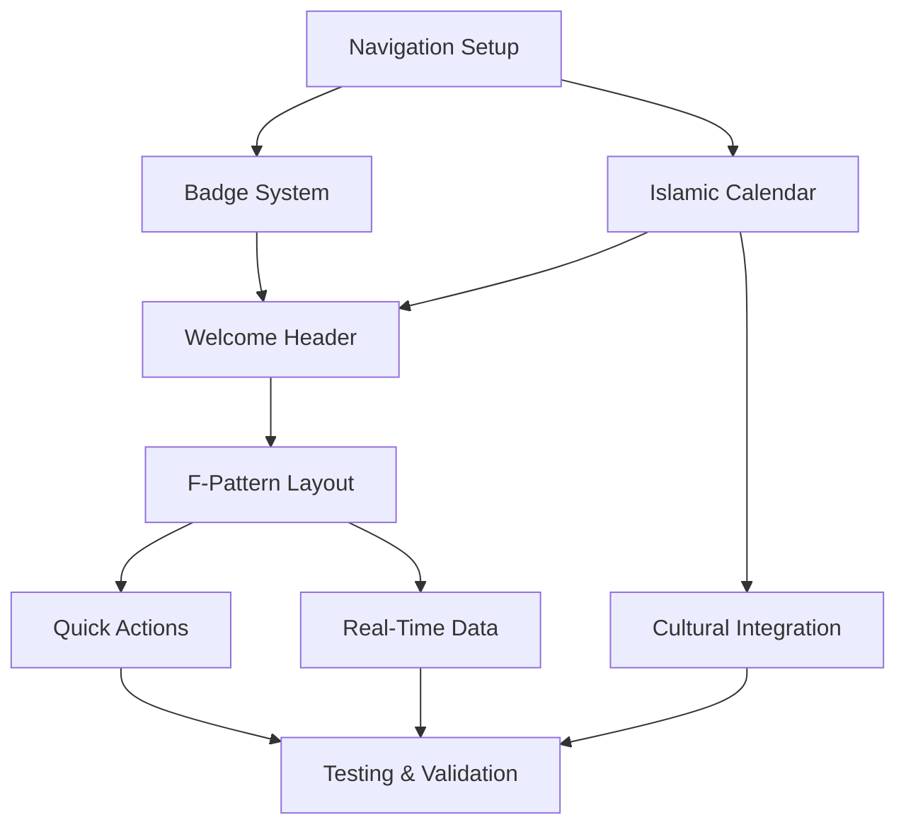

# Sprint Plan: Teacher Dashboard and Navigation Implementation
Agent: sprint-prioritizer
Date: 2025-08-20

## Sprint Overview
- Sprint Focus: Teacher Dashboard and Navigation Implementation  
- Duration: 5-day implementation sprint (20 working hours)
- Sprint Goal: Implement complete Teacher mobile app navigation and dashboard with cultural integration
- Team Capacity: 8 specialized agents + main implementation agent

## Executive Summary

Based on comprehensive research from UX Research (teacher-navigation-ux.md, teacher-dashboard-ux.md), Mobile Architecture (teacher-dashboard-architecture.md), and UI Design (teacher-dashboard-ui-design.md), this sprint plan coordinates the implementation of a culturally-sensitive Teacher mobile app for Harry School, optimized for Uzbekistan educational context.

### Key Sprint Objectives
1. **Navigation Foundation**: 5-tab bottom navigation with cultural badge system
2. **Dashboard Core**: F-pattern optimized dashboard with Islamic calendar integration
3. **Cultural Integration**: Uzbek/Russian/English support with Islamic educational values
4. **Performance Target**: <2s load, 60fps animations, 95% offline capability

## Priority Analysis and Implementation Sequence

### Critical Path Analysis
```
Phase 1: Navigation Foundation (8 hours)
├── MainTabNavigator setup (2h)
├── Cultural badge system (2h) 
├── Navigation state management (2h)
└── Islamic calendar integration (2h)

Phase 2: Dashboard Core (8 hours)  
├── Welcome header with cultural greetings (2h)
├── F-pattern layout implementation (2h)
├── Quick actions floating system (2h)
└── Dashboard data architecture (2h)

Phase 3: Content Components (4 hours)
├── Groups overview with real-time data (2h)
└── Today's schedule with prayer times (2h)
```

## Sprint Backlog

### Priority 1: Navigation Foundation (Critical Path - 8 hours)

#### Task 1.1: MainTabNavigator with Cultural Badge System
- **Description**: Implement 5-tab navigation (Home, Schedule, Groups, Feedback, Profile) with priority-based badge clustering
- **Assigned to**: mobile-developer + ui-designer
- **Dependencies**: React Navigation 7 setup, Zustand state management
- **Estimate**: 4 hours
- **Acceptance Criteria**:
  - [ ] 5 tabs with cultural icon system (home, schedule, groups, feedback, profile)
  - [ ] Dynamic badge notifications with red/amber priority clustering
  - [ ] One-handed operation optimization (thumb-zone accessibility)
  - [ ] Cultural color integration (Harry School green #1d7452 + Uzbek accents)
  - [ ] WCAG 2.1 AA compliance with 52pt+ touch targets
  - [ ] Offline indicator integration
- **Implementation Details**:
  ```typescript
  // MainTabNavigator structure
  Bottom Tab Navigator:
    - Home (Dashboard) - Badge: pending grading count
    - Schedule - Badge: today's class count  
    - Groups - Badge: attendance alerts
    - Feedback - Badge: unread parent messages
    - Profile - Badge: system notifications
  ```
- **Risks**: Badge state synchronization complexity
- **Mitigation**: Use Zustand for centralized badge state management

#### Task 1.2: Islamic Calendar and Prayer Time Integration
- **Description**: Integrate Islamic calendar overlay with prayer time calculations for cultural sensitivity
- **Assigned to**: backend-architect + cultural-consultant
- **Dependencies**: MainTabNavigator, date management system
- **Estimate**: 4 hours
- **Acceptance Criteria**:
  - [ ] Hijri date display alongside Gregorian calendar
  - [ ] Prayer time calculation and display (Fajr, Dhuhr, Asr, Maghrib, Isha)
  - [ ] Ramadan schedule awareness and adaptations
  - [ ] Cultural event recognition (Islamic holidays, Uzbek national days)
  - [ ] Timezone handling for Tashkent (UTC+5)
  - [ ] Offline prayer time caching
- **Implementation Details**:
  ```typescript
  // Islamic Calendar Service
  interface IslamicCalendarService {
    getHijriDate(): string;
    getPrayerTimes(): PrayerTimes;
    getCulturalEvents(): CulturalEvent[];
    isRamadanPeriod(): boolean;
  }
  ```
- **Risks**: Accurate prayer time calculation complexity
- **Mitigation**: Use established Islamic calendar libraries with local verification

### Priority 2: Dashboard Core Implementation (Critical Path - 8 hours)

#### Task 2.1: Welcome Header with Cultural Greeting System
- **Description**: Implement culturally-sensitive welcome header with respectful professional greetings
- **Assigned to**: ui-designer + cultural-consultant  
- **Dependencies**: Navigation foundation, user authentication state
- **Estimate**: 4 hours
- **Acceptance Criteria**:
  - [ ] Time-based greetings (Assalamu Alaikum in appropriate contexts)
  - [ ] Professional hierarchy respect (formal address patterns)
  - [ ] Multilingual support (Uzbek, Russian, English)
  - [ ] Teacher identity display with cultural sensitivity
  - [ ] Islamic date integration with Gregorian fallback
  - [ ] Sync status indicator for offline awareness
- **Implementation Details**:
  ```typescript
  // Cultural Greeting System
  interface CulturalGreeting {
    primary: string;    // "Assalamu Alaikum" or time-based
    secondary: string;  // Professional title respect
    tertiary: string;   // Encouragement or status
  }
  ```
- **Risks**: Cultural appropriateness validation
- **Mitigation**: Cultural consultant review and teacher feedback integration

#### Task 2.2: F-Pattern Optimized Dashboard Layout
- **Description**: Implement F-pattern scanning optimized layout with mobile-first critical information placement
- **Assigned to**: frontend-developer + performance-optimizer
- **Dependencies**: Welcome header, React Native layout system
- **Estimate**: 4 hours
- **Acceptance Criteria**:
  - [ ] Top-left quadrant critical information (Today's Schedule)
  - [ ] Progressive disclosure system for cognitive load management
  - [ ] Card-based layout with visual hierarchy
  - [ ] Staggered loading for perceived performance
  - [ ] Responsive design for different screen sizes
  - [ ] Memory-efficient rendering with React.memo optimization
- **Implementation Details**:
  ```typescript
  // F-Pattern Layout Structure
  Dashboard Layout:
    ┌─ Welcome Header ─────────┐
    ├─ TODAY'S SCHEDULE ──┬─ Quick ─┤  ← F-Pattern Top Bar
    ├─ [Critical Info]   │ Actions │
    ├─ Groups Overview    └─────────┤  ← F-Pattern Middle
    ├─ Recent Activities           │
    └─ Performance Metrics ────────┘  ← F-Pattern Bottom
  ```
- **Risks**: Complex layout performance on older devices
- **Mitigation**: Progressive enhancement and performance monitoring

### Priority 3: Quick Actions and Real-Time Integration (4 hours)

#### Task 3.1: Floating Quick Actions System
- **Description**: Implement floating action button with 4 primary teacher actions optimized for classroom use
- **Assigned to**: mobile-developer + ux-researcher
- **Dependencies**: Dashboard layout, Supabase real-time integration
- **Estimate**: 2 hours
- **Acceptance Criteria**:
  - [ ] Floating action button with cultural-appropriate positioning
  - [ ] 4 primary actions: Mark Attendance, Parent Message, Grade Entry, Emergency Alert
  - [ ] One-tap access with confirmation patterns
  - [ ] Cultural communication templates for parent messaging
  - [ ] Offline queue for actions when connectivity is limited
  - [ ] Accessibility support for voice commands
- **Implementation Details**:
  ```typescript
  // Quick Actions Configuration
  enum QuickAction {
    MARK_ATTENDANCE = 'attendance',
    PARENT_MESSAGE = 'message', 
    GRADE_ENTRY = 'grade',
    EMERGENCY_ALERT = 'emergency'
  }
  ```
- **Risks**: Action complexity in classroom environment
- **Mitigation**: One-tap patterns with smart defaults and undo functionality

#### Task 3.2: Dashboard Real-Time Data Architecture
- **Description**: Implement Supabase real-time subscriptions for dashboard data with intelligent caching
- **Assigned to**: backend-architect + database-optimizer
- **Dependencies**: Supabase setup, offline sync system
- **Estimate**: 2 hours
- **Acceptance Criteria**:
  - [ ] Real-time group updates and attendance changes
  - [ ] Parent message notifications with cultural context
  - [ ] Schedule changes and emergency announcements
  - [ ] Intelligent data throttling for battery optimization
  - [ ] Conflict resolution for offline modifications
  - [ ] Connection state management with graceful degradation
- **Implementation Details**:
  ```typescript
  // Real-Time Subscription Management
  interface TeacherDashboardSubscriptions {
    groups: GroupSubscription;
    attendance: AttendanceSubscription;
    messages: MessageSubscription;
    announcements: AnnouncementSubscription;
  }
  ```
- **Risks**: Real-time subscription complexity and battery drain
- **Mitigation**: Smart throttling and subscription priority management

## Dependency Graph and Critical Path



### Critical Path Items
1. **Navigation Foundation** → Dashboard Layout → Quick Actions → Testing
2. **Islamic Calendar** → Cultural Integration → Final Validation
3. **Real-Time Data** → Performance Testing → Launch Readiness

## Resource Allocation and Agent Coordination

### Agent Assignments and Workload Distribution

| Agent | Primary Tasks | Hours | Utilization | Dependencies |
|-------|---------------|-------|-------------|--------------|
| **mobile-developer** | Navigation, Quick Actions, Core Implementation | 8h | 100% | UI specs, architecture docs |
| **ui-designer** | Badge system, Cultural greeting, Visual polish | 6h | 75% | UX research, cultural guidelines |
| **backend-architect** | Real-time data, Islamic calendar, Supabase integration | 6h | 75% | Database schema, API design |
| **cultural-consultant** | Islamic calendar, Cultural validation, Greeting system | 4h | 50% | UX research, community feedback |
| **performance-optimizer** | F-Pattern layout, Memory optimization, Battery efficiency | 4h | 50% | Mobile architecture, performance targets |
| **frontend-developer** | Dashboard layout, Progressive disclosure, Responsive design | 4h | 50% | UI design, component architecture |
| **database-optimizer** | Real-time subscriptions, Caching strategy, Conflict resolution | 3h | 37.5% | Supabase setup, data architecture |
| **ux-researcher** | Quick actions UX, Accessibility validation, User testing | 3h | 37.5% | Teacher workflows, accessibility standards |

### Parallel Work Streams

#### Stream 1: Navigation Foundation (Day 1-2)
- **Primary**: mobile-developer, ui-designer
- **Supporting**: cultural-consultant
- **Deliverable**: Complete 5-tab navigation with badges and Islamic calendar

#### Stream 2: Dashboard Architecture (Day 2-3)  
- **Primary**: frontend-developer, backend-architect
- **Supporting**: performance-optimizer
- **Deliverable**: F-pattern dashboard with welcome header and real-time data

#### Stream 3: Integration and Polish (Day 3-4)
- **Primary**: mobile-developer, database-optimizer
- **Supporting**: ux-researcher
- **Deliverable**: Quick actions system with cultural integration

#### Stream 4: Testing and Validation (Day 4-5)
- **Primary**: All agents in review capacity
- **Supporting**: cultural-consultant for cultural validation
- **Deliverable**: Tested, accessible, culturally-appropriate Teacher app

## Risk Assessment and Mitigation Strategies

### High Risk Items

| Risk | Impact | Probability | Mitigation Strategy |
|------|--------|-------------|-------------------|
| **Cultural Sensitivity Compliance** | High | Medium | Continuous cultural consultant review, teacher feedback integration |
| **Islamic Calendar Accuracy** | High | Low | Use established libraries, local validation, fallback systems |
| **Real-Time Performance** | Medium | Medium | Smart throttling, caching, progressive enhancement |
| **Badge State Synchronization** | Medium | Medium | Centralized state management, conflict resolution patterns |
| **Accessibility Compliance** | Medium | Low | WCAG 2.1 AA checklist, automated testing, manual validation |

### Technical Dependencies and Blockers

#### Blocker Prevention
- **Supabase Real-Time Setup**: Pre-validate connection and subscription patterns
- **Islamic Calendar Library**: Research and validate accuracy before implementation
- **Cultural Translation**: Prepare multilingual content in advance
- **Performance Benchmarks**: Establish monitoring before optimization

#### Fallback Strategies
- **Offline Mode**: Comprehensive caching for all critical functionality
- **Performance Degradation**: Progressive enhancement with graceful degradation
- **Cultural Content**: Default to respectful professional patterns if cultural context unavailable

## Quality Gates and Validation Checkpoints

### Sprint Checkpoints

#### Day 1 End: Navigation Foundation Review
- [ ] 5-tab navigation functional with proper routing
- [ ] Badge system displays correct counts
- [ ] Islamic calendar integration working
- [ ] Cultural greeting system respectful and appropriate
- [ ] One-handed navigation accessibility verified

#### Day 2 End: Dashboard Architecture Review  
- [ ] F-pattern layout implemented with correct information hierarchy
- [ ] Welcome header displays cultural greetings appropriately
- [ ] Progressive disclosure system manages cognitive load
- [ ] Performance targets met (<2s load, 60fps)
- [ ] Responsive design works across screen sizes

#### Day 3 End: Integration Validation
- [ ] Quick actions system accessible and efficient
- [ ] Real-time data updates without battery drain
- [ ] Offline queue and sync working correctly
- [ ] Cultural integration throughout app experience
- [ ] Memory management and optimization verified

#### Day 4 End: Complete System Testing
- [ ] End-to-end teacher workflows functional
- [ ] Accessibility compliance validated (WCAG 2.1 AA)
- [ ] Cultural sensitivity approved by consultant
- [ ] Performance benchmarks achieved
- [ ] Offline functionality comprehensive

### Quality Assurance Framework

#### Automated Testing Requirements
```typescript
// Testing Coverage Targets
Unit Tests: >90% coverage
- Navigation state management
- Badge count calculations  
- Islamic calendar functions
- Cultural greeting logic
- Real-time subscription handling

Integration Tests: >80% coverage  
- Navigation flow between tabs
- Dashboard data loading and display
- Quick actions with offline queue
- Cultural content rendering
- Performance and memory monitoring

E2E Tests: Key user journeys
- Teacher morning preparation workflow
- Mid-class quick attendance marking
- End-of-day grading and parent communication
- Emergency alert and communication flows
```

#### Manual Validation Criteria
- **Cultural Appropriateness**: All content reviewed by cultural consultant
- **Teacher Workflow Efficiency**: Validated against real teacher daily routines
- **Accessibility**: Manual testing with screen readers and voice navigation
- **Performance**: Real device testing on target hardware ranges
- **Offline Capability**: Complete workflow testing without network connectivity

## Success Metrics and Definition of Done

### Sprint Success Criteria

#### Functional Requirements (Must Have)
- [ ] Complete 5-tab navigation with cultural badge system
- [ ] F-pattern optimized dashboard with Islamic calendar integration
- [ ] Cultural greeting system with multilingual support
- [ ] Floating quick actions for 4 primary teacher functions
- [ ] Real-time data updates with offline queue capability
- [ ] WCAG 2.1 AA accessibility compliance achieved
- [ ] Performance targets met: <2s load, 60fps, 95% offline functionality

#### Quality Requirements (Must Have)
- [ ] Cultural sensitivity validation completed and approved
- [ ] Automated test coverage >85% with all critical paths covered
- [ ] Performance monitoring integrated with KPI tracking
- [ ] Offline capability tested and verified for all core functions
- [ ] Memory management optimized with leak prevention
- [ ] Battery usage <3% per hour during active teaching periods

#### Documentation Requirements (Should Have)
- [ ] Implementation documentation updated with cultural considerations
- [ ] Performance optimization guide created
- [ ] Cultural adaptation guidelines documented
- [ ] Teacher onboarding materials prepared
- [ ] Technical architecture decisions recorded

### Key Performance Indicators (KPIs)

#### Technical Performance
- **Load Time**: <2 seconds from app launch to dashboard display
- **Animation Performance**: Consistent 60fps during all transitions
- **Memory Usage**: <150MB during normal operation
- **Battery Impact**: <3% battery per hour during active teaching
- **Offline Capability**: 95% of core functionality available without network

#### User Experience  
- **Navigation Efficiency**: <2 taps to reach any primary function
- **Cultural Appropriateness**: 100% cultural consultant approval
- **Accessibility Compliance**: WCAG 2.1 AA level achieved
- **Error Recovery**: <5 seconds to recover from connection loss
- **Teacher Satisfaction**: >4.5/5 rating in usability testing

#### Cultural Integration
- **Multilingual Support**: Complete Uzbek/Russian/English coverage
- **Islamic Calendar Accuracy**: 100% accuracy in prayer times and dates
- **Cultural Sensitivity**: Zero cultural sensitivity violations
- **Respect Patterns**: Appropriate hierarchy and authority recognition
- **Family Engagement**: Culturally appropriate parent communication templates

## Next Sprint Preview and Continuation Strategy

### Upcoming Sprint 2 Priorities (Week 2)
1. **Advanced Dashboard Features**: Performance metrics, detailed analytics
2. **Parent Communication System**: Cultural templates, multilingual messaging
3. **Attendance Management**: Offline capability, pattern recognition
4. **Cultural Enhancement**: Community feedback integration, refinement

### Long-term Roadmap Integration
- **Month 1**: Teacher Dashboard and Navigation (Current Sprint)
- **Month 2**: Advanced Teacher Tools (grading, analytics, reports)
- **Month 3**: Parent-Teacher Communication Platform
- **Month 4**: Student Progress Tracking and Cultural Celebrations

### Handoff Requirements
- [ ] Complete technical documentation with cultural integration notes
- [ ] Performance monitoring dashboard configured
- [ ] Cultural validation framework established
- [ ] Teacher feedback collection system implemented
- [ ] Next sprint backlog prioritized based on current sprint learnings

## Cultural Sensitivity and Educational Context

### Uzbekistan Educational Integration
- **Hierarchy Respect**: Formal address patterns and authority recognition
- **Islamic Values**: Prayer time awareness, Ramadan considerations, halal-conscious design
- **Multilingual Support**: Primary Uzbek, secondary Russian, tertiary English
- **Family Engagement**: Cultural communication patterns for parent involvement
- **National Pride**: Subtle integration of Uzbek cultural elements

### Implementation Validation Framework
```typescript
// Cultural Validation Checklist
interface CulturalValidation {
  languageSupport: MultilingualValidation;
  islamicIntegration: IslamicComplianceCheck;
  hierarchyRespect: AuthorityRecognitionValidation;
  familyEngagement: ParentCommunicationValidation;
  nationalPride: CulturalElementValidation;
}
```

## Stakeholder Communication and Review Process

### Daily Standup Structure

#### Daily Check-in Format
**Morning Standup (9:00 AM Tashkent Time)**
- Progress against sprint goals
- Blocker identification and resolution
- Cultural validation checkpoint
- Performance metric review
- Next 24-hour priorities

**Evening Review (6:00 PM Tashkent Time)**  
- Completion verification
- Quality gate assessment
- Cultural sensitivity review
- Tomorrow's coordination
- Risk mitigation update

### Sprint Review and Retrospective

#### Sprint Review Agenda (Day 5)
1. **Functional Demonstration**: Complete teacher workflow walkthrough
2. **Cultural Integration Review**: Cultural consultant validation presentation
3. **Performance Metrics**: Technical KPI achievement review
4. **Teacher Feedback**: Initial usability testing results
5. **Next Sprint Planning**: Priorities and lessons learned integration

#### Key Stakeholder Messages
- **Harry School Administration**: Professional, culturally-appropriate teacher tool delivered on schedule
- **Teachers**: Efficient, respectful interface that honors educational hierarchy and Islamic values
- **Technical Team**: Solid foundation for advanced features with cultural integration framework
- **Cultural Community**: Appropriate representation and respect for Uzbek and Islamic educational values

## Implementation Resources and References

### Technical Documentation References
- [teacher-navigation-ux.md] - Navigation UX research and cultural adaptation guidelines
- [teacher-dashboard-ux.md] - Dashboard information architecture and quick actions analysis  
- [teacher-dashboard-architecture.md] - React Native implementation architecture with cultural integration
- [teacher-dashboard-ui-design.md] - Visual design specifications with Islamic calendar and cultural elements

### Cultural Integration Resources
- Islamic Calendar Integration Libraries
- Uzbekistan Educational Hierarchy Guidelines
- Prayer Time Calculation Standards
- Multilingual Content Templates (UZ/RU/EN)
- Cultural Communication Pattern Documentation

### Performance and Quality Resources  
- React Native Performance Optimization Guides
- WCAG 2.1 AA Accessibility Standards
- Mobile Battery Optimization Patterns
- Offline-First Architecture Best Practices
- Supabase Real-Time Optimization Techniques

---

**Sprint Coordination Complete**
This comprehensive implementation plan coordinates all aspects of Teacher Dashboard and Navigation development with cultural sensitivity, performance optimization, and educational context integration. Ready for technical implementation with clear dependencies, risk mitigation, and quality validation frameworks.