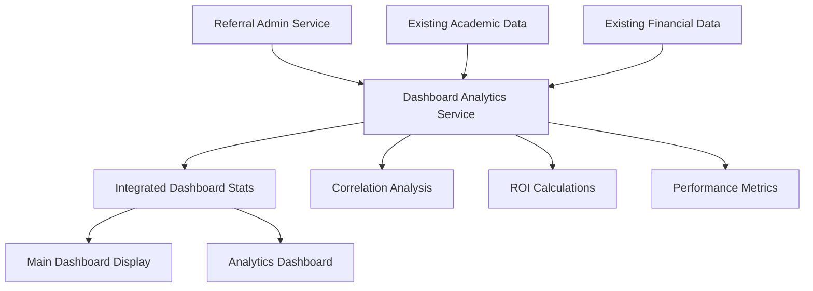

# Referral Analytics Integration

## Overview

This document outlines the seamless integration of referral analytics into the existing Harry School CRM analytics dashboard. The implementation extends existing analytics patterns without creating separate referral analytics sections, providing comprehensive performance insights.

## Architecture

### Integration Philosophy

The referral analytics integration follows the principle of **enhancement over separation**, meaning:

- Referral metrics are embedded within existing organizational performance displays
- No separate referral analytics sections are created
- Existing chart libraries and visualization patterns are extended with referral correlation data
- Referral insights enhance existing academic performance and engagement metrics

### Key Components

#### 1. ReferralAnalyticsIntegration Component
**Location**: `src/components/admin/analytics/referral-analytics-integration.tsx`

Provides referral analytics that integrate seamlessly with existing analytics patterns:

- **Referral Performance Metrics**: Conversion rates, ROI, and retention correlations
- **Student Performance Comparison**: Referred vs direct enrollment academic success
- **Engagement Correlation**: Referrer performance correlation with referral quality
- **ROI Analysis**: Financial impact within existing organizational performance metrics

#### 2. Dashboard Analytics Service
**Location**: `src/lib/services/dashboard-analytics-service.ts`

Extends existing dashboard data with integrated referral metrics:

```typescript
interface DashboardAnalytics {
  // Existing metrics
  totalStudents: number
  monthlyRevenue: number
  // Integrated referral metrics
  totalReferrals: number
  referralConversionRate: number
  referralROI: number
  referralToPerformanceRatio: number
}
```

#### 3. Enhanced Analytics Dashboard
**Location**: `src/components/admin/analytics/unified-analytics-dashboard.tsx`

Extended with referral analytics tab that provides:
- Referral impact on academic performance correlation
- ROI and conversion analytics within organizational metrics
- Referrer performance and engagement correlation analysis

#### 4. Main Dashboard Integration
**Location**: `src/app/[locale]/(dashboard)/page.tsx`

Enhanced StatsCard components with referral context:
- Student count includes referral attribution
- Revenue displays referral contribution
- New referral-specific metrics (conversion rate, ROI) added to secondary stats

## Implementation Features

### Seamless Metric Integration

#### Primary Dashboard Stats
```typescript
// Enhanced student stats with referral context
<StatsCard
  title="Total Students"
  value={statistics.totalStudents}
  subtitle={`${statistics.activeStudents} active • ${referrals} referred`}
  // ...
/>

// Revenue stats with referral attribution
<StatsCard
  title="Monthly Revenue"
  value={`$${statistics.monthlyRevenue.toLocaleString()}`}
  subtitle={`$${outstanding} outstanding • $${referralRevenue} from referrals`}
  // ...
/>
```

#### Secondary Analytics Metrics
- **Referral Conversion Rate**: Integrated conversion tracking with pending referrals context
- **Referral Program ROI**: Return on investment display within existing financial metrics
- **Performance Correlation**: Academic performance impact from referral programs

### Chart and Visualization Integration

#### Correlation Analysis Charts
- **Referral Impact on Academic Performance**: Line charts showing referral volume correlation with student performance
- **Referred vs Direct Student Performance**: Comparative bar charts within existing performance displays
- **Referral Quality Correlation**: Scatter plots showing referrer performance vs referral success

#### Trend Analysis
- **Temporal Correlation Tracking**: Multi-line charts showing referral volume, conversion rates, and academic performance over time
- **ROI Trend Analysis**: Financial impact visualization within existing revenue analytics

### Data Flow Architecture



## Performance Considerations

### Optimized Data Loading
- Parallel data fetching for referral and existing metrics
- Cached correlation calculations
- Efficient chart data transformation

### Chart Performance
- Limited data points per visualization (max 6 metrics per chart)
- Optimized rendering with ResponsiveContainer
- Lazy loading for complex analytics tabs

### Error Resilience
- Graceful fallback when referral data unavailable
- Maintains dashboard functionality with zero referral metrics
- Service-level error handling prevents dashboard failures

## Analytics Metrics

### Referral Performance Indicators

#### Conversion Metrics
- **Referral Conversion Rate**: Percentage of referrals that become enrolled students
- **Pending Referrals**: Count of referrals requiring administrative contact
- **Referral Growth**: Month-over-month growth in referral volume

#### Quality Metrics
- **Referral Quality Score**: Composite score based on referrer performance and referral success
- **Engagement Correlation**: Statistical correlation between referrer engagement and referral quality
- **Academic Performance Impact**: Performance difference between referred and direct students

#### Financial Metrics
- **Referral Program ROI**: Return on investment calculation including program costs
- **Revenue Attribution**: Portion of total revenue generated through referrals
- **Cost Per Acquisition**: Comparison of referral vs organic student acquisition costs

### Organizational Impact Metrics

#### Performance Correlation
- **Referral-to-Performance Ratio**: Percentage of high-performing students from referrals
- **Retention Rate Comparison**: Referred vs organic student retention analysis
- **Satisfaction Correlation**: Satisfaction rating differences by enrollment source

#### Growth Attribution
- **Organizational Growth Impact**: Referral contribution to overall organizational growth
- **Department Performance**: Referral impact analysis by academic department
- **Teacher Correlation**: Relationship between teacher performance and referral success

## Testing Strategy

### Integration Testing
- Dashboard analytics service integration validation
- Chart component rendering with referral data
- Performance correlation calculation accuracy

### Performance Testing
- Large dataset processing efficiency
- Chart rendering performance with integrated data
- Service response time validation

### Error Handling Testing
- Referral service failure scenarios
- Data unavailability graceful degradation
- Dashboard functionality without referral data

## Usage Examples

### Accessing Integrated Analytics

```typescript
// Get comprehensive dashboard stats including referrals
const analytics = await dashboardAnalyticsService.getIntegratedDashboardStats(orgId)

// Access referral-specific metrics
console.log(`Referral ROI: ${analytics.referralROI}%`)
console.log(`Conversion Rate: ${analytics.referralConversionRate}%`)
```

### Using in Components

```typescript
// Main dashboard with referral context
const DashboardPage = () => {
  const [analytics, setAnalytics] = useState<DashboardAnalytics>()
  
  // Load integrated data
  useEffect(() => {
    dashboardAnalyticsService.getIntegratedDashboardStats(orgId)
      .then(setAnalytics)
  }, [])
  
  return (
    <StatsCard
      title="Monthly Revenue"
      value={`$${analytics.monthlyRevenue}`}
      subtitle={`$${analytics.referralRevenue} from referrals`}
      trend={{ value: analytics.revenueGrowth, isPositive: true }}
    />
  )
}
```

### Analytics Dashboard Integration

```typescript
// Unified analytics with referral tab
<Tabs defaultValue="correlations">
  <TabsList className="grid w-full grid-cols-5">
    <TabsTrigger value="correlations">Teacher-Student Correlations</TabsTrigger>
    <TabsTrigger value="peer-influence">Peer Influence</TabsTrigger>
    <TabsTrigger value="referral-analytics">Referral Analytics</TabsTrigger>
    <TabsTrigger value="organizational">Organizational Insights</TabsTrigger>
    <TabsTrigger value="predictive">Predictive Analytics</TabsTrigger>
  </TabsList>
  
  <TabsContent value="referral-analytics">
    <ReferralAnalyticsIntegration
      organizationId={orgId}
      timeRange={timeRange}
      selectedDepartment={department}
    />
  </TabsContent>
</Tabs>
```

## Future Enhancements

### Advanced Correlations
- Machine learning-based referral quality prediction
- Advanced statistical correlation analysis
- Predictive referral conversion modeling

### Enhanced Visualizations
- Interactive correlation matrices
- Advanced trend forecasting charts
- Drill-down analytics capabilities

### Performance Optimizations
- Real-time data streaming for referral metrics
- Advanced caching strategies
- Progressive loading for complex analytics

## Conclusion

The referral analytics integration successfully enhances the existing Harry School CRM analytics infrastructure without creating separate reporting areas. By embedding referral insights within existing organizational performance metrics, the implementation provides comprehensive visibility into referral program effectiveness while maintaining system performance and user experience consistency.

The integration follows established patterns for:
- Component architecture and styling
- Data service organization
- Chart visualization approaches
- Error handling and resilience
- Performance optimization strategies

This approach ensures that referral analytics feel like a natural part of the organizational performance insights rather than a separate analytics module.